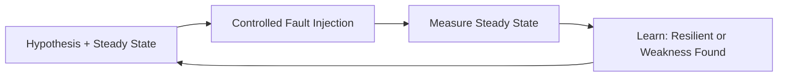

# Chaos engineering basics

> **Learning Path:** Testing, Quality & Observability Foundations
> **Section:** 22.1.6 — Testing strategy

### The problem

Distributed systems fail in ways you cannot predict from unit tests, integration tests, or even staging.

You can test each service in isolation. You can test happy paths. You still get outages from:
- cascading latency when a downstream dependency slows
- partial network partitions between zones
- a node that dies mid-request
- a bad deployment that only triggers under real traffic mix

The constraint is not effort. It is coverage. The number of failure combinations grows faster than you can simulate manually, and staging never matches production load, data, and topology.

Traditional approach: hope monitoring catches it, then fix post-mortem. That optimizes for mean time to recovery, not mean time to failure discovery.

### Mental model

Chaos engineering is the practice of intentionally injecting real failures into a live system to prove it behaves as designed.

It is not random breaking. It is a learning loop:

Hypothesis about steady state -> controlled experiment -> measure deviation -> learn.

Think of it as a vaccine for your architecture: a small, safe dose of failure to build immunity.

### How it works

Four minimal pieces make it workable.

**Steady state.** Define what normal looks like in measurable terms. E.g., p95 latency < 200ms, error rate < 0.1%, checkout success rate stable. Without this, you cannot tell if an experiment did anything.

**Hypothesis.** "If we terminate a payment service instance, then checkout success rate will stay within bounds because the service is stateless and load-balanced."

**Experiment.** Inject a fault with limited blast radius: kill one instance, add 200ms latency to DB calls, partition a subnet. The injection is automated, reversible, and time-boxed.

**Learn.** Compare steady state before/during/after. If steady state holds, your architecture is resilient to that failure. If it breaks, you found a weakness before users did.

Blast radius controls risk: start in dev, then canary, then a single AZ, then production with feature flags.

### Architectural reasoning

When it helps: you have a distributed system with non-obvious dependencies, where failure modes are emergent rather than local. Especially services with retries, timeouts, circuit breakers, autoscaling, and multi-region data.

What it solves: it turns unknown unknowns into known unknowns. It validates that your resilience patterns actually work under real traffic and real coupling.

Alternatives:
- **Game days / manual fault injection.** Good for culture, bad for repeatability and scale.
- **Fault injection tests in CI.** Cheap and safe, but limited to synthetic loads and mocks.
- **Observability + post-mortems.** Necessary but reactive.

Choose chaos engineering when the cost of a surprise outage exceeds the cost of building safe experimentation. That is usually at scale, with revenue-critical paths, or when you are adopting patterns like microservices, serverless, or multi-region.

### Trade-offs and failure modes

**Safety vs realism.** The more realistic the experiment, the more risk. You need strong observability, automated rollbacks, and guardrails. Without those, chaos engineering creates outages.

**Signal vs noise.** Bad steady state definitions lead to false positives. You need baselines that are stable and SLO-aligned.

**Complexity cost.** You are maintaining experiments, hypotheses, and safety checks. For small, simple systems this is overkill.

**Failure modes to watch:**
- Experiments that are too broad and cause real customer impact
- Teams treating it as a demo, not a learning system
- Lack of runbooks when steady state degrades
- Experiments that pass but only because traffic was low

### Example

An e-commerce checkout depends on inventory, payment, and recommendation services. Each has retries with exponential backoff and a circuit breaker.

Hypothesis: "If we add 500ms latency to inventory for 2 minutes, p95 checkout latency stays < 800ms and error rate stays < 0.5%."

Experiment runs in production during low-traffic window, targeting 5% of pods via latency proxy.

Result: p95 latency spikes to 1.2s, circuit breaker trips too late, retries amplify load. You discover the timeout is set too high and the breaker threshold is wrong.

Fix: lower timeout, tune breaker, add bulkhead isolation. Re-run experiment to confirm.

You found a cascading failure that no staging test reproduced.

### Reasoning challenge

You are architecting a new AI inference service that calls an external vector DB and a model endpoint. Latency SLO is 1s p95. You have good unit tests and load tests in staging.

Should you invest in chaos engineering now, or wait until you have 3 months of production data and an incident?

What steady state would you define first, and what is the smallest safe experiment you could run?

### Key takeaway

- Reliability is an emergent property of the whole system; you must test it as a whole, in production-like conditions.
- Chaos engineering is controlled failure injection guided by a measurable steady state and a falsifiable hypothesis.
- Use it to validate resilience patterns, not to prove the system is perfect.
- Safety mechanisms — blast radius, observability, automated rollback — are part of the architecture, not optional.
- Run experiments to learn, not to impress. One validated hypothesis beats ten random failures.
