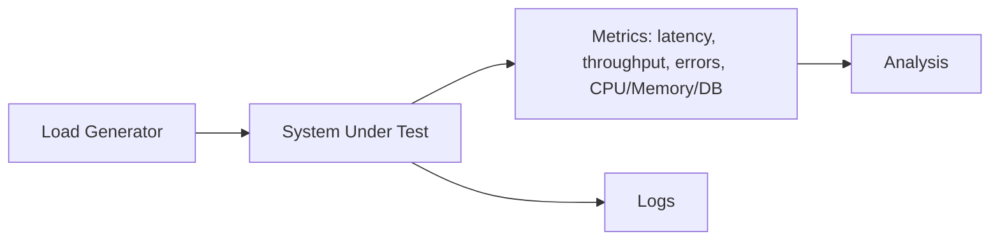

# Load testing

> **Learning Path:** Testing, Quality & Observability Foundations
> **Section:** 22.1.7 — Testing strategy

**Load testing**

### 1. The problem

A system that passes unit tests and handles a few manual requests can still fail in production. The failure mode is not a bug in logic, it is a constraint exposed by demand: latency spikes, queue buildup, connection exhaustion, cascading failures.

You cannot discover these constraints by looking at code. You discover them when concurrent users, data volume, and system state interact over time. Production is the only real proof, but production is not a safe place to learn.

Load testing exists to find the breaking point *before* real users do, in a controlled environment.

### 2. Mental model

Think of it as a rehearsal with a scripted audience.

You define a workload profile - number of concurrent users, request rate, think time, distribution of operations - and replay it against a system under test. You are not testing correctness, you are testing behavior under demand: how latency, throughput, error rate and resource utilization change as load increases.

The goal is not "make it pass". The goal is to find where the system stops behaving linearly and start degrading.

### 3. How it works

The essential mechanism is simple:

Load generator creates virtual users/sessions. Ramp up to target load, hold steady state, ramp down. While running you collect golden signals from the system and its dependencies.

The useful profiles are:
* **Load test**: sustained expected traffic to validate SLOs
* **Stress test**: push past expected to find breaking point and recovery
* **Soak test**: hours/days at moderate load to find leaks and degradation
* **Spike test**: sudden burst to test autoscaling and circuit breakers

Script realism matters more than raw RPS. A realistic mix of reads/writes, session behavior, and data hot spots will reveal bottlenecks a uniform GET flood will hide.

### 4. Architectural reasoning

When it helps:
* Before a launch or traffic event to size capacity and validate autoscaling policies
* To set and defend SLOs: p95/p99 latency under known load
* To find the first bottleneck in a distributed chain: app, cache, DB, message bus, downstream API
* To test failure modes: backpressure, queue saturation, connection pool exhaustion

What alternatives exist:
* Production monitoring and gradual rollouts will tell you eventually, but at user cost
* Synthetic monitoring gives health signals, not capacity limits
* Chaos engineering tests resilience, not steady-state capacity

Choose load testing when you need a repeatable, controlled experiment to make capacity and architectural decisions before risk is incurred. It is an engineering tool for decision making, not a QA checkbox.

### 5. Trade-offs and failure modes

* **Fidelity vs cost.** Realistic data, realistic traffic mix, and production-like environment are expensive. A cheap test on a toy dataset can give false confidence. The most common failure is testing the wrong thing well.
* **Environment parity.** If test DB is smaller, network is faster, or caches are warm, you will miss the real bottleneck. Test environment must approximate production constraints, especially data size and dependency latency.
* **Observability dependency.** Load without correlated metrics is noise. You need request traces, per-service latency, queue depth, DB wait time, and saturation signals. Otherwise you see "slow" but not "why".
* **State pollution.** Tests that create real data can poison downstream systems. Use isolated namespaces, reset scripts, and read-only reference data where possible.
* **Warm-up bias.** Cold caches and JIT compilation skew first minutes. Discard warm-up and measure steady state.

### 6. Example

E-commerce checkout before Black Friday.

Expected peak: 5k concurrent users, 80% browse, 15% add to cart, 5% checkout. Checkout calls inventory service, payment gateway, and writes order.

Load test shows p95 latency stays under 400ms up to 3k concurrent users, then climbs to 2s. CPU is fine, but DB `inventory` table row locks spike and connection pool saturates. Autoscaling triggers too late because cooldown is 5 minutes.

Decision: increase pool size, add read replica for inventory reads, tune autoscaling cooldown, and add backpressure at API gateway. Re-test confirms SLO holds to 7k concurrent users.

Without the test, the bottleneck would have surfaced in production as failed payments.

### 7. Reasoning challenge

You are launching a RAG agent with LLM inference and vector search. Should you load test with synthetic prompts generated by an LLM, or replay anonymized production queries?

What are the risks of each, and what metrics would actually tell you if the system is ready for peak traffic?

### 8. Key takeaway

* Load testing finds capacity constraints and non-linear degradation before users do
* Realism of workload and environment fidelity outweigh raw request volume
* Use steady-state load to validate SLOs, stress/soak/spike to find limits and recovery behavior
* The output is an architectural decision: scale, redesign bottleneck, tune autoscaling, or change SLOs - not a pass/fail
