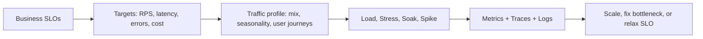

# Performance testing strategy

> **Learning Path:** Testing, Quality & Observability Foundations
> **Section:** 22.1.8 — Testing strategy

**The problem**

You ship a feature that passes all functional tests. In production it collapses at 2x normal traffic, or latency spikes at 3am, or costs explode. Functional correctness is not enough.

Performance testing exists to answer: *Will the system meet its SLOs under realistic load, and what breaks first?* It is not about finding bugs, it is about discovering capacity limits, bottlenecks, and failure modes before users do.

### Mental model

Think of performance testing as a controlled experiment on constraints.

You define a target: requests per second, p95 latency < 200ms, error rate < 0.1%, cost per 1k requests.

You apply load that mimics production patterns and observe where the system deviates from the target.

The output is not pass/fail. It is a capacity envelope and a list of limiting components.

### How it works

A performance strategy is built around four questions answered in order:

1. **What matters?** Derive targets from business SLOs, not generic numbers.
2. **What load is realistic?** Production traffic shape, not just peak RPS.
3. **What are we testing?** Component vs end-to-end, steady vs burst.
4. **How do we know it is valid?** Same observability as production.

The core test types are:

* **Load test** - Sustained expected traffic. Validates baseline SLOs.
* **Stress test** - Push past expected max to find breaking point and recovery.
* **Soak test** - Long duration at steady load to find leaks, GC, connection exhaustion.
* **Spike test** - Sudden burst to test autoscaling and queuing behavior.

### Architectural reasoning

Performance testing is chosen when the cost of being wrong is high: revenue events, user-facing latency, autoscaling costs, and data pipeline backpressure.

It helps when:
* You have non-functional requirements tied to money or retention.
* You have distributed components with shared resources: DB, cache, queue, network.
* You are changing architecture: adding service mesh, moving to serverless, changing DB.

Alternatives are cheaper but insufficient:
* **Production monitoring only** tells you after damage.
* **Unit / integration tests** measure correctness, not behavior under contention.
* **Chaos testing** finds resilience, not capacity limits.

Decision point: test early on critical paths, not everything. Pick the 20% of flows that carry 80% of load and business value.

### Trade-offs and failure modes

* **Realism vs cost.** Production-like data and traffic is expensive. Synthetic data misses edge cases. Real traffic replay is accurate but risky.
* **Environment fidelity.** Staging rarely matches production in size, data volume, and network topology. Results are misleading if you ignore that gap.
* **Wrong metric.** Average latency hides tail latency. Architects care about p95/p99 and error budget burn.
* **Testing the test.** Load generators themselves become the bottleneck. You must measure generator saturation.
* **Ignoring system state.** Testing cold caches, empty queues, or freshly provisioned instances gives optimistic numbers.

Common failure mode: passing a load test in a perfect lab, then failing in prod because connection pools, thread limits, or downstream rate limits were not modelled.

### Example

E-commerce checkout during Black Friday.

SLO: 10k checkouts/min, p95 < 1.5s, error <0.1%.

Strategy:
* Profile: 70% mobile, 30% desktop, 60% new users, cart size distribution from prod.
* Load test: 10k/min sustained for 30 min with production-like data on a staging cluster sized 1:1 with prod.
* Spike test: 0 → 20k/min in 60s to validate autoscaling and queue depth.
* Soak test: 8k/min for 12h to catch memory leak in payment service.
* Metrics: request latency by service, DB connection wait, cache hit rate, queue lag, cost per request.

Finding: p95 ok, p99 spikes to 4s at DB. Root cause: read replica lag under write-heavy promotion. Decision: add read-after-write consistency for order status or increase replica.

### Reasoning challenge

You have a new AI inference API with variable payload size. You can run tests in a full production clone costing $50k/month, or a smaller canary environment costing $5k/month.

Your SLO is p95 latency < 500ms at 5k RPS. You have limited time before launch.

What do you test first, what fidelity do you accept, and what production signal do you plan to rely on post-launch? What is the risk you are taking?

### Key takeaway

* Performance testing validates SLOs under realistic load, not code correctness.
* Define targets from business SLOs, then design load from production traffic shape.
* Test the critical path with load, stress, soak, and spike; measure tail latency and system saturation, not averages.
* The biggest risk is environment mismatch. If you cannot match prod, instrument prod and accept a guarded rollout.

You should finish able to decide *what* to test, *how real* the test must be, and *what* you will do when the test fails.
