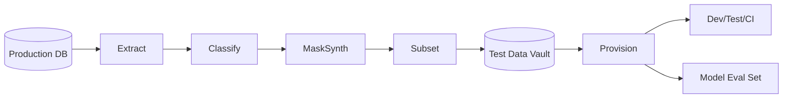

# Test data management

> **Learning Path:** Testing, Quality & Observability Foundations
> **Section:** 22.1.9 — Testing strategy

**Test data management**

### The problem

Tests need data that is realistic, isolated, and reproducible. Production data is none of those in testing.

Production is sensitive, huge, constantly changing, and coupled to real users. Cloning it breaks compliance. Using it directly leaks PII/PCI. Using it fully makes CI slow and tests flaky. Different teams need different slices at the same time, so sharing one copy creates contention.

For AI systems the problem compounds: model evaluation needs stable, representative datasets that don’t leak into training, and synthetic data must preserve statistical properties without exposing real customers.

The problem isn’t “get data”. It’s: *how do you provide safe, fast, consistent data that matches production behavior without copying production risks?*

### Mental model

Treat test data as a first-class product, not a by-product of dumps.

You want a vault of curated datasets, versioned like code, provisioned on demand to isolated environments. The pipeline that builds it is: classify → transform → subset/synthesize → version → provision.

Fidelity vs safety is the central tension. You need enough realism to find bugs, but no more risk than necessary.

### How it works

The core mechanism is a controlled pipeline, not ad-hoc scripts.

1. **Classify and discover.** Tag tables/fields by sensitivity, criticality, and referential dependency. AI data also needs labeling for distribution, bias, and drift.
2. **Transform.** Mask/PII-anonymize or synthetically generate values that preserve referential integrity and statistical shape. Masking keeps real keys and distributions; synthesis creates artificial rows.
3. **Subset and scale.** Take a representative slice that exercises edge cases, not the whole DB. For models, hold out a frozen evaluation set.
4. **Version and store.** Keep the transformed data in a test data vault with lineage, schemas, and generation parameters.
5. **Provision as code.** Spin up per-branch, per-team, per-CI-run environments with an exact data version via IaC.

### Architectural reasoning

Use managed test data when you have shared services, regulated data, parallel teams, or AI evaluation.

* It solves environment contention and flaky tests caused by shared mutable data.
* It enforces compliance by design, removing manual redaction.
* It enables fast CI because subsets are small and provisioned in seconds.

Alternatives:
* **Raw prod clone:** maximum realism, maximum risk and cost. Only viable in fully isolated labs with strict controls.
* **Synthetic only:** safe and fast, but may miss rare real-world edge cases.
* **Static fixtures:** cheap, but drifts from production and hides integration bugs.

Choose masked subsets for transactional systems where referential integrity matters. Choose synthesis for AI training where privacy and distribution control dominate, and keep a frozen, real-derived evaluation set for regression.

### Trade-offs and failure modes

* **Realism vs privacy vs cost.** More realism increases risk and storage. Masking preserves joins but may leak via quasi-identifiers. Synthesis is safe but needs validation.
* **Freshness vs stability.** Tests need stable data for reproducibility, but stale data hides bugs. Versioned datasets with scheduled refresh solve this, at operational cost.
* **Centralization vs autonomy.** A central vault gives governance; self-service generation gives speed. Architect a platform with policies, not a bottleneck.

Common failures: PII leak because masking was incomplete; non-deterministic tests because data changes under teams; test data drift where synthetic data no longer matches production schema; and evaluation leakage in AI where test rows contaminate training.

### Example

A payments platform needs to test fraud scoring.

Production card data cannot leave the VPC. Engineers need realistic transactions with merchant graphs, velocity patterns, and rare fraud cases.

Architecture: nightly extract of transactions, classification of PII fields, format-preserving masking of PANs and names, referential-preserving subset of 1% of customers with all their related rows. The subset is versioned and stored in the vault. CI jobs provision a fresh Postgres with that version in <30s.

For the fraud model, a separate synthetic generator creates additional rare fraud patterns to augment training, while a frozen, masked evaluation set derived from real data is locked and used for all model comparisons to avoid leakage.

### Reasoning challenge

You are architecting test data for a new RAG system that ingests customer support tickets. Legal requires no real tickets in dev. Product wants tests to catch retrieval failures on long, multi-turn conversations.

Do you use synthetic tickets only, masked real tickets, or a hybrid? What do you freeze for model evaluation and why?

### Key takeaway

* Test data is a product with lifecycle, ownership, and SLAs.
* Safety and reproducibility beat raw realism. Control fidelity with masking, subsetting, and synthesis.
* Version data and provision it as code to eliminate environment drift and contention.
* For AI, separate training augmentation from a frozen, lineage-tracked evaluation set to prevent leakage and enable reliable comparison.
