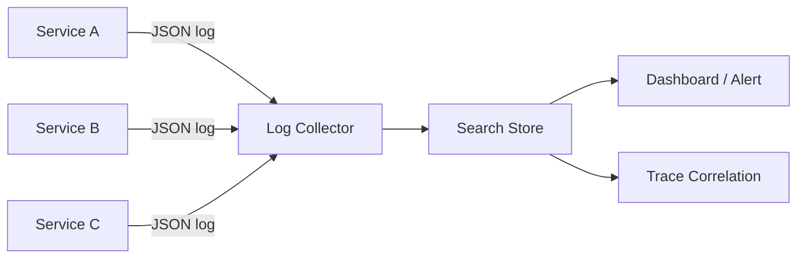

# Structured logging

> **Learning Path:** Testing, Quality & Observability Foundations
> **Section:** 22.2.1 — Observability foundations

**Structured logging**

### 1. The problem

In a single service, `logger.error("Payment failed for user 123")` is fine. In a distributed system with 100 services, 10k RPS, and 5 teams, it breaks.

You need to answer: Which requests failed? Why did latency spike at 14:03? Which user was affected? What was the exact input that caused the error?

Unstructured text logs force you to grep with regex, guess field names, and correlate by hand across services. At scale that is manual incident response and slow root cause.

The constraint is not "logs are messy". It is: **observability requires machine-readable context that can be indexed, filtered, and correlated across a distributed trace**.

### 2. Mental model

Structured logging = logs as data, not as prose.

Instead of one free-form string, you emit a record with a fixed schema: `timestamp, level, message, service, trace_id, user_id, request_duration_ms, ...`. The message is human readable, the fields are queryable.

Think of it as an append-only event stream where each event is a JSON object with a contract.

### 3. How it works

Emitter → structured record → collector → store → query.



Implementation is minimal. You keep the same logging API, you just attach context as fields.

```python
logger.info("payment_processed", extra={
  "trace_id": "a1b2c3",
  "user_id": "u_42",
  "amount": 99.90,
  "currency": "USD",
  "duration_ms": 142
})
```

Emitted as:
```json
{"timestamp":"2026-01-11T10:12:00Z","level":"info","message":"payment_processed","trace_id":"a1b2c3","user_id":"u_42","amount":99.90,"currency":"USD","duration_ms":142}
```

Now you can query: `service=payments AND level=error AND duration_ms>500` and join on `trace_id`.

### 4. Architectural reasoning

Structured logging solves three architectural needs:

* **Correlation across boundaries.** `trace_id`, `request_id`, `user_id` become first-class fields, not substrings to parse.
* **Machine analysis.** Aggregations, histograms, and alerts become trivial: `rate(errors[5m]) by service`.
* **Decoupling.** Producers emit data; consumers decide how to index, sample, or retain it.

Alternatives:
* **Unstructured text + log parsing.** Works for small scale, breaks with schema drift and costs CPU in parsers.
* **Metrics only.** Great for aggregates, loses the why and the request context.
* **Full tracing.** Gives latency and causality, but not business events or free-form diagnostics.

Choose structured logs when you need searchable, correlatable diagnostic data at high volume and you cannot afford ad-hoc parsing in production incidents.

### 5. Trade-offs and failure modes

* **Schema discipline vs flexibility.** Free fields invite chaos. Teams need conventions for field names, types, and required context. Otherwise you get `userId`, `user_id`, `user`.
* **Cardinality explosion.** Logging high-cardinality values like `request_id` or raw payloads as fields makes indexes explode and queries slow. Log values, not tag them.
* **Cost.** JSON is larger than text and indexing is expensive. You pay in storage and ingest. Mitigate with sampling, retention tiers, and dropping verbose fields in prod.
* **PII and security.** Structured fields make PII easy to find, which is good for redaction and bad if you log secrets by accident. Enforce allowlists and scrubbing at the emitter.
* **Performance.** Synchronous JSON serialization adds latency. Use async appenders and batching.

Failure mode to remember: a team adds `error.message` as a string field containing the whole stack trace. Queries become useless and storage balloons. Structure the error, not the narrative.

### 6. Example

E-commerce checkout. Request enters API gateway, gets `trace_id`. Each service logs structured events with same `trace_id`, `user_id`, `cart_id`.

Incident: checkout success rate drops. Query: `service=checkout AND message=payment_failed AND trace_id:*` in last 10 min. Join with `service=inventory` logs on `trace_id`. Find pattern: `inventory_service_error_code=INS-402` correlates with `payment_processor=timeout`. Root cause isolated in 2 minutes, not 2 hours of grepping.

### 7. Reasoning challenge

You are architecting a new LLM-powered recommendation service. It generates suggestions per user and logs each generation. Do you log the full prompt + completion as structured fields?

Consider cost, PII, queryability, and debugging needs. What do you log as fields vs what do you put in a message or offload to object storage?

### 8. Key takeaway

* Structured logs turn diagnostics into queryable data, enabling correlation and automation at scale.
* The value is not JSON, it is a shared schema for context that travels with the request.
* Design fields for filtering and aggregation, keep high-cardinality data out of indexes.
* Enforce conventions early; unstructured structure is worse than unstructured text.
* Logs complement metrics and traces: metrics tell you what, traces tell you where, structured logs tell you why.
