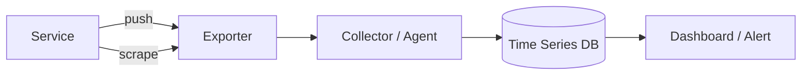

# Metrics fundamentals

> **Learning Path:** Testing, Quality & Observability Foundations
> **Section:** 22.2.2 — Observability foundations

### 1. The problem

You ship a distributed service. It works in dev. In production you have thousands of instances, traffic spikes, deploys, dependencies failing.

Logs tell you *what happened* to one request. Traces tell you *how* one request flowed. Neither gives you a cheap, continuous answer to: Is the system healthy right now? Is latency drifting? Are errors increasing? Are we running out of capacity?

Reading logs at scale is impossible. Sampling traces for every request is expensive. You need a compact, numeric signal that can be aggregated over time and across the fleet, and that can be alerted on.

That creates the constraints for metrics: high volume, low cardinality, pre-aggregated, time-series, queryable in seconds.

### 2. Mental model

Metrics are numbers over time with dimensions.

Think of a time series: `value` at `timestamp`, labeled by `service`, `env`, `region`, etc. You don't store events, you store aggregates.

This is the difference:
* Logs = discrete events, high detail, hard to aggregate
* Traces = request-level causality, expensive to store
* Metrics = continuously sampled measurements, cheap to store and alert on

You lose individual request detail, you gain fleet-wide visibility.

### 3. How it works

Essentially three primitives:

* **Counter** - monotonically increasing. `http_requests_total`. Only goes up, used for rates.
* **Gauge** - point-in-time value. `cpu_usage`, `queue_depth`. Can go up and down.
* **Histogram / Summary** - distribution. `http_request_duration_seconds_bucket`. Lets you derive p50/p95/p99 and rate.

Instrumentation emits these values with labels. Two collection models exist:

Pull is common: Prometheus scrapes exporters on an interval. Push is common for short-lived jobs.

Storage is optimized for writes and range scans, not full event replay. Retention is short, downsampling is normal.

### 4. Architectural reasoning

Use metrics when you need:

* **Operational health** over time: the Four Golden Signals - latency, traffic, errors, saturation.
* **Alerting** on SLO violations. You can't alert on a log line, you alert on a rate of errors > 0.5% over 5m.
* **Capacity planning**. CPU, memory, queue length trends drive autoscaling.

Don't use metrics when you need:
* Who exactly failed and why → logs
* Why this specific request was slow → traces

Alternatives: high-cardinality event streams like logs with aggregation. They preserve detail but cost more to query and are noisy for alerting.

Decision rule: If you can answer the question with a number + label + time window, use a metric. If you need the story, use logs/traces.

### 5. Trade-offs and failure modes

* **Cardinality explosion.** Every unique label combination is a new time series. `request_count{user_id="..."}` creates millions of series, exhausts memory and cost. Keep labels high-level: service, method, status_code, region. Never put request ids or user ids.
* **Loss of detail.** Aggregation hides outliers. A p99 spike can be invisible in averages. Use histograms, not just averages.
* **Sampling and staleness.** Scrapes are periodic, not event-driven. You see ~15-60s lag. Metrics are approximate.
* **Naming and semantics.** `*_total` for counters, `*_seconds` for durations, monotonic increase. Bad naming breaks dashboards and alerts across teams.
* **Alert fatigue.** Metrics make alerting easy, which leads to too many alerts. Tie alerts to SLOs, not every anomaly.

### 6. Example

Payment service SLO: 99.9% of requests < 500ms over 30 days.

Instrumentation:
* `http_requests_total{service="payments",method="POST",code="2xx|5xx"}`
* `http_request_duration_seconds_bucket{service="payments"}`

From these you derive:
* error rate = rate(5xx) / rate(total)
* p99 latency = histogram_quantile(0.99, ...)

Dashboard shows error rate climbing after a deploy. Alert fires when error rate > 0.1% for 5 minutes. You correlate with traces/logs to find the root cause, but metrics found it first.

### 7. Reasoning challenge

You want per-user latency for a premium tier to prioritize them. Proposal: add label `user_id` to `http_request_duration_seconds`.

Do you allow it? What breaks, and what would you do instead?

### 8. Key takeaway

* Metrics are aggregated numbers over time with labels, built for health, alerting, and scaling decisions, not debugging.
* Choose counters for rates, gauges for state, histograms for latency/distribution.
* Keep cardinality low and labels consistent; cardinality is the primary cost and failure mode.
* Use metrics for the Four Golden Signals, logs for the story, traces for the path.
