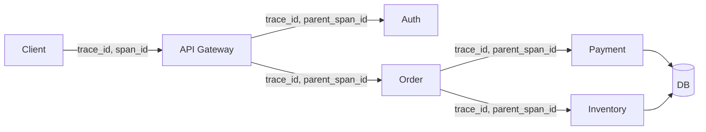

# Distributed tracing basics

> **Learning Path:** Testing, Quality & Observability Foundations
> **Section:** 22.2.3 — Observability foundations

**Distributed tracing basics**

### 1. The problem

You have a request that touches 5-10 services. Logs per service are correct in isolation, metrics show latency is up, but you cannot answer: *Where exactly is the time going? Which service in the chain is slow, and for which requests?*

Logs give you events per host. Metrics give you aggregates per service. Neither gives you a single, correlated view of one request as it crosses process boundaries.

The constraint is distribution: no shared memory, no single clock, no single log stream. You need a causal map of the request.

### 2. Mental model

Think of a distributed request as a journey with passports and stamps.

A **trace** is the whole journey for one incoming request. A **span** is one leg of the journey in one service: start time, end time, name, tags. Spans form a tree via parent-child links.

The trace ID is the passport, passed in a header. Each service stamps its own span and forwards the passport.

This gives you end-to-end latency and the breakdown per hop.

### 3. How it works

Three minimal pieces:

* **Instrumentation**: library creates a span on entry/exit of operation, records start/end and attributes. Propagates context via headers like `traceparent`.
* **Propagation**: trace context is carried across network boundaries. Parent span ID becomes child’s parent.
* **Collection & storage**: spans are exported to a collector, stored in a backend. UI reconstructs the trace tree from trace_id.

You do not need perfect clocks, just monotonic timestamps per process and causal ordering via parent links.

### 4. Architectural reasoning

When it helps:
* Requests span multiple services and latency is business critical.
* Failures are intermittent and request-specific.
* You need to attribute SLO violations to a component.

Alternatives:
* **Logs with correlation IDs**: Good for forensics, bad for latency breakdown and visual path.
* **Metrics**: Good for trends, bad for single-request root cause.

Choose tracing when you need *causal latency attribution* across boundaries. It complements logs and metrics; it does not replace them. Logs explain *what* happened, metrics tell you *how much*, tracing tells you *where*.

### 5. Trade-offs and failure modes

* **Overhead and cost**: Every span is data. High cardinality tags = storage explosion. Sampling is essential in production.
* **Sampling decisions**: Head sampling is cheap, tail sampling catches rare slow requests but needs buffering.
* **Instrumentation burden**: Missing spans create gaps. You need consistent conventions for span naming and attributes.
* **Clock skew**: Absolute latency sums can be off. Rely on durations per span, not wall-clock deltas across hosts.
* **Privacy/security**: Traces contain request payloads, user IDs. Redact PII before export.

Failure mode: tracing deployed without sampling and consistent naming leads to noisy, expensive data you never query.

### 6. Example

Payment flow: `POST /checkout`

Gateway starts trace `t1`. Span: `gateway.handle_checkout 45ms`
-> Auth span child: `auth.validate 12ms`
-> Order span child: `order.create 80ms`
   -> Payment span grandchild: `payment.authorize 200ms` <- slow
   -> Inventory span grandchild: `inventory.reserve 30ms`

You see total 320ms, 62% spent in payment.authorize for this trace. Without tracing you would only see order service p99 up.

### 7. Reasoning challenge

You are architecting a flash sale for an e-commerce platform. Traffic will spike 10x for 10 minutes. Full tracing will generate 50k spans/sec. Your budget allows either full tracing for the sale or sampled tracing + detailed logs.

Do you sample, and if so, how do you still catch the 0.1% of requests that time out? What do you trace in the critical path vs background jobs?

### 8. Key takeaway

* Tracing exists to reconstruct causal latency across services, not to replace logs or metrics.
* A trace is a tree of spans linked by trace_id and parent_id, propagated via headers.
* Use sampling and naming conventions to keep it operable and cheap.
* The architectural value is faster root cause and SLO attribution, at the cost of instrumentation discipline and storage.
