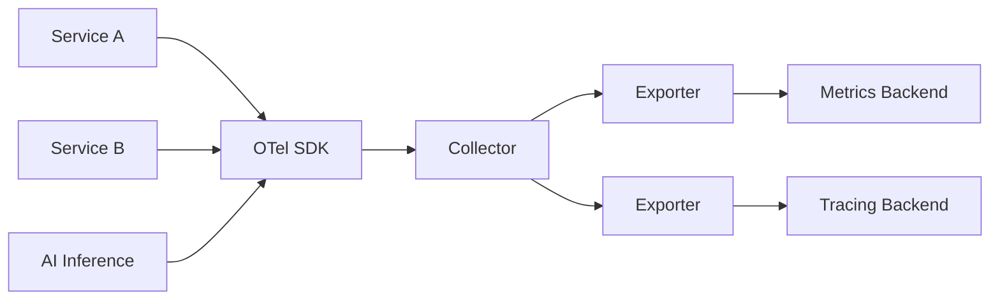

# OpenTelemetry

> **Learning Path:** Testing, Quality & Observability Foundations
> **Section:** 22.2.4 — Observability foundations

### The problem

You run a distributed system. A request touches 5-10 services, maybe a queue, maybe an LLM call. Latency spikes. Who is slow? Which request is bad? Which dependency failed?

Logs tell you what happened in one process. Metrics tell you system health over time. Traces tell you how a request flows. Without correlation, you are debugging with three separate, incompatible tools per vendor.

The constraint is scale and ownership. Teams ship services independently. Vendors change. You need telemetry that is consistent across services, languages, and teams, and you need to own the data, not the vendor.

### Mental model

OpenTelemetry is a standard for producing and collecting telemetry signals, not a backend.

Think of it as a contract: services emit **traces, metrics, logs** in a common format. A collector normalizes and ships them. Backends store and visualize them.

It decouples instrumentation from storage. You can instrument once and send to Datadog, Jaeger, Prometheus, or your own stack.

### How it works

Three signals, one pipeline.

**Traces** = request flow. Spans with start/end, parent-child, attributes.
**Metrics** = time series. Counters, gauges, histograms for rates/latency.
**Logs** = event records, now correlated with trace IDs.

Essential mechanism:

SDK instruments code via auto-instrumentation or manual spans. Collector handles batching, sampling, retries, and export. Exporters are pluggable. The API is vendor-neutral.

You get context propagation for free: trace context flows via headers across service boundaries.

### Architectural reasoning

When it helps: microservices, polyglot repos, multi-cloud, and any system where you need a single source of truth for observability across teams.

Alternatives: proprietary APM agents per vendor, or custom log/metric pipelines per team. Those work until you need to compare data across tools, change vendors, or correlate traces with metrics from different backends.

Why choose it: it moves observability from a product decision to an architectural decision. Instrumentation is standardized, data ownership stays with you, and you can evolve backends without re-instrumenting services.

It also enables platform teams to enforce standards: sampling policies, attribute naming, export destinations, without touching application code.

### Trade-offs and failure modes

**Cardinality cost.** High-cardinality dimensions like `user_id` in metrics will explode storage and cost. Architect for low-cardinality labels.

**Sampling loss.** Full traces in production are expensive. Tail-based sampling keeps errors, drops successes. You trade completeness for cost.

**Collector is a critical path.** It is a network hop and a single point of failure. Run it regionally, with backpressure, and monitor it as a first-class service.

**Instrumentation tax.** Manual spans improve signal quality but increase code coupling to observability. Auto-instrumentation is easier but noisy.

**Signal correlation.** Logs without trace IDs are orphaned. You must enforce trace context propagation and consistent attribute naming across teams, or correlation breaks.

### Example

Enterprise payment platform with API gateway, auth, fraud scoring service, and an LLM-based risk explainer.

Each service runs OTel SDK. Gateway starts a trace. Context propagates to fraud service and LLM call. Metrics emit `http_request_duration_bucket` and `llm_tokens_total`. Logs include `trace_id`.

Collector samples 100% of errors, 1% of successes, enriches with service name and region, exports traces to Jaeger and metrics to Prometheus. Platform team changes sampling policy centrally without redeploys.

During an incident, you see a latency spike in the trace waterfall, pinpoint it to LLM provider p95 latency, and see correlated error logs with the same trace ID. No vendor lock-in.

### Reasoning challenge

You are designing observability for a real-time recommendation service that serves 100k RPS. Full traces would be terabytes per day. You need to debug tail latency and model drift.

What do you sample, what metrics do you keep at high cardinality, and where do you put the collector to avoid adding latency to the request path? What would you sacrifice if budget is constrained?

### Key takeaway

* OpenTelemetry solves the problem of fragmented, vendor-locked telemetry in distributed systems by standardizing signals and decoupling instrumentation from storage.
* It is an architecture for telemetry collection: SDK → Collector → Exporter → Backend, with traces, metrics, and logs correlated by context.
* Choose it when you need portability, consistent instrumentation across teams, and long-term ownership of observability data.
* Watch cardinality, sampling strategy, collector reliability, and attribute conventions — those are where observability architectures fail, not the SDK.
