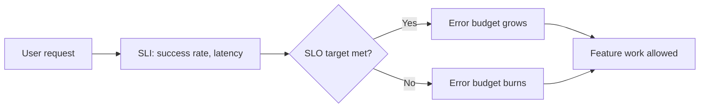

# SLI/SLO introduction

> **Learning Path:** Testing, Quality & Observability Foundations
> **Section:** 22.2.7 — Observability foundations

### The problem

You can monitor a service forever — CPU, latency, error rate, logs — and still not know if it's *good enough*. 

In a distributed system, "working" is not binary. A checkout API can return 200 OK but be 4 seconds slow. A model endpoint can be available but return garbage 2% of the time. Teams argue about priorities because "make it faster" has no shared definition.

You need a way to translate business expectations into measurable, observable properties that everyone agrees on, and to decide when to stop shipping features and fix reliability.

That need creates SLI/SLO.

### Mental model

Think of a doctor.

* **SLI** is the thermometer reading: a specific, measurable signal of health. e.g., request latency, success rate.
* **SLO** is the fever threshold: a target for that signal over a time window. e.g., p99 latency < 200ms for 99.9% of requests in 30 days.
* **Error budget** is how much fever you can tolerate before you must stop. If SLO is 99.9% availability, you have 43 minutes of downtime per month.
* **SLA** is the contract with the customer. SLO is internal, SLA is external. You set SLOs to meet SLAs with margin.

SLIs are not metrics for dashboards. They are the few signals that actually matter to users.

### How it works

1. **Pick SLIs from user perspective.** Start with the 4 golden signals: latency, traffic, errors, saturation. For an API, a good SLI is request success rate. For a queue, it is processing lag. For an AI inference service, it could be p95 latency and prediction quality drift.
2. **Define SLO as a target over a window.** Target + window. Example: 99.95% of requests succeed in 28 days. The window matters — a 30-day window smooths spikes, an hourly window drives alerting.
3. **Compute error budget.** `error budget = 1 - SLO`. Burn it when SLI misses target. Burn rate tells you how fast you're consuming budget.
4. **Use budget to gate work.** Green budget = ship features, experiments, risky refactors. Red budget = freeze changes, focus on reliability.

### Architectural reasoning

SLI/SLO solves the problem of *operational ambiguity*.

When it helps:
* Multiple teams own parts of a request path. SLOs make handoffs measurable.
* You need to prioritize reliability vs velocity with data, not opinions.
* You run services with real SLO commitments to customers.

Alternatives:
* Alert on every metric spike → alert fatigue, no prioritization.
* SLA only → external promise with no internal mechanism to keep it.
* Availability percentage without latency → hides degraded user experience.

Why choose SLI/SLO over ad-hoc alerting: it couples measurement to decision making. The error budget is an explicit trade-off knob between reliability and delivery speed.

### Trade-offs and failure modes

* **Wrong SLI = false confidence.** Measuring HTTP 200 rate while ignoring 5s latency is a classic failure. SLI must reflect user-perceived success.
* **Too many SLIs.** Each SLI needs ownership and alerting. Pick 2-4 per service max.
* **Overly aggressive SLO.** 99.999% sounds good but leaves almost no budget for deploys. You will either violate constantly or never ship.
* **Error budget gaming.** Teams can widen the window or change the SLI definition to stay green. SLOs must be stable and reviewed.
* **Latency vs availability conflict.** Improving one can hurt the other. You need separate SLIs or an composite SLI.

### Example

Payments API, enterprise SaaS.

User impact: checkout must complete fast and reliably.

SLIs chosen:
1. Availability: successful request rate
2. Latency: p99 request duration

SLOs:
* Availability ≥ 99.95% over 30 days
* p99 latency < 300ms over 30 days

Error budget = 0.05% downtime ≈ 21 min/month, and 0.05% of requests can be >300ms.

A deploy causes 10 minutes of 5xx errors. Budget burns 48% in one day. Policy triggers: freeze non-critical deploys, page on-call, run game-day. After budget recovers, feature work resumes.

This makes the trade-off explicit to product and engineering.

### Reasoning challenge

You are designing SLOs for a real-time AI chatbot inference service.

Which SLI would you choose first, and what SLO window would you use for alerting vs for quarterly reliability review? What would you *not* measure as an SLI even if it’s easy to instrument?

### Key takeaway

* SLIs are user-centric health signals, not all metrics. Pick few, meaningful ones.
* SLOs turn qualitative expectations into quantitative targets with a time window.
* Error budget is the operational currency that trades reliability for velocity.
* Good SLOs enable clear decisions about when to ship and when to fix.

You should be able to answer: What does this service promise to users, how do we measure it, and how much failure can we afford this month?
