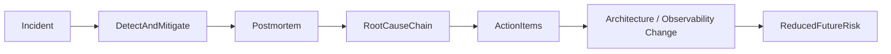

# Postmortems

> **Learning Path:** Testing, Quality & Observability Foundations
> **Section:** 22.3.1 — Incident & on-call basics

### The problem

Incidents happen even in well-engineered systems. The immediate problem is fixed under pressure, the service recovers, and the on-call engineer moves on.

The lingering problem is what you lose: why it happened, what signals were missed, and why it will happen again. Without a structured capture, that knowledge stays tribal, resets with team turnover, and repeats under a different name. Engineers also avoid reporting near-misses because they fear blame, which makes the system more fragile over time.

A postmortem exists to close that learning loop.

### Mental model

A postmortem is not a report card. It is a feedback mechanism from runtime failure back into design.

Think of it as: **Incident -> Understanding -> Prevention**. The goal is to improve the system, not to find who to punish. Blameless does not mean consequence-free; it means the focus is on conditions that allowed a mistake, not on the person who made it.

### How it works

A good postmortem is short, factual, and action-oriented.

* **Timeline.** What happened when, from first signal to resolution. Use logs, metrics, alerts. No interpretation yet.
* **Impact.** Users affected, duration, blast radius, data loss, revenue.
* **Root cause chain.** Not a single villain. What was the proximate cause and what made it possible? e.g., config change -> missing validation -> no canary -> deployment to prod.
* **Action items.** Specific, owned, prioritized fixes. Distinguish *remediations* that prevent recurrence from *corrective* work that improves detection.

Postmortems are written soon after the incident while memory is fresh, reviewed with those involved, and shared broadly without identifying individuals.

### Architectural reasoning

Postmortems help when you need to turn operational pain into architectural decisions.

They solve: repeated incidents, silent degradation, and missing safeguards. Alternatives like ad-hoc debriefs or skipping documentation save time now but cost reliability later.

You choose a formal postmortem when:
* The incident had customer impact, data risk, or could recur
* The fix involved a system-level change, not just a one-off revert
* You want to improve detection, containment, and recovery

They also drive observability design. A common pattern is an action item that becomes a new SLO, alert, dashboard, or guardrail: e.g., add a circuit breaker after a cascade, add a canary analysis after a bad deploy, add a metric for queue depth after silent backlog growth.

### Trade-offs and failure modes

* **Psychological safety vs speed.** If the process feels like blame, people will sanitize timelines. Blameless requires leadership modeling and enforcement.
* **Action item debt.** Teams generate dozens of todos. Without triage and ownership, the postmortem becomes theater. Prioritize by risk reduction per effort.
* **Over-analysis.** Spending weeks finding the "root root cause" delays learning. Good enough causality that enables prevention is the target.
* **Too narrow.** Focusing only on the service that failed misses upstream dependencies. Good postmortems trace across boundaries.

### Example

Payment service latency spikes to 5s P99 for 23 minutes during peak.

Timeline shows: new fraud model deployed at 14:02, latency rose at 14:07, alerts fired at 14:19, rollback at 14:25.

Root cause chain: model had unbounded feature fetch to a legacy DB with no timeout. Load increased under peak traffic. No canary or latency SLO gate on the deployment. Alerts existed but threshold was too high.

Action items: add request timeouts and retries with backoff to feature client; add canary with automated latency SLO check before full rollout; lower alert threshold and add SLO burn-rate alert.

The postmortem changed architecture, not just the model.

### Reasoning challenge

A minor 3-minute blip on an internal dashboard went unnoticed by users but was caught by synthetic monitoring. The on-call reverted a config change and moved on. Do you write a full postmortem?

Consider impact, recurrence risk, and whether the fix creates a precedent. What minimal learning would you capture, and what signals would make you escalate to a formal postmortem?

### Key takeaway

* Postmortems exist to convert incidents into system improvements, not to assign blame.
* The value is in the action items that change architecture, observability, and process, not the narrative.
* Psychological safety and timely, factual timelines determine quality more than template perfection.
* Treat postmortems as a reliability feedback loop: detect faster, contain smaller, learn once.
