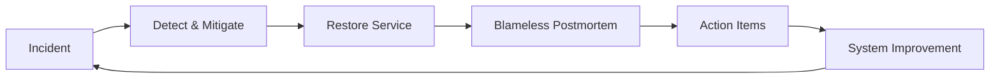

# Blameless culture

> **Learning Path:** Testing, Quality & Observability Foundations
> **Section:** 22.3.2 — Incident & on-call basics

**The problem**

Production incidents will happen. Systems are distributed, complex, and built by humans. When an outage hits, the immediate need is to restore service and understand why it failed.

The problem is not the failure. It is the response to failure.

If the response is blame, engineers hide mistakes, downplay signals, and slow down the postmortem. On-call engineers become defensive instead of transparent. Root cause analysis gets sanitized. The same failure mode returns.

With blame, you optimize for *who* to punish. Without it, you optimize for *what* to fix.

### Mental model

Blameless culture = treat incidents as system failures, not individual failures.

People are not the problem. The system that allowed a human mistake to become a customer-impacting outage is the problem.

The goal is psychological safety: anyone can report, escalate, or admit a mistake without fear of punishment. Safety enables speed and learning.

### How it works

It is operationalized through process and language.

**Incident response** is separated from **learning**. During the incident: fix first, ask questions later. No post-mortem in the war room.

**Blameless postmortem** happens after recovery. The format is fixed:

1. Timeline of events, sourced from logs/metrics
2. What went well / what went wrong
3. Contributing factors, not root cause
4. Action items with owners, categorized as: fix the system, improve detection, improve response

Language is enforced. Replace "who pushed the bad config" with "what allowed the bad config to reach production". Replace "mistake" with "gap".

The loop is closed by changing the system, not by retraining the person.

### Architectural reasoning

When it helps: high reliability systems with on-call, frequent deploys, and complex distributed interactions. Exactly where AI systems, financial platforms, and SaaS products live.

What it solves: 
* Faster incident resolution because engineers share information openly
* Better root cause analysis because logs are not hidden
* Compounding reliability improvements over time

Alternatives: Blame culture, punitive postmortems, and "five whys" used to find a person. Those create short-term accountability theater and long-term brittleness.

You would choose blameless when you want learning velocity > punishment velocity. You would not choose it if you have an actual policy violation or malicious act; those require separate, explicit handling.

### Trade-offs and failure modes

**Trade-offs**
* Psychological safety costs time upfront. Building trust and training facilitators is slower than firing people.
* It can feel like no accountability. You must pair it with clear ownership of action items and system changes.
* Requires strong observability. You cannot be blameless if you cannot reconstruct what happened.

**Failure modes**
* Performative blameless: document says blameless, meeting says "who did this". Engineers quickly learn the difference.
* No follow-through: postmortems produce action items that are never prioritized. Culture decays.
* Shifting blame to "process": using blameless as excuse to never improve guardrails.

### Example

Enterprise payment service, 15 min outage during peak.

Timeline shows: engineer deployed config change to reduce timeout from 30s to 3s to improve latency. Change passed tests, was approved, merged automatically. Production dependency started timing out, retry storm, cascade.

Blame response: engineer reprimanded, deploy freeze for 2 weeks.

Blameless response: Postmortem finds contributing factors:
* No canary for config changes
* Timeout change could reduce to any value, no validation
* No alert on retry rate spike
* Runbook missing for retry storm

Actions: add config schema validation, canary for all config, alert on retry rate, improve runbook. Engineer is not punished; they own the canary improvement.

System gets stronger. Next similar mistake is caught before customers notice.

### Reasoning challenge

Your team had a 45 minute outage caused by an on-call engineer who acknowledged an alert 20 minutes late and then misdiagnosed the problem, extending the incident.

The engineer admits fatigue from being on-call 4 nights in a row and missing the alert due to alert fatigue.

What is the correct focus of the postmortem, and what system changes do you propose? What do you *not* do?

### Key takeaway

* Incidents are system properties, not character flaws. Design for learning, not punishment.
* Speed of recovery depends on psychological safety. Safety comes from blameless language and consistent process.
* Close the loop with system changes: detection, prevention, and response improvements, not individual reprimands.
* Blameless does not mean consequence-free. Accountability moves from people to action items on the system.
