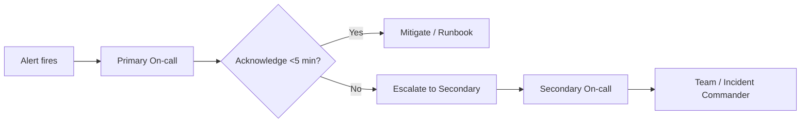

# On-call rotations

> **Learning Path:** Testing, Quality & Observability Foundations
> **Section:** 22.3.3 — Incident & on-call basics

**22.3.3 — Incident & on-call basics: On-call rotations**

### 1. The problem

Production systems fail at 3am on a Saturday. Not during business hours. You need a human who can assess, mitigate, and decide in minutes, not hours.

Constraints create the need:
* **Availability requirement:** SLA demands 24/7 response, but engineers sleep.
* **Expertise distribution:** Not everyone knows every service.
* **Cognitive load:** Constant vigilance burns people out.
* **Cost:** You cannot staff a full team awake all the time.

Without a plan, you get ad-hoc paging, slow MTTR, and engineers quitting.

### 2. Mental model

An on-call rotation is a *reliability shift schedule*.

Think of it like firefighting coverage for a building. You don’t need all firefighters on the floor, you need a guaranteed responder with the right keys and training, and a clear escalation path if the fire is bigger than one person.

The rotation makes the cost of availability predictable and shared.

### 3. How it works

The essential mechanism is not the pager, it is the contract:

* **Rotation:** Time-boxed ownership. Primary on-call for a service or domain, usually 1 week. Secondary provides backup.
* **Escalation policy:** Primary -> Secondary -> Manager / broader team. Time-based, not hope-based.
* **Alert routing:** Alerts come from observability, not from users. Routing is based on service ownership, not who is online.
* **Runbooks and SLOs:** What to do in first 5 minutes, when to page, when to degrade.

Mermaid for the flow:

Follow-the-sun rotations exist for global teams: handoff between regions so no one gets night shifts forever.

### 4. Architectural reasoning

When it helps:
* You have services with uptime SLOs > 99.9%
* Incidents require domain knowledge that cannot be automated immediately
* You need a clear owner for production risk

What problem it solves: It converts an unpredictable, system-wide liability into a bounded operational cost.

Alternatives:
* **Dedicated SRE/NOC team.** Works at scale, isolates engineers from on-call, but expensive and creates handoff friction.
* **Everyone is always on-call.** Cheap to start, destroys trust and velocity.
* **No on-call, ticket queue.** Acceptable for internal tools with low impact. Unacceptable for customer-facing revenue paths.

Decision point for an architect: Choose rotation granularity by blast radius and expertise. One rotation per service is too noisy. One rotation per business domain is usually right.

### 5. Trade-offs and failure modes

The few trade-offs that matter:

* **Coverage vs. cognitive load.** Smaller rotations = fewer pages per person, but more people need context.
* **Primary vs. secondary depth.** Secondary must be able to actually help, not just re-page.
* **Alert fatigue.** Bad thresholds turn on-call into a no-op. Good on-call requires good alerting: actionable, correlated, and tied to SLOs.
* **Burnout and bus factor.** If one person is the only expert, rotation is theater. Rotation forces knowledge sharing and documentation.

Common failure modes:
* Pager without runbook = panic.
* Escalation without timeout = silence.
* Rotation without postmortem = repeated pages.
* No off-call protection = engineers work 24/7.

### 6. Example

Payment processing service at an e-commerce platform. SLO: 99.95% availability, error budget 21 min/month.

Architecture: Service owns a primary on-call rotation of 2 engineers per week, secondary rotation from adjacent checkout team. Alerts route from Prometheus + SLO dashboard via PagerDuty to primary.

Incident at 2am: latency spike breaches burn rate. Primary acknowledges, runs runbook: check DB replica lag, check checkout queue depth. Finds failing deployment. Mitigates by rolling back. Secondary is paged only if primary does not acknowledge in 5 min. Postmortem next day updates alert threshold and adds automated rollback.

The rotation didn’t prevent the bug, it bounded response time and ensured the right context was awake.

### 7. Reasoning challenge

You are designing on-call for a new AI inference API with three models: recommendation, search rerank, and billing classification. Team is 6 engineers, globally distributed. Recommendation is customer-facing, 99.9% SLO. Search rerank is internal, 99% SLO. Billing classification is revenue-critical, 99.99% SLO.

How many rotations do you create, and who is primary vs. secondary? What do you do about the night shift?

Think about blast radius, expertise overlap, and alert noise.

### 8. Key takeaway

* On-call exists to make 24/7 reliability *predictable and fair*, not to create heroes.
* Rotation design is an architectural decision about blast radius, expertise, and cost.
* Good on-call requires good alerting, runbooks, and postmortems, not just a schedule.
* The goal is not faster paging, it is lower MTTR and sustainable ownership.
