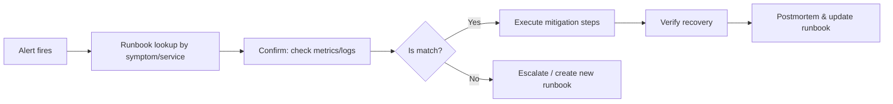

# Runbooks

> **Learning Path:** Testing, Quality & Observability Foundations
> **Section:** 22.3.4 — Incident & on-call basics

**The problem**

Incidents don't happen at 10am on a Tuesday with the original author on call. They happen at 2am to an engineer who has never seen this failure mode before, under time pressure, with incomplete context, and a production system degrading.

The constraint is human: cognitive load is high, memory is unreliable, and tribal knowledge is not a scalability strategy. The cost is MTTR, error rates during remediation, and on-call burnout.

Without a shared, executable source of truth, each incident becomes an ad-hoc investigation. That creates inconsistent responses, repeated mistakes, and heroics instead of operability.

**Mental model**

A runbook is an operational playbook for a known failure mode. It is not documentation for its own sake. It is a decision aid that converts symptoms into actions under stress.

Think of it as the difference between "figure out how to restart the payment service" and "follow the payment-service-latency runbook".

**How it works**

A good runbook is short, symptom-driven, and time-boxed.

`Symptom -> Confirm -> Contain -> Mitigate -> Verify -> Escalate`

It starts with observable signals you can match to an alert, not abstract theory. It gives exact commands, thresholds, and expected outputs. It defines success criteria and when to stop and escalate.

It lives next to the system it describes, is versioned, and is linked from alerts. The best runbooks are tested.

**Architectural reasoning**

Runbooks help when:
* Failure modes are recurrent and high-impact
* The blast radius of a wrong action is large
* On-call rotation means expertise is distributed
* You need auditability for compliance

Alternatives exist. Tribal knowledge is cheap until it isn't. Chat history is searchable but noisy and untested. Full automation is ideal for some cases, but you still need a runbook for the automation failure itself.

The architectural decision is: where on the spectrum from manual playbook to automated remediation do you sit, and what human-in-the-loop guardrails do you keep.

Runbooks enable a layered response architecture: detection -> triage -> automated containment -> guided manual remediation -> escalation.

**Trade-offs and failure modes**

* Stale runbooks are worse than none. They create false confidence. Runbooks must be treated as production code: reviewed, tested in game days, and updated in postmortems.
* Over-specification. A 40-page runbook won't be read at 2am. If it takes >5 minutes to find the right step, it fails.
* Too many runbooks. Engineers ignore them. Prioritize by frequency x severity.
* Runbook as excuse to avoid automation. If a step is repeated weekly, automate it. Runbooks should shrink over time.

The core trade-off is maintenance cost vs MTTR and error reduction. Good runbooks are expensive to write, cheap to run, and expensive to maintain.

**Example**

Payment service p95 latency >2s.

Runbook: `payments-latency-high`

1. Confirm: check `payments_queue_depth` and `db_replica_lag`. Expected: queue depth >1000 or replica lag >5s.
2. Contain: if queue depth high, enable rate limit `payments.inbound=50%` via feature flag.
3. Mitigate: if replica lag, promote replica `payments-db-replica-us-west-2b` following DB failover runbook section 3.
4. Verify: p95 <500ms for 5 min, error rate <0.1%.
5. Escalate: if no improvement in 10 min, page DBA on-call.

Linked from alert `PaymentsLatencyHigh` and tested quarterly in chaos drill.

**Reasoning challenge**

You have a new AI inference service with rare, non-deterministic latency spikes. The root cause is unclear and changes weekly. Do you invest in detailed runbooks now, or focus on better observability and automated canary rollback? What criteria would make you change that decision?

**Key takeaway**

* Runbooks exist to reduce cognitive load and variance during incidents, not to document everything.
* A runbook is good if an unfamiliar on-call engineer can execute it correctly under stress in <10 minutes.
* Treat runbooks as living operational code: versioned, linked to alerts, tested, and updated in postmortems.
* Automate what is repetitive; keep runbooks for judgment-bound failures and as the fallback when automation fails.
