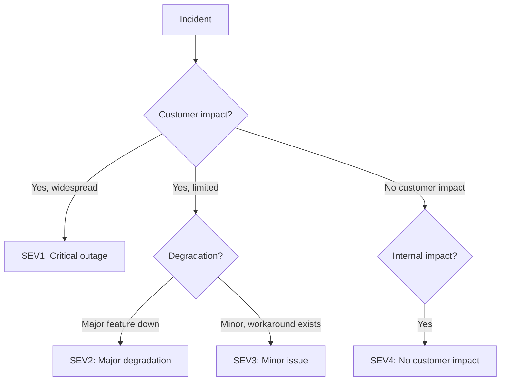

# Incident severity levels

> **Learning Path:** Testing, Quality & Observability Foundations
> **Section:** 22.3.5 — Incident & on-call basics

### 1. The problem

An incident is happening. Pages are firing, Slack is noisy, three engineers are already in a Zoom call. The critical question is not *what* is broken, it's *how much does it matter right now* and *who needs to do what*.

Without a shared severity, you get two failure modes:
* Everything is an emergency. Engineers burn out, alert fatigue sets in, and real outages get lost in noise.
* Everything is low priority. A revenue-impacting outage waits for business hours because no one agreed it was urgent.

Severity levels are a triage protocol for a distributed system under stress. They convert ambiguous impact into an operational decision: how fast, how many people, and with what authority.

### 2. Mental model

Think of severity as hospital triage, not as a bug rating.

Severity = **blast radius × urgency × business impact**, assessed at the moment of detection, not after root cause is known.

It is not a measure of technical complexity. A simple config error can be SEV1. A deep database bug that affects one internal tool can be SEV4.

### 3. How it works

Most orgs use SEV1-4. The exact names vary, the logic does not.

* **SEV1 - Critical outage:** Service is down or core functionality is unusable for a large portion of customers. Revenue/security/reputation is at immediate risk. All hands, exec escalation, war room now.
* **SEV2 - Major degradation:** Significant portion of customers affected, or critical feature degraded with no easy workaround. High priority fix, on-call + additional engineers.
* **SEV3 - Minor issue:** Limited impact, workaround exists, or small subset of users. Normal backlog priority, can wait for next on-call rotation.
* **SEV4 - No customer impact:** Internal tooling, flaky test, minor alert. Track, don't page.

Severity is set early, often by the first responder, and can be escalated as impact grows. It drives the response playbook, not the post-mortem.

### 4. Architectural reasoning

Severity enables **scalable incident response**.

When it helps:
* You have on-call rotations and need to decide who to wake up.
* You need a consistent escalation policy across teams.
* You want to measure operational health, e.g., SEV1 rate per quarter.

What it solves:
* Prioritization under uncertainty. You don't need full diagnosis to start mobilizing the right level of resources.
* Communication. "SEV1" is a shorthand for impact and expected response time.
* Accountability. Severity definitions make it clear when a response was appropriate or not.

Alternatives: impact-based tagging, custom priority per service. Those work for small teams but break down at scale. Severity is a shared language.

### 5. Trade-offs and failure modes

* **Under-severing:** Fear of escalation leads to labeling a customer-impacting outage as SEV3. Result: slow response, longer MTTR, customer churn.
* **Over-severing:** Everything is SEV1. Result: alert fatigue, engineers stop trusting pages, escalation loses meaning.
* **Severity inflation by SLOs:** Teams may define severity by error budget burn rate rather than actual user impact. Good for automation, bad if it divorces from customer reality.
* **Static definitions:** If SEV1 is defined only as "service down", degraded performance that silently loses revenue may never get escalated.

The architect's job is to keep severity tied to *customer and business impact*, not internal technical signals alone.

### 6. Example

E-commerce platform on Black Friday.

* Search service latency p99 jumps from 200ms to 4s, checkout succeeds but 30% of users abandon. No errors, just slowness. First responder sets SEV1 because revenue impact is immediate and widespread. Engineering manager paged, war room opened, feature flag to degrade search results to cached version.
* Same day, internal CI dashboard is down for one team. SEV4. Logged, fixed next business day.

Same root cause class — latency — different severity because blast radius and business impact differ.

### 7. Reasoning challenge

Your payment API is returning 5xx for 0.5% of requests, only for users in EU, only on mobile. Success rate overall is 99.95%. No workaround. It's 2am local time for the US on-call.

What severity do you set now, and what information would change it? Consider impact, not error rate.

### 8. Key takeaway

* Severity is a triage decision about *customer impact now*, not technical severity.
* It standardizes who responds, how fast, and with what authority.
* Keep definitions simple, impact-based, and consistently applied. Review them after real incidents.
* SEV1 rate is a useful operational health metric, not a performance review target.
