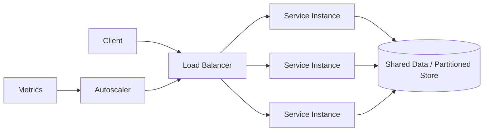

# Scalability

> **Learning Path:** Reliability Engineering & Cost Fundamentals
> **Section:** 23.1.1 — Non-functional requirements

### 1. The problem

A working system hits a wall when demand grows. More users, larger payloads, bigger models, longer peak windows. Latency climbs, errors rise, costs explode. The business asks for "handle 10x traffic next quarter" and the existing architecture starts to degrade.

Scalability is not a feature. It is a non-functional requirement that forces a decision about how capacity is added under constraints: latency SLOs, cost budget, team operational load, and data consistency.

The core problem is coupling capacity to a single unit.

### 2. Mental model

Think of capacity as lanes on a highway.

Vertical scaling = widening the existing road. One bigger server, more CPU/RAM. Simpler, but you hit a max width, downtime to upgrade, and a single point of failure.

Horizontal scaling = adding more parallel roads with on-ramps and traffic distribution. More instances, partitioned data, load balancing. More complex to coordinate, but capacity is additive and failures are isolated.

Scalability means you can increase throughput and lower latency by adding units, not by rebuilding the system.

### 3. How it works

Scalable systems are designed to be elastic, not just big.

* **Stateless compute.** Requests can go to any instance. Session state moves to a shared store or JWT. This enables any instance to be added/removed without coordination.
* **Partitioning.** Work is split by key: shard users, topics, or requests. Each partition has a bounded load.
* **Decoupling.** Producers and consumers are separated by queues/streams. Bursts are absorbed, and consumers can scale independently.
* **Autoscaling signals.** Metrics like queue length, CPU, p95 latency drive scale out/in. Scale out is fast, scale in must be safe to avoid thrashing.

Capacity is added at the unit of scale: instance, partition, shard, or replica.

### 4. Architectural reasoning

When does scalability help?

* Demand is variable or unpredictable. Peaks for sales, news events, model inference spikes.
* Failure isolation matters. Losing one instance should not lose the service.
* Cost efficiency at low load. You want to pay for capacity you use, not provisioned peak.

Alternatives and why you might not choose them:

* **Scale up.** Choose when you have a hard data locality constraint, a license model tied to instances, or a short horizon where complexity cost outweighs benefit.
* **Scale out.** Choose when throughput is the bottleneck and the workload is partitionable.

Decision rule: If you can make the unit of work independent and move state out, prefer horizontal. If you cannot, you are architecturally capped.

### 5. Trade-offs and failure modes

* **Complexity vs elasticity.** More instances = more coordination, partitioning logic, distributed transactions, and observability cost.
* **Consistency vs availability.** Partitioned data makes strong consistency expensive. You trade latency and availability for partition tolerance.
* **Cost pattern.** Horizontal scale out shifts cost from over-provisioning to orchestration. Autoscaling can be expensive if signals are noisy and scale-in is too aggressive.
* **Failure modes architects miss:** hot partitions where one shard gets all traffic; thundering herd on scale up; stateful components that cannot be added; and data gravity where moving state is more expensive than scaling compute.

Scalability without observability is blind. You need per-partition load, error budgets, and saturation signals to know if you are actually scaling.

### 6. Example

AI inference API for image moderation.

Initial: one GPU server. Latency OK at 100 RPS. Launch with a mobile app -> 2,000 RPS peak, p95 latency >2s, queue drops.

Architectural response:

* Make inference workers stateless. Model loaded in memory, requests are independent.
* Put a queue in front. API writes to Kafka, workers pull and process. This decouples ingest from processing.
* Shard by tenant and autoscale workers on queue length and GPU utilization.
* Store results in partitioned DB, read via cache.

Result: peak handled by adding workers, failures limited to one worker, cost scales with actual demand. The trade-off is added latency from queueing and operational complexity of managing partitions and model versioning.

### 7. Reasoning challenge

You have a relational Postgres service with strong transactional consistency for payments. Traffic is growing 3x YoY, reads dominate writes 20:1. Latency SLO is 200ms p95.

Do you scale up the primary, add read replicas, shard the database, or cache aggressively? What non-functional requirement forces the choice and what fails first if you get it wrong?

### 8. Key takeaway

* Scalability is about adding capacity by adding units, not making one unit bigger.
* Horizontal scale requires statelessness, partitioning, and decoupling. Without those, you are capped.
* The real cost is operational: complexity, consistency, and observability, not just hardware.
* Design for the bottleneck you will hit next: compute, storage, network, or coordination.
