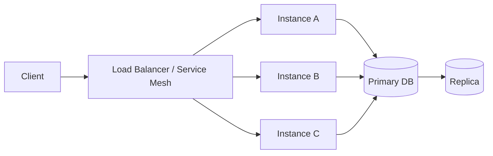

# Availability

> **Learning Path:** Reliability Engineering & Cost Fundamentals
> **Section:** 23.1.2 — Non-functional requirements

### 1. The problem

Users don't care why your service is down, only that it is. For an engineer, availability is the probability that a request gets a correct response within an acceptable time window.

The problem isn't building something that works when everything is perfect. It's building something that continues to work when things fail — networks partition, disks die, deployments go bad, traffic spikes 10x.

Availability forces you to design for failure as the normal case, not the exception.

### 2. Mental model

Think of availability as a budget you spend on downtime.

Availability = Uptime / Total time

99.9% "three nines" sounds great until you translate it:
* 99.9% = ~43 minutes downtime per month
* 99.99% = ~4 minutes per month
* 99.999% = ~26 seconds per month

Each nine costs exponentially more in architecture, ops, and money. The question is not "how available can we be?" but "how available do we need to be for this workload, and what are we willing to pay for it?"

### 3. How it works

Availability is not one feature, it's a set of mechanisms that hide failures from the caller.

Essential mechanisms:
* **Redundancy:** Multiple instances across failure domains. One dies, traffic shifts.
* **Health checking + automatic failover:** Detect unhealthy nodes fast and stop sending traffic.
* **Replication:** Data and state replicated so a single node loss is not data loss.
* **Graceful degradation:** Core path stays up even if non-critical features are shed.
* **Isolation:** Blast radius containment via bulkheads, circuit breakers, rate limiting.

These mechanisms work together to turn hard failures into soft latency or partial loss.

### 4. Architectural reasoning

When does availability matter most? When the cost of unavailability > cost of building for it.

Choose high availability when:
* The service is a critical dependency for revenue or safety
* Downtime has a direct financial penalty or SLA
* Failure is correlated across users, not isolated

Alternatives exist on a spectrum:
* **Single instance, no redundancy:** Cheapest, acceptable for internal tools with manual restart windows
* **Active-passive:** One standby, cheaper than active-active but failover takes minutes
* **Active-active with multi-zone replication:** Highest availability, highest complexity and cost

The decision is driven by SLOs, not technology. Define the SLO first: e.g., 99.95% availability, p95 latency < 500ms. Then design backwards to meet it.

### 5. Trade-offs and failure modes

**Availability vs Consistency.** In distributed systems you often trade one for the other. A highly available system may serve stale data during a partition. That's the CAP trade-off in practice.

**Availability vs Cost.** Each nine roughly doubles cost. Redundancy, cross-region replication, and over-provisioning are expensive.

**Availability vs Complexity.** More failover logic creates new failure modes: split-brain, flapping, thundering herd on recovery.

Common failure modes architects miss:
* **Cascading failure:** One slow dependency causes thread exhaustion and takes down the whole service. Mitigated by timeouts, retries with jitter, circuit breakers.
* **Failover that fails:** Health checks too aggressive, causing churn. Or failover takes longer than the outage window.
* **Data availability vs service availability:** Service is up but database is read-only. Availability of data path matters as much as compute.

### 6. Example

Payment authorization API for an e-commerce platform.

Requirement: 99.95% availability during checkout. Downtime = lost revenue and cart abandonment.

Architecture decision:
* Stateless API tier behind a regional load balancer with 3+ instances per AZ, autoscaling.
* Database with synchronous primary + asynchronous read replicas in same region, plus cross-region async replica for disaster recovery.
* Circuit breaker to fraud scoring service. If it times out, allow transaction with higher risk score instead of blocking checkout.
* Feature flag to disable non-critical post-purchase recommendations during overload.

Result: A single AZ failure or DB primary crash doesn't cause outage. The service degrades but checkout remains available. The error budget is preserved for planned deployments.

### 7. Reasoning challenge

You are architecting a new AI inference service for real-time chat. Latency SLO is p95 < 800ms. Traffic is bursty, cost is a concern.

Option A: Single large GPU pool in one region, autoscaling enabled, 99.9% availability target.

Option B: Two smaller GPU pools in two regions with active-active routing and model replication, 99.99% target.

What do you choose and what is the key trade-off you must validate with the business?

### 8. Key takeaway

* Availability is a business decision expressed as an SLO, not a technical checkbox.
* Design for failure: redundancy, health checks, failover, and graceful degradation are the core tools.
* Each additional nine of availability costs disproportionately more in complexity and money.
* Availability always trades against consistency and cost; make the trade explicit.

You should now be able to reason: given a workload's cost of downtime, define a realistic SLO, choose the minimal architecture that meets it, and anticipate the failure modes that will erode it.
