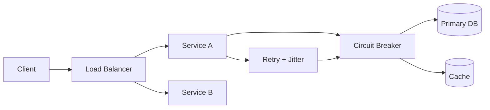

# Reliability

> **Learning Path:** Reliability Engineering & Cost Fundamentals
> **Section:** 23.1.3 — Non-functional requirements

**The problem**

You ship a feature that works perfectly in staging. In production it fails at 2am on a Saturday during a traffic spike. A database connection pool exhausts, a downstream API times out, and the checkout flow hangs. Users see errors, retries amplify the load, and the on-call engineer is paged.

The problem is not a missing feature. It is that the system does not continue to do its required job under real-world conditions: load, failures, partial outages, bad input, and human error.

Reliability is the non-functional requirement that answers: *how likely is the system to keep working, and for how long, when the world is messy.*

**Mental model**

Reliability = probability of successful operation over time under stated conditions.

Think of it as a contract with reality. Availability is a subset: is the service up right now? Durability is another: will data survive? Reliability ties them together: can the system perform its function despite faults.

A useful mental model is *failure budget, not perfection*. You cannot eliminate failures. You can decide how much failure you can afford and design to stay within it.

**How it works**

Reliability is made observable and manageable with three primitives:

1. **SLI/SLO/Error budget.** SLI = how you measure. e.g., `successful_checkout / total_checkout_attempts` over 5 min. SLO = target, e.g., 99.95% success. Error budget = how much failure you can consume before you must stop shipping risky changes.

2. **Fault containment.** Isolate failure domains so one component fails without taking the system down. Timeouts, bulkheads, circuit breakers, retries with jitter.

3. **Graceful degradation.** Define a core happy path that must stay reliable, and degrade non-critical paths. Read from cache if DB is slow. Serve stale data rather than error.

The diagram shows containment: LB spreads load, circuit breaker stops cascading failures, cache provides fallback.

**Architectural reasoning**

Reliability helps when the cost of failure exceeds the cost of prevention.

Choose it when:
* Business impact of downtime is high: payments, auth, core checkout.
* Users cannot retry easily or trust is fragile.
* Dependencies are outside your control.

It solves: unpredictable outages, cascading failures, and silent data loss.

Alternatives and why you might not choose maximal reliability:
* **Best effort vs strong guarantee.** A batch analytics job can tolerate delay. A payment cannot.
* **Synchronous replication** gives stronger consistency and durability but adds latency and write amplification.
* **Eventual consistency** improves availability and throughput but requires idempotency and reconciliation.

The decision is not "make everything reliable". It is *which parts must be reliable, to what degree, and for how long*.

**Trade-offs and failure modes**

* **Cost vs reliability.** Redundancy, multi-region, and active-active clusters cost more. The error budget tells you if the spend is justified.
* **Complexity vs resilience.** Circuit breakers, retries, and fallbacks add code paths that themselves can fail. Over-engineering creates new failure modes.
* **Latency vs safety.** Strong consistency and synchronous writes improve reliability at the cost of latency. At scale, latency becomes reliability.
* **Common failure modes:** retry storms without jitter, thundering herd on recovery, partial writes leading to inconsistency, and monitoring blind spots where you measure availability but not correctness.

**Example**

A payment processing service.

Functional requirement: charge a card and return a result.

Reliability requirements derived from business:
* SLO: 99.99% successful authorizations, measured as 5xx-free responses within 2s.
* RPO < 1 minute, RTO < 5 minutes for regional failure.
* Degrade: if fraud scoring is slow, allow payment with basic checks and queue async scoring.

Architecture choices: multi-AZ deployment with active-passive DB, read replicas for balance queries, circuit breaker to payment gateway with exponential backoff, idempotent request IDs to safely retry, and a write-ahead log for durability. Error budget gates releases; if budget is low, roll back.

**Reasoning challenge**

You have a user profile service with two options:
A. Synchronous replication to 3 regions. Writes are ~120ms, availability high, cost high.
B. Asynchronous replication with local writes. Writes are ~20ms, but a regional failover may lose the last ~5 seconds of writes.

User profiles are read 100x more than written. A missed update is annoying but not revenue-impacting. Writes must eventually succeed.

Which do you choose and what reliability mechanisms do you add to make it safe? What SLI do you pick?

**Key takeaway**

* Reliability is a non-functional requirement defined by SLOs, not by good intentions.
* Design for failure containment and graceful degradation, not for zero failure.
* Spend reliability budget where business impact is highest; accept best-effort elsewhere.
* Measure correctness and latency, not just uptime. An up service that returns wrong data is unreliable.
