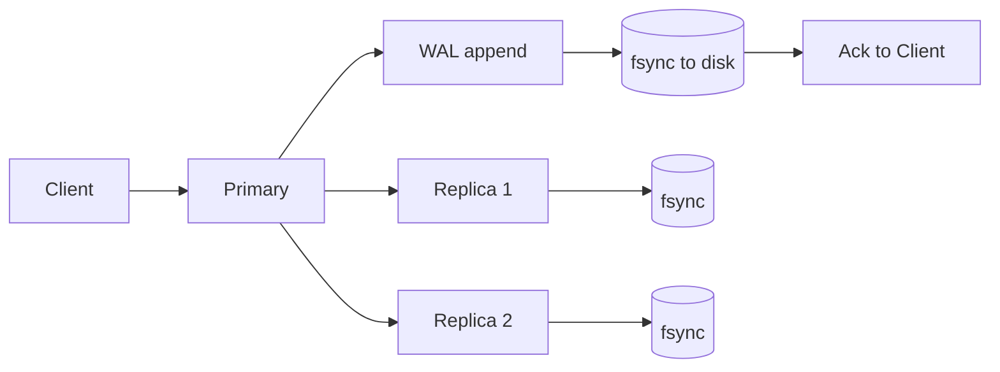

# Durability

> **Learning Path:** Reliability Engineering & Cost Fundamentals
> **Section:** 23.1.4 — Non-functional requirements

**Durability**

### 1. The problem

You tell a client "write successful". Then the process crashes, power fails, or a disk dies. Is the data gone?

Durability is the non-functional requirement that answers this: **once a write is acknowledged, it survives failures**. Not just temporary unavailability, but permanent loss.

Availability lets you read. Durability lets you trust the write.

The problem appears everywhere: a payment is recorded then lost on restart, a user profile update disappears after a node crash, a training run checkpoint is gone because the volume was ephemeral. The cost is not downtime, it is data loss and business inconsistency that cannot be replayed.

### 2. Mental model

Think of durability as a promise about persistence, not uptime.

`acknowledged = durable`

If you cannot guarantee that, you must not acknowledge. Durability is the bridge between volatile memory and permanent storage.

Analogy: a notary. The document is only durable when it is in the bound ledger and ink is dry, not when it is on the clerk's desk.

### 3. How it works

Durability is implemented with two mechanisms: local persistence and replication.

Local persistence:
Write-ahead log + fsync. Data is appended to a sequential log and flushed to stable storage before ack. This protects against single-node crash and power loss.

Replication:
A write is not durable on one node. It is durable when it is stored on enough independent replicas to survive node, rack, or zone failures. A quorum write means a majority of replicas have fsync'd.

The critical decision point is *when* to send the ack: after local write, after local fsync, or after replica fsync. Each step increases durability and latency.

### 4. Architectural reasoning

Use durability when data loss is more expensive than latency or storage cost.

* Financial ledgers, inventory, user identity, audit logs
* AI training datasets and model artifacts that are expensive to recreate
* RAG vector stores where re-ingestion costs are high

Alternatives:
* Ephemeral caches and in-memory queues: fast, cheap, not durable. Accept loss.
* Async replication with eventual durability: lower latency, risk of loss on failure window.

You choose durability level by matching RPO to business impact. RPO = 0 means no acknowledged write can be lost. RPO > 0 accepts a window of loss.

### 5. Trade-offs and failure modes

* **Latency vs durability.** fsync and cross-region replication add tens to hundreds of ms. You pay per write.
* **Cost vs durability.** 3x replication, SSD with power loss protection, and cross-zone storage increase cost 2-5x vs single copy.
* **Availability vs durability.** Strict durability can reduce availability during partitions. Waiting for a quorum may block writes if replicas are down. This is the classic CP tension.
* **Failure modes architects miss.** 
  - Ack before fsync: data loss on crash
  - Replication lag: primary fails after ack but before replica persists
  - Silent corruption: no checksum/validation on read
  - Partial writes: crash mid-append without WAL ordering

Durability is not a feature flag. It is a contract enforced by write path design.

### 6. Example

Payments service. A debit must survive a node crash immediately after ack.

Architecture: write to primary WAL, fsync locally, replicate synchronously to 2 other AZs, ack after majority fsync. Reads can be served from local replica for availability.

If you ack after local memory only, a crash loses the payment and creates money with no record. If you ack after async replication, a zone failure can lose the last seconds of writes. The business cost of an orphan debit outweighs the extra latency.

For model checkpoints in training: durability means write to durable object storage with versioning, not a local tmp file. Retraining costs dominate storage cost.

### 7. Reasoning challenge

You are designing a real-time recommendation feature with a high-throughput event stream. Writes must be fast. You can either:
A) Ack after in-memory write with background flush every 5s
B) Ack after fsync to local SSD only
C) Ack after quorum replication across 3 zones

Which do you choose for user click events vs for final purchase events? What is your RPO for each and why?

### 8. Key takeaway

* Durability means acknowledged writes survive crashes, not just that the system is up.
* It is enforced by WAL + fsync locally and quorum replication across failures.
* The core trade-off is latency and cost vs RPO.
* Never ack a write before the durability condition you promised is met.
* Design durability per data class: not all data needs the same RPO.
