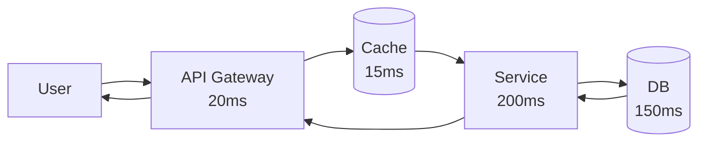

# Performance requirements

> **Learning Path:** Reliability Engineering & Cost Fundamentals
> **Section:** 23.1.6 — Non-functional requirements

**Performance requirements**

### The problem
A feature works in dev and passes QA, then degrades in production. Page loads jump from 200ms to 4s at peak. An AI inference that was fine for 10 requests/min times out at 100/min. Users abandon, costs spike, SLOs breach.

Functional correctness is not enough. Performance is a contract with users and the business. Without explicit performance requirements you optimize for the wrong thing, or optimize too late when changes are expensive.

### Mental model
Performance requirements are promises, not wishes. They translate business needs into measurable system behavior.

* **Latency:** How long does a single request take? Users care about p95/p99, not average.
* **Throughput:** How many requests per second can you sustain?
* **Scalability:** How does latency/throughput change with load?
* **Efficiency:** Cost per request, CPU/memory per transaction.

Think of a latency budget. You have 500ms end-to-end for a checkout. That budget is split across components.

If DB takes 200ms, the budget is blown. You don't get to add it up later.

### Architectural reasoning
Performance requirements drive architecture before code.

**When it helps:** User-facing synchronous paths, billing/real-time decisions, AI inference with cost per token, high-volume ingestion.

**Options and why you choose them:**
* **Reduce work:** Caching, read replicas, pre-computation. Choose when reads dominate writes and staleness is tolerable.
* **Reduce distance:** Edge, colocate services, reduce hops. Choose for latency-sensitive global users.
* **Parallelize / async:** Queue work, batch, streaming. Choose when durability matters more than immediate response.
* **Provision for peak:** Over-provision, autoscale, rate limiting. Choose when bursts are predictable and cost of miss is high.

The decision is not "make it fast". It is: *what latency at what percentile, for what load, at what cost, with what failure mode?*

### Trade-offs and failure modes
* **Latency vs Cost:** Lower p99 latency means larger provisioned capacity or more aggressive caching. You pay for headroom you rarely use.
* **Latency vs Consistency:** Strong consistency adds coordination. Eventually consistent reads are faster and cheaper.
* **Throughput vs Latency:** Throughput can be increased by batching, which increases per-request latency.
* **Optimizing too early:** Premature caching adds complexity and invalidation bugs. Measure first, then budget.

Common failure modes: tail latency from GC pauses, noisy neighbor in shared infra, thundering herd on cache miss, unbounded queues causing latency spikes, and cost blow-up from autoscaling on a traffic spike you could have shed.

### Example
Enterprise search with AI reranking.

Requirement: p95 < 800ms for 5k QPS, p99 < 1500ms. Cost target $0.001/query.

Reasoning leads to: 
* First pass retrieval from vector DB with 200ms budget.
* Rerank only top 20 candidates, not 1000, to keep inference under 400ms.
* Cache popular queries for 60s. 
* Async write path for index updates, separate from read path.

If you tried to rerank 1000 candidates synchronously, you would hit p99 > 3s and cost 3x. The requirement forces the design.

### Reasoning challenge
Your AI chatbot has p95 latency 1.2s today at 200 RPS. Product wants to launch a live demo expecting 2k RPS with p95 < 1s. You can add caching, model distillation, or autoscale GPUs.

Which do you explore first, and what measurement do you need before committing? What is the risk of choosing the wrong lever?

### Key takeaway
* Performance requirements are measurable SLOs, not adjectives like "fast".
* Design from a latency budget down, not from components up.
* Latency, throughput, cost and consistency trade off against each other; you choose based on business impact.
* Optimize the critical path first, measure p95/p99 under realistic load, and make failure modes explicit.
