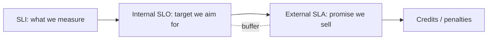

# SLA

> **Learning Path:** Reliability Engineering & Cost Fundamentals
> **Section:** 23.1.7 — Non-functional requirements

### The problem

You ship a distributed service. Users experience slow pages, errors, and downtime. The team says "it's fine", users say "it's broken". Without a shared definition of "good", you either over-provision everything to be safe, or get blindsided by incidents.

Cost makes it worse. Higher availability costs more: redundancy, multi-region, faster hardware. You need a way to translate business risk into an engineering target and a commercial promise.

That is what SLA solves.

### Mental model

An SLA is a contract about non-functional behavior, not features. It says: *under these conditions, we will deliver this level of service, measured this way, or we pay you back.*

It is the external face of an internal control loop:

SLI = Service Level Indicator, the metric. SLO = Service Level Objective, the internal target. SLA = Service Level Agreement, the contractual commitment. The buffer between SLO and SLA is deliberate.

### How it works

An SLA is defined by four things:

* **What** is measured. Availability, latency p95/p99, throughput, error rate, data durability.
* **How** it is measured. Measurement window, aggregation method, exclusions. Is downtime measured from the client or the edge? Are planned maintenance windows excluded?
* **Target**. e.g., 99.9% availability monthly = ~43m downtime/month.
* **Consequence**. Service credits, refunds, termination rights.

The architecture to support it is measurement + error budget. You instrument SLIs, aggregate them reliably, alert on burn rate, and stop deploying when the error budget is exhausted.

### Architectural reasoning

When it helps:
* Multi-party systems where reliability is a commercial risk. SaaS, payment APIs, cloud infra.
* You need to allocate cost. An SLA forces you to decide how much reliability the business will pay for.
* It creates a shared language between product, ops, and customers.

Alternatives:
* No formal SLA, just best effort. Cheap, but no trust for critical workloads.
* Internal SLOs only. Good for engineering discipline, but doesn't align incentives with customers.

Why choose an SLA: you are selling reliability as a product. The SLA sets the budget for redundancy, autoscaling, multi-region, and on-call.

Why not: early stage products with volatile traffic. SLAs lock you into measurement definitions and remediation costs before you know failure modes.

### Trade-offs and failure modes

* **Availability vs cost.** 99.9% to 99.99% is 10x less downtime but often 3-10x more cost due to redundancy, active-active regions, and faster failover.
* **Scope vs trust.** Too many exclusions make an SLA meaningless. Too few make it unaffordable. The measurement definition is the real contract.
* **Gaming the metric.** If you measure availability at the load balancer, backend failures are invisible. Architects must define SLIs that match user experience.
* **Error budget exhaustion.** Teams tempted to ship through a degraded SLO to hit roadmap. The SLA forces a decision: degrade feature velocity or degrade reliability.

Common failure: promising latency SLOs without controlling tail latency. p99 latency is driven by queueing, cold starts, and downstream variance, not average CPU.

### Example

Enterprise payment API.

Business need: merchants cannot retry payments indefinitely. Customer impact is lost revenue.

Decision: Offer 99.95% availability monthly, p99 latency < 500ms, measured from merchant edge.

Architecture implications:
* Multi-AZ active-active with regional failover. 
* Circuit breakers and bulkheads to protect p99.
* Separate SLI dashboards for availability and latency, with error budget burn rate alerts.
* Internal SLOs set to 99.98% availability and p99 < 400ms to leave buffer for incidents.

Cost: higher than best-effort, but the SLA lets the business price the service and the team knows when to stop shipping risky changes.

### Reasoning challenge

You are architecting a new AI inference API for a startup. Latency matters, but traffic is spiky and model cost dominates. A large prospect asks for a 99.99% availability SLA with <200ms p99 latency and 10% service credit for breaches.

What do you need to validate before agreeing, and what architectural decisions does that force you to make?

### Key takeaway

* SLA is a commercial translation of reliability. SLO is the internal target, SLA is the external promise with buffer.
* Define SLIs from user perspective, not infrastructure metrics. Measurement definition is the contract.
* Every 9 adds ~10x cost and complexity. Choose the target from business risk, not vanity.
* Use error budgets to balance reliability and delivery speed. The SLA tells you how much error you can afford.
