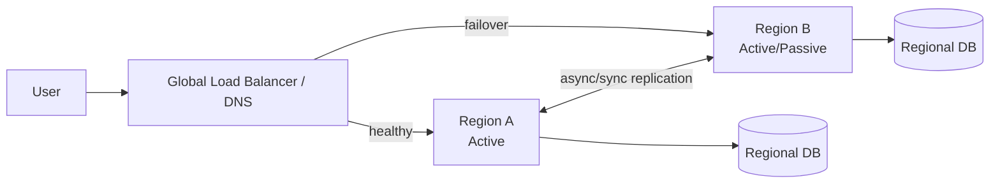

# Multi-region architecture

> **Learning Path:** Reliability Engineering & Cost Fundamentals
> **Section:** 23.2.1 — Disaster recovery & high availability

## The problem

A single region can fail. Not just an AZ outage — whole region loss from power, network, natural disaster, or control-plane bugs. Even with multi-AZ, you still have correlated failure.

For an experienced engineer this is the constraint: **availability is not just uptime, it's uptime under independent failure domains**. One region = one blast radius.

You also hit latency and compliance. Users in Sydney hitting us-east-1 add 250ms. Data residency laws require data stay in EU.

Single region forces you to trade all of those against cost and complexity.

## Mental model

Multi-region = run the same workload in two or more independent geographic regions, with users routed to the nearest healthy region.

Think of it as a failure domain you can *choose* to lose. The system must remain correct when one region disappears, and eventually recover without manual heroics.

## How it works

The essential mechanism is separation of control plane and data plane across regions, plus a way to decide where writes go.

Simplified request flow:

Three patterns matter:

* **Active-passive**: One region serves traffic, the other is warm/cold standby. Failover is manual or automated. Low write complexity, higher RTO.
* **Active-active**: Both regions serve reads and writes. Needs conflict-free data model or partitioned writes. Lower RTO, much higher complexity.
* **Read-local, write-global**: Writes go to primary region, reads are local via replication. Good compromise for read-heavy workloads.

Data replication is the hard part. Synchronous cross-region replication adds 50-150ms latency to writes and couples availability. Asynchronous replication gives low latency writes but non-zero RPO.

## Architectural reasoning

When it helps:
* RTO < 15 min and RPO < 1 min are required by SLA or regulation
* Latency SLA requires users to be within ~100ms
* Legal requirement for data residency or data sovereignty

What it solves:
* Region-level failure becomes a routine failover, not an incident
* Latency improves via locality
* Compliance can be satisfied with region-bound data

Alternatives:
* Multi-AZ in one region: cheaper, handles AZ failures, not region failures
* CDN + static front only: fine for read-only content, not for transactional systems
* Single region with robust DR backups: lower cost, RTO measured in hours

Why choose multi-region: the business cost of downtime exceeds the cost of running duplicated infrastructure and the engineering cost of consistency.

## Trade-offs and failure modes

**Cost vs reliability.** You pay 2x compute/storage plus cross-region data transfer. Warm standby still costs ~60-80% of active-active.

**Consistency vs availability.** CAP applies across regions. You either accept write latency for strong consistency, or accept eventual consistency and resolve conflicts.

**Failover is not free.** Automated failover can cause split-brain if health checks are flaky. Manual failover is safer but slower.

Common failure modes:
* **Split brain / dual writes** during network partition between regions
* **Data divergence** after async replication lag, especially with deletes/updates
* **Thundering herd** on failover saturating the passive region
* **Operator error** promoting the wrong region and losing writes

## Example

Payments platform with users in US and EU.

Architecture decision: active-active with write partitioning by tenant region, read-local. US tenants write to us-east-1, EU tenants write to eu-west-1. Global ledger is asynchronously reconciled nightly.

Global DNS health checks remove unhealthy region. Each region has its own Aurora cluster with cross-region read replicas. Writes that must be globally consistent go through a single writer region with synchronous replication, accepting latency.

RTO ~ 2 min, RPO ~ 5 sec for partitioned writes, < 1 min for global writes. Cost ~ 2.1x single region.

## Reasoning challenge

You have a SaaS with 99.95% uptime SLA, 10k writes/sec, users in US and APAC. RPO must be < 60s, RTO < 30 min. Budget is tight.

Would you choose active-active with async replication, active-passive warm standby, or read-local/write-primary? What data consistency problem do you have to solve first?

## Key takeaway

* Multi-region exists to eliminate a correlated failure domain and meet latency/compliance constraints, not to increase normal uptime.
* The real cost is consistency and operability, not just infra duplication.
* Choose active-passive for simplicity and low write volume; choose active-active only if you can partition writes or tolerate conflict resolution.
* Define RTO/RPO first, then derive replication model, failover automation, and data partitioning. Everything else follows.
