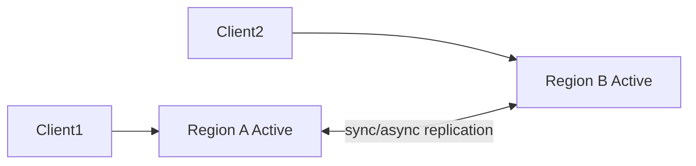

# Active-active vs active-passive

> **Learning Path:** Reliability Engineering & Cost Fundamentals
> **Section:** 23.2.2 — Disaster recovery & high availability

**The problem**

You need availability during region failure and low latency globally, but you can’t afford to over-provision everything.

A single active region gives you a single point of failure. If it fails, you must failover to a standby. If you want users in Europe and Asia to have low latency, you must serve them from local regions. The question is not *if* you replicate, it’s *how you use the replicas*.

That creates two constraints:
1. **RTO/RPO targets** - how fast you must recover and how much data you can lose
2. **Cost and complexity** - running full capacity in two places is expensive and hard to keep consistent

From those constraints comes the choice between active-passive and active-active.

### Mental model

Think of two kitchens.

Active-passive is one kitchen cooking and serving, the other kitchen is staffed and stocked but idle, watching the recipes being written. If the main kitchen burns down, you flip a switch and start serving from the backup.

Active-active is both kitchens cooking and serving at the same time. Customers in two neighborhoods are served locally. You need a way to keep the menus in sync and decide who makes which dish when a customer orders the last steak.

### How it works

**Active-passive**
One region is primary, one or more are warm/cold standby. Writes go only to primary. Data is replicated asynchronously or synchronously to standby.

Failover is manual or automated promotion of standby. Reads can be served from standby for DR testing, but production writes are single-leader.

**Active-active**
Two or more regions accept reads and writes concurrently. Traffic is routed by latency, geography, or user.

You need conflict-free data models, CRDTs, last-write-wins with vector clocks, or application-level partitioning to avoid split-brain writes.

### Architectural reasoning

Choose active-passive when:
- You can tolerate failover time of minutes and have a clear primary region
- Writes must be strongly consistent and ordered
- Cost matters more than global write latency
- Your failure domain is region, not global write scale

Choose active-active when:
- You need RTO ~ seconds and zero data loss across regions
- Users are globally distributed and need local write latency
- You can partition data by key, user, or tenant so writes rarely collide
- You accept the complexity of conflict resolution

Alternatives in between: active-passive with read replicas globally, or active-active for reads only with single writer.

### Trade-offs and failure modes

**Active-passive**
*Pros:* Simpler consistency, single source of truth, lower cost. Failover is well understood.
*Cons:* Failover time, split-brain risk during promotion, standby capacity is idle, cross-region failover causes latency spike.

Failure mode: network partition between primary and standby leaves standby stale. Automated failover can promote both regions if health checks lie.

**Active-active**
*Pros:* No failover event, higher utilization, local latency for writes.
*Cons:* Data consistency is hard. Write conflicts, replication lag, and clock skew cause anomalies. Operational complexity skyrockets.

Failure mode: a network partition creates two writable leaders. Without fencing, you get divergent data that is expensive to reconcile. Also, cost is 2x for full capacity and you still pay for cross-region bandwidth.

Cost is not just infra. Active-active costs engineering time in conflict handling, testing partition scenarios, and observability.

### Example

A global SaaS control plane for AI model serving.

Active-passive: US-East primary, EU-West warm standby. Writes to tenant config go to US-East, replicated async. If US-East fails, DNS flips to EU-West after health checks. RTO ~5 min, RPO ~30 sec. Acceptable for config changes, cheap to run.

Active-active: Same service but with per-tenant sharding. Tenant A writes only in US-East, Tenant B only in EU-West. Reads served locally. No cross-region writes for a given tenant, so conflicts disappear. This is effectively partitioned active-active, which is the practical way most systems do it.

### Reasoning challenge

You are designing a payments ledger. You need <1 sec failover, zero lost transactions, and users in US and APAC must be able to create payments locally.

Do you pick active-passive or active-active? What partitioning or consistency mechanism would you need to make the choice viable, and what is the biggest operational risk you must mitigate?

### Key takeaway

* Active-passive trades availability for simplicity and cost. It optimizes for failover, not continuous multi-region writes.
* Active-active trades simplicity for latency and availability. It requires partitioning writes and explicit conflict resolution.
* The real decision is about **write consistency and cost tolerance**, not just uptime.
* Most production systems are partitioned active-active for reads and single-writer active-passive for writes.
