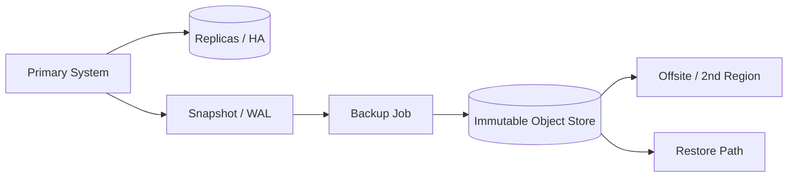

# Backup strategies

> **Learning Path:** Reliability Engineering & Cost Fundamentals
> **Section:** 23.2.3 — Disaster recovery & high availability

**Backup strategies**

### 1. The problem

High availability keeps a system running. Backups keep data recoverable. Those are different problems.

HA protects against hardware failure, AZ outage, or a bad deploy. It does not protect against logical corruption, accidental `DROP TABLE`, a compromised admin credential, or ransomware that replicates to all live copies.

When you build AI systems you have two kinds of loss:
* **Availability loss:** model serving is down. Cost is latency and revenue.
* **Data loss:** training data, curated labels, fine-tuned weights, feature store history are gone or poisoned. Cost is weeks of work and model quality.

Backups exist to bound the second problem with RPO and RTO: Recovery Point Objective = how much data you can afford to lose, Recovery Time Objective = how long you can afford to be down.

### 2. Mental model

Think of backup as an isolated, point-in-time copy with a different trust boundary than production.

Replication makes data faster and more available. Backup makes data recoverable even if production is compromised.

A useful mental model: **3-2-1 as insurance, not a checklist.**
* 3 copies of data
* 2 different media / technologies
* 1 off-site / immutable

The goal is isolation: an attacker, bug, or operator who can reach production should not be able to reach all backups.

### 3. How it works

The essential mechanism is periodic point-in-time capture + isolation + retention.

* **Snapshots** are fast, consistent copies for short RPO. They are cheap but usually live in the same control plane as production.
* **Backups** are exported, compressed, and written to an append-only store with object lock. They are slower to create and restore, but isolated.
* **Incremental vs full:** full backups are simple to restore, incremental saves cost. The trade-off is restore complexity and chain fragility.

Retention is a cost/reliability curve. Keep frequent recent backups for fast recovery from mistakes, keep sparse long-term backups for compliance and rare rollback.

### 4. Architectural reasoning

When to choose what:

* **RPO < 1 hour, RTO < 1 hour:** continuous WAL shipping + PITR to a standby region, plus daily immutable backups. You need both replication for speed and backups for safety.
* **RPO hours to days, large immutable datasets:** nightly incremental backups to immutable object storage with 30-90 day retention. Restore is slow, acceptable for data lakes and model artifacts.
* **Regulated data:** immutable backups with legal hold, separate account and KMS key, cross-region copy. Test restores are mandatory.

Alternatives:
* **Replication only:** cheap, fast failover, zero protection against logical errors.
* **Snapshots only:** fast, but co-located. Good for dev/test, bad for ransomware.
* **Backup + replication:** the default for production. Replication handles outages, backups handle corruption.

### 5. Trade-offs and failure modes

* **Cost vs recoverability.** Immutable storage and cross-region copies are 2-4x storage cost. You pay for isolation. Tiering helps: hot backups for 7 days, then IA/Glacier.
* **Consistency vs speed.** Application-consistent backups need quiescing. Crash-consistent is faster but requires replay. For databases, use WAL checkpoints. For AI artifact stores, write-once object versions are enough.
* **Restore speed vs backup speed.** Incremental saves write cost but restores require replaying a chain. Full backups cost more to write but restore is one operation.
* **Key loss.** Encrypted backups you cannot decrypt are not backups. Store KMS keys separately and test decryption.

Common failure modes architects miss:
* Backups are never tested. Restore drill finds corruption or missing dependencies.
* Backup chain broken by a single bad incremental.
* Ransomware reaches backup credentials because backup account shares IAM with production.
* RPO miscalculated because backup job fails silently for weeks.

### 6. Example

Enterprise ML platform with a Postgres feature store, S3 data lake, and Sagemaker model registry.

* Feature store: 15 min WAL shipping to standby region for RPO ~15 min, plus daily immutable Postgres dumps to S3 with object lock, retained 90 days. Restore drill quarterly.
* Data lake: objects are immutable by design. Still keep versioned snapshots of curated datasets weekly to a second region with 1 year retention. RPO is 7 days, acceptable because raw ingestion is replayable.
* Model artifacts: each trained model is a 50GB tar + metadata. After training, push artifact to immutable bucket with model ID, then replicate to second region. RTO is hours, cost of retraining dominates.

This separates the fast path for operational data from the slow, cheap, isolated path for long-term recoverability.

### 7. Reasoning challenge

You are designing backup for an e-commerce checkout DB with 5k TPS and a nightly batch that retrains a recommendation model from clickstream.

RPO for checkout is 5 minutes, RTO 30 minutes. RPO for the trained model weights is 24 hours, RTO 2 hours. Budget is tight.

Where would you use replication vs immutable backups, and what retention would you choose for each? What is the single most dangerous assumption if you only rely on managed DB point-in-time recovery?

### 8. Key takeaway

* Backups protect against logical loss and compromise; HA protects against downtime. You need both.
* Design for isolation: separate account, separate region, immutable storage, separate credentials.
* RPO/RTO drive frequency, retention, and storage tier, not the other way around.
* An untested backup is not a backup. Budget for periodic restore drills and monitoring of backup health.

You should be able to reason: given a data asset, its change rate, business impact, and compliance constraints, pick the minimal backup architecture that meets RPO/RTO without overpaying for durability you already have.
