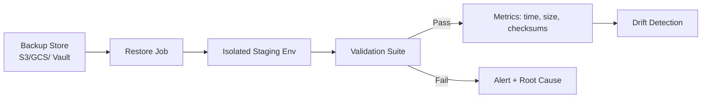

# Restore testing

> **Learning Path:** Reliability Engineering & Cost Fundamentals
> **Section:** 23.2.4 — Disaster recovery & high availability

**Restore testing**

### 1. The problem

Backups are not recovery. A backup is a copy of data at a point in time. Recovery is the ability to make that data usable again in a real system under real constraints.

The problem appears when you need the backup:
* The backup file is corrupt or incomplete
* The restore process requires a version of the database, OS, or dependencies that no longer exists
* Permissions, secrets, and network config are missing in the target environment
* The restored data is logically inconsistent or unqueryable
* The restore takes 10x longer than your RTO allows

You only discover these failures during an incident, when the cost of failure is maximal. Restore testing exists to move that discovery to peacetime.

### 2. Mental model

Think of backups as an insurance policy and restore tests as a fire drill.

A backup gives you the *potential* to recover. A restore test gives you *evidence* that recovery is possible, how long it takes, and what breaks.

### 3. How it works

A restore test is a controlled, automated restore of a backup to an isolated environment followed by validation.

Essential mechanism:
* **Isolation.** Restore to a separate account/namespace so tests cannot impact production.
* **Representative target.** Use the same or newer version of the software stack that production will use on restore.
* **Validation, not just mount.** Check: data integrity checksums, row counts, application boot, critical queries succeed, writes are possible.
* **Measure.** Record restore duration, data size, RTO achieved, and failure modes.

Implementation is typically a CI/CD job or scheduled workflow that pulls a recent backup, restores, runs smoke tests, tears down.

### 4. Architectural reasoning

When it helps:
* Any system with an RPO/RTO commitment where data loss is unacceptable
* Systems with complex dependencies: databases + object storage + secrets + infra as code
* AI workloads where model artifacts, vector stores, and training data must be recoverable

What it solves:
* Proves RTO is achievable, not just estimated
* Detects silent backup corruption and schema drift early
* Validates operational runbooks before they are needed

Alternatives:
* **Backup verification only:** checks file existence and checksums. Cheaper, but does not prove usability.
* **Manual ad-hoc restore:** human driven, inconsistent, rarely done.
* **No testing:** assumes backups work. Common and dangerous.

Choose automated restore tests when the cost of an unrecoverable failure exceeds the cost of running isolated environments.

### 5. Trade-offs and failure modes

* **Cost vs confidence.** Full production-scale restores are expensive. Trade full fidelity for sampled restores or restore to smaller subsets.
* **Data privacy.** Restoring production data to a test environment risks PII exposure. Use anonymization or restore to a private sandbox with strict access controls.
* **Environment parity.** Tests are only useful if the staging environment matches production close enough. Drift in versions or config creates false confidence.
* **Restore performance.** Restoring to cold storage is slow. Tests must measure realistic restore paths, including cross-region pulls and network limits.
* **Common failure modes:** missing credentials in backup, incompatible binary versions, missing init scripts, underestimated storage IOPS, and validation that only checks "restore succeeded" not "data is correct".

### 6. Example

Enterprise Postgres with daily snapshots to S3.

Architecture: nightly snapshot -> S3 with versioning -> weekly automated restore test in isolated VPC.

The job:
1. Pull latest snapshot to staging account
2. Restore to new RDS instance from snapshot
3. Run validation suite: `SELECT count(*)`, run application migration scripts, execute a read-only canary query from the app container
4. Record restore time = 18 min, RTO target = 30 min → pass
5. Tear down

After a schema change, the test failed because the restore job used an old init script that no longer created required extensions. The bug was fixed before it would have blocked a real disaster recovery.

### 7. Reasoning challenge

You have a multi-region vector database with daily backups costing $12k/month to store. Full restores cost ~$2k per test and take 4 hours. Your RTO is 8 hours.

How often do you test full restores vs partial restores, and what do you validate to keep cost reasonable while still proving recoverability?

### 8. Key takeaway

* Backups prove you can copy data. Restore tests prove you can recover a service.
* Test the restore, not the backup file. Validate data usability, not just existence.
* Isolate tests, measure RTO/RPO in practice, and automate the loop.
* A restore test that never runs is worse than no test: it creates false confidence.
