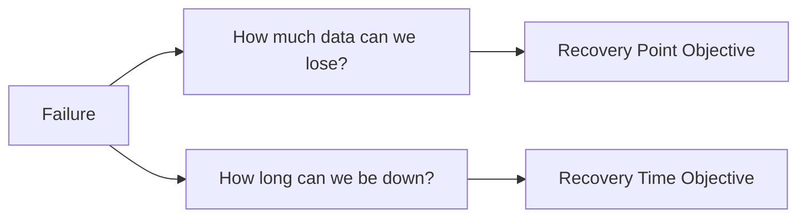

# RTO / RPO

> **Learning Path:** Reliability Engineering & Cost Fundamentals
> **Section:** 23.2.5 — Disaster recovery & high availability

**RTO / RPO**

### 1. The problem

An outage has two costs: downtime and data loss. Downtime costs revenue and reputation. Data loss costs correctness, compliance, and trust. You cannot eliminate failures, but you can decide how much of each you will tolerate.

That tolerance must be explicit before you design. Without it you over-build cheap systems and under-build critical ones.

### 2. Mental model

Think of a failure as a gap in time and a gap in data.

`RTO = Recovery Time Objective` — how long you can be down.
`RPO = Recovery Point Objective` — how much data you can afford to lose.

RPO is about durability and replication lag. RTO is about detection, failover speed, and restore speed. They are independent. You can have zero data loss but 4 hours downtime, or 5 minutes downtime but lose an hour of writes.

### 3. How it works

RTO and RPO are not features, they are targets that drive architecture.

RPO is set by how often you durably persist state and how far behind your replicas can lag.
* Synchronous replication, write-ahead logs, and continuous shipping → RPO ~0.
* Async replication every 5 min, nightly backups → RPO = 5 min to 24h.

RTO is set by how fast you can detect failure and promote a healthy copy.
* Active-active with automated health checks and DNS failover → RTO in seconds/minutes.
* Manual restore from backup to a new cluster → RTO in hours.

You measure them, you design for them, you test them.

### 4. Architectural reasoning

When it helps: when you need to choose between cost and resilience.

Alternatives live on a spectrum:
* **Do nothing**: Accept downtime. RTO/RPO are business-defined as "whenever".
* **Backups**: Cheap, slow. Good RPO if backups are frequent, terrible RTO.
* **Async replication**: Good balance. RPO = replication lag, RTO = time to promote.
* **Sync replication / multi-region active-active**: Expensive. RPO ~0, RTO ~0.

Why choose it: RTO/RPO translate business impact into engineering constraints. A payment service needs RPO ~0 and RTO < 1 min. An internal analytics warehouse can tolerate RPO 24h and RTO 4h. The same budget can buy very different architectures depending on the target.

### 5. Trade-offs and failure modes

* **RPO vs cost**: Lower RPO means more write traffic, stronger consistency, more storage. Sync replication costs latency and availability.
* **RTO vs complexity**: Lower RTO means automation, active-active, health checks, split-brain prevention. Complexity grows non-linearly.
* **They drift**: You design for RPO 15 min, but replication lag spikes under load. You design for RTO 5 min, but manual runbooks take 30 min.
* **Failover is a failure mode**: Automated failover can cause flapping. Manual failover can be too slow. Test both.
* **RPO is a lie if you don’t test restore**: Backups that aren’t restored are not backups.

### 6. Example

E-commerce checkout vs product catalog search.

Checkout must not lose orders and must recover fast. Target: RPO 0, RTO < 2 min. Architecture: synchronous writes to primary + standby in another AZ, automated failover, WAL shipping. Cost is high but acceptable.

Catalog search can be rebuilt from source. Target: RPO 1h, RTO 30 min. Architecture: async replica, daily snapshot + incremental. Rebuild index if needed. Much cheaper.

Same platform, different targets, different architectures.

### 7. Reasoning challenge

You have a SaaS notes app. Users expect edits to persist. Support can handle a brief read-only mode, but not data loss. Budget is tight.

What RPO/RTO do you set, and what is the minimal architecture to meet it? What do you give up if you try to make RTO < 30 seconds?

### 8. Key takeaway

* RTO is downtime tolerance, RPO is data loss tolerance. Both are business decisions.
* RPO is driven by durability and replication; RTO is driven by detection and failover automation.
* Lower targets cost more in latency, complexity, and infra. Choose targets per service, not company-wide.
* Design to the target, then prove it with chaos tests and restore drills.
