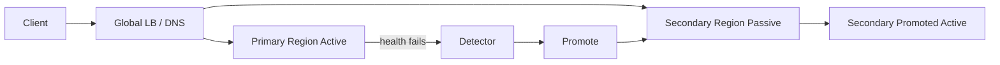

# Failover design

> **Learning Path:** Reliability Engineering & Cost Fundamentals
> **Section:** 23.2.6 — Disaster recovery & high availability

## The problem

A service is only as reliable as its weakest link. When a node, AZ, region, or data center fails, requests stop being served unless there is another path to serve them. Failover design is about making that path explicit and automatic.

The problem is not preventing failure — failures are inevitable. The problem is bounding the impact: how long does it take to detect the failure, how much data can be lost, and how much does it cost to keep the alternate path warm.

## Mental model

Think of a spare tire, not a second car. A failover system keeps capacity you hope you never use, and you pay for it in idle cost, complexity, and operational risk.

Two patterns dominate:
* **Active-passive:** One primary serves traffic, a standby mirrors state and is promoted on failure.
* **Active-active:** Multiple sites serve traffic simultaneously. Failure means shedding load to the remaining sites.

The choice is about how fast you can recover vs how much you pay to keep recovering.

## How it works

Failover is a closed loop: detect → decide → promote → verify.

Detection is health checks, heartbeats, or quorum loss. Decision is usually automated with a threshold to avoid flapping. Promotion switches routing: DNS, load balancer, service mesh, or client-side retry to the alternate.

Data must be ready on the standby. That means replication lag, write consistency, and a clear definition of who can write when. The failover controller must also prevent split-brain: two primaries accepting writes.

## Architectural reasoning

Use failover when downtime cost > cost of standby capacity + operational complexity.

It helps when:
* You have a hard availability target, e.g., 99.95%+ SLA where a single AZ outage breaches it.
* The failure domain is large enough that manual recovery is too slow. RTO < 15 min usually needs automation.
* State can be replicated with acceptable RPO.

Alternatives are retries with backoff, graceful degradation, and accepting downtime. Failover is more expensive than those, but it preserves full functionality.

Choose active-passive for cost-sensitive workloads with a single writer, like a primary database replica. Choose active-active for global read-heavy services or when you need near-zero RTO, accepting the complexity of conflict resolution and multi-master writes.

## Trade-offs and failure modes

* **Cost vs availability.** Standby capacity is idle cost. Active-active doubles cost for most components.
* **Detection latency vs false positives.** Aggressive health checks fail fast but cause flapping. Slow checks increase RTO.
* **Consistency vs availability.** Promoting a replica with replication lag means data loss or divergence. You must pick RPO.
* **Split-brain.** Network partitions can make both sites think they are primary. Use fencing, quorum, or a consensus lease to prevent it.

Common failure modes: failover works in test but not in prod because DNS TTL is too long, health checks monitor liveness not readiness, promotion scripts fail on edge cases, and no one tests the fail-back path.

## Example

Payment authorization API in two regions. Primary writes to a regional Postgres primary. Writes are asynchronously replicated to secondary region with ~1-2s lag. Global load balancer routes to primary.

On primary region failure, health checks fail, LB removes it, and a runbook/automation promotes the replica to primary and updates the LB. RTO ~ 2 minutes, RPO ~ 2 seconds of transactions. Writes are paused briefly during promotion to ensure a single writer.

The team runs monthly chaos drills and keeps DNS TTL at 60s. They accept the replication lag cost to avoid multi-master complexity.

## Reasoning challenge

Your AI inference service serves real-time chat. Latency SLA is <500ms p95. You have two regions, each can handle full load, but cross-region replication of model weights is expensive and model state is not shared. Do you design active-active with client-side routing, active-passive with fast DNS failover, or accept regional downtime? What is your RTO/RPO and what breaks first?

## Key takeaway

* Failover trades idle capacity and complexity for bounded recovery time.
* Design around detection speed, promotion safety, and data consistency, not just switching.
* Active-passive saves cost, active-active saves RTO, both create new failure modes like split-brain.
* Test failover like a feature: you must practice detection, promotion, verification, and fail-back.
