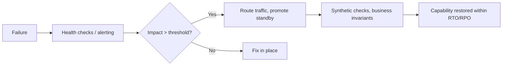

# Business continuity planning

> **Learning Path:** Reliability Engineering & Cost Fundamentals
> **Section:** 23.2.7 — Disaster recovery & high availability

**Business continuity planning**

### 1. The problem

An outage is not an IT problem. It is a business problem with a cost per minute.

A database fails. A region goes dark. A key service degrades. The question is not "can we restore the system?" It is "how long can the business survive without this capability, and how much data loss can it tolerate?"

Without a plan you get ad-hoc heroics: manual failovers, conflicting runbooks, data loss you discover too late, and recovery times that are guessed instead of engineered.

Business continuity planning exists to make the impact explicit, and to pre-pay the cost of recovery so it is fast and predictable when failure is inevitable.

### 2. Mental model

Think of it as insurance + a fire drill.

Business Impact Analysis tells you what must stay alive and how quickly. RTO = Recovery Time Objective, how long you can be down. RPO = Recovery Point Objective, how much data you can afford to lose.

The plan is a set of pre-made decisions: what to replicate, where, how to fail over, who decides, and how you verify it works.

### 3. How it works

The core loop is:

**Identify critical capabilities → Define RTO/RPO → Choose a DR tier → Implement replication and automation → Test and document.**

DR tiers are a practical shorthand:

* **Backup and restore:** hours to days RTO, high RPO. Cheapest.
* **Pilot light:** minimal warm resources in another region. Start up on demand.
* **Warm standby:** replicated data, scaled-down services ready to scale.
* **Hot / Active-active:** full capacity in multiple regions, traffic split.

Replication strategy follows the RTO/RPO. Synchronous multi-region replication gives near-zero RPO but adds latency and cost. Asynchronous replication gives higher RPO but cheaper and faster writes.

Failover is a decision, not just automation. You need detection, a decision authority, and a runbook that changes DNS / traffic routing, promotes a database, and validates health before declaring success.

### 4. Architectural reasoning

Choose the tier from the business constraint, not from technology preference.

* High revenue impact, strict compliance, or global users → Active-active or warm standby. You pay for idle capacity to buy low RTO.
* Batch-oriented, internal tools, or cost sensitive → Pilot light or backup restore. You accept hours of downtime.
* Data gravity matters. Replicating a 50TB Postgres synchronously across continents may be infeasible. That forces you to accept higher RPO or redesign for partition tolerance.

Alternatives are not just "multi-region". You can also reduce blast radius with cell-based architecture, graceful degradation, and circuit breakers so a single failure does not become a business stop.

### 5. Trade-offs and failure modes

* **Cost vs recovery speed.** Every minute of RTO removed costs exponentially more. Hot standby costs ~2x for maybe 99.99% availability.
* **Consistency vs availability.** Synchronous replication improves RPO but increases write latency and can halt writes during network partitions.
* **Automation vs safety.** Fully automated failover is fast but can cause flapping or split-brain. Many architects keep manual approval for promotion with automated detection and preparation.
* **Test gap.** Untested DR is wishful thinking. Real failure modes: DNS TTL too long, credentials not replicated, manual steps forgotten, data drift between primary and standby, and runbooks that assume the primary engineer is available.

Common failure: optimizing for RTO without considering RPO. You can bring the service up in 5 minutes but lose 4 hours of orders because replication lag was never measured.

### 6. Example

E-commerce checkout. Business impact analysis shows $120k loss per hour, cannot lose orders.

Decision: RPO < 1 minute, RTO < 15 minutes.

Architecture: Active-active web tier behind global anycast DNS. Order writes go to a multi-region strongly consistent database with synchronous replication within a region and asynchronous cross-region with conflict resolution. Payment processing is idempotent and writes to an append-only event log replicated cross-region.

Failover runbook: automated health detection promotes the secondary region's database, DNS shifts traffic, synthetic checkout validates business invariants. Cost is higher, but it matches the business constraint.

### 7. Reasoning challenge

Your AI inference service runs in one region, backed by a single Postgres. RTO target is 4 hours, RPO target is 15 minutes. Leadership wants to cut cloud spend by 40%.

Do you move to cross-region async replication with a pilot light, or keep current setup and invest in faster backups? What new failure modes does your choice introduce, and how would you prove the RPO is actually met?

### 8. Key takeaway

* Business continuity is about preserving business capability, not just uptime. Start with RTO/RPO derived from business impact.
* DR tier is an economic decision. You are buying insurance against downtime; price it against loss per minute.
* Replication choice drives RPO. Latency, cost, and consistency limits are the real constraints.
* Untested plans fail. Automate detection and validation, keep failover safe, and run game days regularly.
