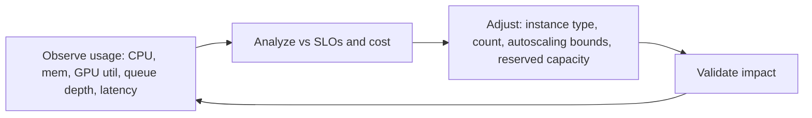

# Right-sizing

> **Learning Path:** Reliability Engineering & Cost Fundamentals
> **Section:** 23.3.2 — Cloud cost / FinOps

### The problem

Cloud bills grow linearly with provisioned capacity, not used capacity. You launch an m5.2xlarge because peak load needs it, then the workload averages 20% CPU for 90% of the month. You pay for peak forever.

The problem gets worse with AI workloads: GPU instances idle between training jobs, data pipelines burst for 10 minutes then sit idle, services scale for Black Friday traffic that never materializes.

Over-provisioning buys headroom and safety. Under-provisioning buys outages. The cost of both is real.

### Mental model

Right-sizing is matching provisioned capacity to actual demand, with a safety margin for variance.

Think of it as a thermostat, not a one-time setup. You observe usage, compare to service targets, and adjust the provisioned capacity. Too low = throttling/latency. Too high = waste.

### How it works

Right-sizing is a feedback loop, not a tool.

Essential signals: utilization, saturation, error rate, latency distribution, and cost per unit of work. Utilization alone is misleading. A service at 30% CPU can be memory-bound or I/O-bound.

Mechanisms:
* **Vertical right-sizing**: change instance type/size to better fit workload shape. e.g., memory-optimized for cache, compute-optimized for CPU-bound.
* **Horizontal right-sizing**: adjust replica count and autoscaling policies. Tighten min/max and scale metrics.
* **Temporal right-sizing**: use scheduled scaling, spot/preemptible instances, or scale-to-zero for batch/ dev workloads.
* **Commitment right-sizing**: convert stable baseline demand to Savings Plans/Reserved Instances after sizing is proven stable.

### Architectural reasoning

Right-sizing helps when workload is variable and cost is a first-class constraint.

Choose it when:
* Workload has a clear baseline + burst pattern you can measure.
* SLOs allow some latency for scale-up, or you can pre-warm.
* You have observability to distinguish noise from trend.

Alternatives:
* Over-provision and forget. Simple, high availability, expensive.
* Auto-scale aggressively with large headroom. Good for spiky traffic, bad for cost.
* Serverless / FaaS. Pushes sizing to provider, good for event-driven, bad for sustained compute and cold starts.

Decision logic is cost vs risk. For a payment API with 99.99% SLO, you keep headroom. For an overnight ETL job, you scale to zero and use spot.

### Trade-offs and failure modes

* **Cost vs latency**: Tight right-sizing saves money but increases tail latency during scale-up. You need warm pools or predictive scaling.
* **Stability vs savings**: Aggressive down-sizing can cause thrashing. Scale policies need cooldowns and hysteresis.
* **Utilization vs saturation**: High CPU with low latency is fine. High latency with low CPU means you're bottlenecked elsewhere. Right-sizing the wrong dimension makes things worse.
* **Observability cost**: You need good metrics and ideally workload tracing. Right-sizing blind is gambling.
* **Commitment lock-in**: Reservations save money only if the right-sized baseline holds. A bad reservation is a sunk cost.

Common failure: right-sizing to average utilization. Averages hide peaks. Size to P95/P99 demand with a margin, not mean.

### Example

E-commerce checkout service on Kubernetes. 
Baseline: 200 RPS, bursts to 1200 RPS on weekends. Initially provisioned with 20 pods of c6i.2xlarge.

Observability shows: CPU ~15% avg, memory 60% steady, P99 latency 80ms, autoscaling rarely triggers. Cost $28k/mo.

Right-sizing steps:
1. Profile workload: CPU-bound, memory stable. Switch to c6i.xlarge.
2. Reduce min replicas to 8, max to 30, scale on request queue length not CPU.
3. Move baseline 8 pods to 1-year Savings Plan.
4. Validate for 2 weeks: P99 latency stays <120ms, no OOMs.

Result: 40% cost reduction, SLO maintained. The remaining headroom is intentional for burst.

### Reasoning challenge

You have an AI inference service serving a chatbot. Traffic is 500 RPM steady, spikes to 5000 RPM for 5 minutes after product launches. GPU instances take 90s to warm. P99 latency SLO is 800ms. Spot GPUs save 70% but can be reclaimed.

Do you right-size to the steady state and accept launch spikes, over-provision for spikes, or use a hybrid? What metric would you use to trigger scale-up?

### Key takeaway

* Right-sizing is continuous control of capacity vs demand under cost and SLO constraints.
* Size to workload shape and saturation, not just average CPU.
* The loop is observe → analyze vs SLO → adjust → validate.
* The trade-off is always cost savings vs latency/reliability risk and operational complexity.
* Prove stability before committing capacity with reservations.
