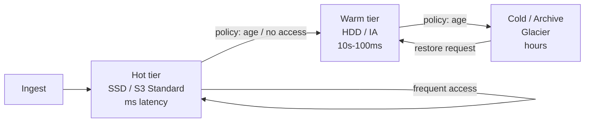

# Storage tiering

> **Learning Path:** Reliability Engineering & Cost Fundamentals
> **Section:** 23.3.3 — Cloud cost / FinOps

**Storage tiering**

### 1. The problem

Storage cost grows linearly with data, but access is heavily skewed. 90% of queries hit <10% of data, and that hot set changes over time. 

Keeping everything on the fastest, most expensive tier is wasteful. Moving everything to the cheapest tier kills latency and availability. You need a way to pay for performance only where it is actually used, without manual babysitting.

This is a cost vs latency vs durability trade-off, and it gets worse at scale. In FinOps terms, it's uncapped storage spend with flat performance assumptions.

### 2. Mental model

Think of a warehouse with three zones:
* **Front dock** — fast pick, expensive rent. Hot data.
* **Back racks** — slower pick, cheaper rent. Warm data.
* **Off-site vault** — retrieval takes hours, very cheap. Cold/Archive data.

Items move automatically between zones based on rules: how old it is, how often it was accessed, compliance requirements. The system hides the move from readers; they just pay the latency of the zone the item lives in now.

### 3. How it works

Tiering is policy-driven data placement, not just two buckets.

* **Access metadata drives placement.** Last access time, access frequency, object age, size, and business tags drive promotion/demotion.
* **Lifecycle policies automate moves.** Rules like: `if age > 30 days and access_count < 2 → move to warm; if age > 365 days → move to archive`.
* **Tier capabilities differ.** Hot = low latency, high IOPS, high $/GB. Warm = moderate latency, lower $/GB. Cold/Archive = high retrieval latency, low $/GB, often with minimum storage duration and restore fees.
* **Read path is tier-aware.** A request for a cold object triggers a restore to a warmer tier, which is why you feel the cost of a bad placement.

### 4. Architectural reasoning

Use tiering when you have:

* **Long tail data with clear access skew.** Logs, backups, user generated media, training datasets, historical analytics.
* **Predictable devaluation over time.** Freshness matters for business value.
* **Cost is a first-class constraint.** You can tolerate latency for old data.

It solves the problem of paying premium performance for data you rarely touch, while keeping hot paths fast.

Alternatives:
* **One tier for all** — simple, but financially unsustainable at scale.
* **Manual partitioning** — cheaper but operationally brittle; teams forget to move data.
* **Delete / externalize** — works if data truly has no future value, but risky for compliance and AI training.

Choose tiering when access patterns are measurable and policy can be automated. Don't use it when access is random and unpredictable, or when consistent low-latency SLAs apply to all data.

### 5. Trade-offs and failure modes

* **Latency surprise.** An application that assumes uniform latency will break when an object is demoted. Mitigate with read-before-write checks or pre-warming.
* **Restore costs and time.** Archive tiers charge for retrieval and can take hours. A bulk scan of cold data can generate a massive bill.
* **Policy churn.** Too aggressive demotion causes thrashing: move down, get accessed, move up, repeat. Track access frequency, not just age.
* **Eventual consistency and metadata lag.** Tier moves are asynchronous. A just-demoted object may still appear in the hot tier for a window.
* **Compliance lock-in.** Archive tiers often have minimum retention and legal hold constraints. Moving data back is expensive.

### 6. Example

E-commerce platform with order events and product images.

* Hot tier: last 7 days of orders, current catalog images. Sub-10ms reads for checkout and recommendation.
* Warm tier: 8-90 days of orders, last season images. Used for daily analytics.
* Cold tier: >90 days of orders, replaced images. Retained 7 years for audit, queried <1x/month.

Lifecycle policy moves objects automatically. Analytics jobs explicitly query warm tier; ad-hoc audit requests accept restore latency. Monthly storage cost drops ~60% vs all-hot, while p99 checkout latency is unchanged.

### 7. Reasoning challenge

You are designing storage for an AI training data lake. Data ingests 5 TB/day, 90% of it is raw video that is used only once for initial labeling, then occasionally for re-training. Labelled curated sets are accessed daily.

Where do you place raw vs curated data, and what policy signals would you use to avoid a costly restore storm when a researcher requests a random 6-month-old raw batch? 

Think about access frequency vs age, restore cost, and who can tolerate latency.

### 8. Key takeaway

* Storage tiering exists to match cost to actual access value, not assumed value.
* Hot/Warm/Cold is a placement policy driven by age, frequency, and business need.
* The architectural win is automated cost reduction without manual data management.
* The risk is hidden latency and restore costs if policies are wrong or applications assume uniform performance.
* Measure access patterns first, then tier. Tiering without telemetry is guesswork.
