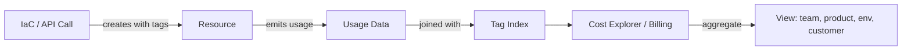

# Cost allocation & tagging

> **Learning Path:** Reliability Engineering & Cost Fundamentals
> **Section:** 23.3.4 — Cloud cost / FinOps

### Cost allocation & tagging

**The problem**
The cloud bill is one number. A single AWS account can run hundreds of services across multiple teams, environments, and customers. Without allocation, you know you spent $2.3M last month, but you cannot answer: which product, which team, which environment, which customer caused it? That opacity kills accountability, prioritization, and architecture decisions.

The constraint is not technical, it is organizational. Finance needs showback/chargeback. Engineering needs cost signals in the same loop as latency and errors. Leadership needs to kill wasteful workloads. You need cost to be attributable, auditable, and actionable at the same granularity you operate.

### Mental model
Tags are a distributed accounting system. A tag is key-value metadata attached to a resource that survives to the cost record. Cost allocation is then a join: cost data + tags = who owns what.

Think of it as a label on a physical server rack. The rack costs money. The label tells you which team pays. In cloud, the rack is ephemeral, so the label must be enforced in code, not by a human writing on a sticker.

### How it works
Resources are created with tags. The billing system ingests usage and projects tags onto cost records. Reports aggregate by tag key.

The essential mechanism is propagation and inheritance. You set tags at creation time and they must be inherited by child resources.

Critical points: tags must be present at provision time, they must be consistent, and they must be enforced on all resource types that incur cost. Tagging is only useful if it is automatic.

### Architectural reasoning
Tagging solves attribution, not optimization. It enables:

* **Showback/chargeback:** Teams see their spend. Product managers can price features.
* **Guardrails:** Budgets and policies can be enforced per tag value, e.g., `env=prod` cannot use spot, `team=ml` has a quota.
* **Waste removal:** Find untagged or idle resources by tag.
* **FinOps KPIs:** Unit economics per customer, per feature.

Alternatives exist but are weaker. Account per team gives perfect isolation but creates blast radius and overhead. Manual spreadsheets give control but drift instantly. Tags give a shared account model with logical separation.

Choose tags when you need fine-grained attribution inside a shared platform and you already control provisioning via IaC. Choose per-account isolation when you need hard security boundaries or regulatory separation.

### Trade-offs and failure modes
* **Enforcement vs flexibility.** Strict mandatory tags block deploys. Loose tags create gaps. The right balance is mandatory tag keys with a controlled vocabulary for values.
* **Tag completeness vs latency.** You can tag resources, but you cannot retroactively tag existing resources easily. Drift means historical cost is unallocatable.
* **Tag sprawl.** Teams invent `Team`, `team`, `owner`, `OwnerEmail`. Normalization requires a central taxonomy and automated validation.
* **Propagation gaps.** Not all resources support tags, and some services propagate tags inconsistently. You need a tag policy and a scanner that finds untagged spend.
* **Cost of ownership.** Tagging is a socio-technical system. It needs ownership, linting in CI, and reconciliation dashboards, not just documentation.

Failure mode to watch: 30% of spend becomes `Untagged`. That is the signal your control plane is broken.

### Example
Enterprise platform with 3 products, 2 environments, and shared data services.

Tag keys: `Product`, `Team`, `Env`, `CostCenter`, `Customer`.

IaC module requires all 5 keys. A policy in CI rejects plans missing keys. Tag propagation is enabled for EKS, where pod labels flow to node groups.

Monthly FinOps review shows `Product=Search, Env=dev` spend grew 4x. Tag drill-down reveals a forgotten load test. The team is billed via showback and the test is automated to auto-terminate.

Without tags, that would have been "infrastructure grew".

### Reasoning challenge
You are moving to a multi-tenant SaaS on one AWS account. Finance wants per-customer billing, Security wants per-customer isolation, Engineering wants minimal overhead. You can tag resources with `CustomerId` or create one account per customer.

What do you choose for compute vs data storage, and what tag enforcement do you need to make per-customer cost reports trustworthy? What breaks if a Lambda is created without `CustomerId`?

### Key takeaway
* Tags turn a flat cloud bill into an accountable cost graph.
* Attribution only works if tagging is enforced at creation, normalized, and propagated automatically.
* Cost allocation enables chargeback and guardrails, it does not reduce cost by itself.
* The real risk is untagged spend and inconsistent taxonomy, not the absence of a tag UI.
