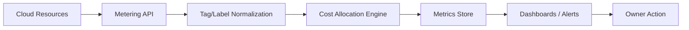

# Cost monitoring

> **Learning Path:** Reliability Engineering & Cost Fundamentals
> **Section:** 23.3.5 — Cloud cost / FinOps

**Cost monitoring**

### 1. The problem

Cloud cost is not a finance problem, it is a reliability problem. 
When you build on cloud, usage is elastic and cost is a function of decisions made by every team: instance size, retention, request batching, model choice, data transfer.

Without visibility, cost grows silently. A spike in inference traffic, a forgotten dev cluster, or a missing tag can turn a $20k/mo service into $80k/mo before anyone notices. By the time the bill arrives, the cause is gone.

Cost monitoring exists to make cost observable, attributable, and controllable like latency or error rate.

### 2. Mental model

Think of cost as a distributed metric emitted by resources.

`usage -> metering -> attribution -> signal`

Metering gives you raw units: vCPU-hours, GB-month, requests, tokens. Attribution maps those units to a business context: team, service, environment, customer, feature. Signal turns attribution into action: anomaly, budget burn, unit economics.

You are not tracking dollars, you are tracking the cost drivers and who owns them.

### 3. How it works

The essential loop is continuous, not monthly:

* **Metering:** Cloud providers emit usage at 1h granularity. For AI workloads you add application-level metering: requests, tokens, prompts, vector DB reads.
* **Normalization & tagging:** Resource tags, resource groups, and cost allocation rules map usage to ownership. This is the weakest link.
* **Allocation:** Split shared costs, e.g., platform VPC, multi-tenant storage. Allocation must be deterministic and auditable.
* **Signals:** Budget burn rate, anomaly detection on daily spend, cost per request, cost per active user.

Implementation is lightweight: export billing data to a warehouse, join with tags, materialize cost per service per day. Add real-time proxies for high-velocity workloads.

### 4. Architectural reasoning

Cost monitoring helps when cost is variable and owned by multiple teams.

* **When it helps:** Multi-team platform, production AI inference, data pipelines with variable scale, SaaS with customer-level unit economics.
* **Alternatives:** Manual spreadsheets, provider billing console only, finance-only review. Those give you cost after the fact, no attribution, no feedback loop.
* **Why choose it:** It closes the loop between architecture decisions and business impact. Engineers can reason about cost per feature, not just throughput.

Architectural decision enabled: you can enforce cost guardrails in CI/CD and runtime, e.g., block non-tagged resources, enforce budget alerts per service, and choose models based on cost/latency trade-off.

### 5. Trade-offs and failure modes

* **Granularity vs overhead.** Fine-grained per-request tagging is accurate but adds latency and cost to ingest. Daily allocation is usually enough for most services; real-time is needed for autoscaling and spot instances.
* **Tagging drift.** Resources created without required tags become "unallocated". This creates blind spots and erodes trust. Enforce tagging via IaC policy and deny non-compliant creation.
* **Allocation complexity.** Over-allocation with too many dimensions makes dashboards noisy. Pick 3-4 dimensions that map to ownership and business value: service, environment, team, customer tier.
* **Signal fatigue.** Too many budget alerts lead to ignoring them. Use burn rate alerts and anomaly detection, not static thresholds.

Failure mode to expect: the first month you will discover cost you cannot explain. That is normal. The system is working.

### 6. Example

An AI chatbot service runs on Kubernetes with autoscaling GPUs for inference and a vector DB.

Cost monitoring tags every pod with `service=chatbot`, `env=prod`, `model=tinyllama`. Application emits `cost_per_request` = token cost + GPU time.

Daily job joins cloud billing with tags and app metrics. Dashboard shows cost per 1k requests per model variant. Alert fires when burn rate > 110% of forecast for 2 consecutive days.

When a new feature increases prompt size, cost per request rises 18% before latency degrades. Team rolls back prompt template, saves $12k/mo.

### 7. Reasoning challenge

You are architecting a multi-tenant RAG service. Each tenant has isolated vector indexes and a shared embedding model. You can tag by tenant at storage level but not at inference time.

Do you allocate embedding cost per tenant by request count, by token volume, or treat it as platform overhead? What data do you need to make that decision defensible, and what failure mode are you accepting?

### 8. Key takeaway

* Cost is a first-class operational metric. Make it observable, attributable, and actionable.
* Attribution depends on consistent tagging and allocation rules enforced at creation time.
* Monitor cost drivers, not just dollars: cost per request, cost per user, burn rate.
* Design alerts around anomalies and budget velocity, not static monthly caps.
