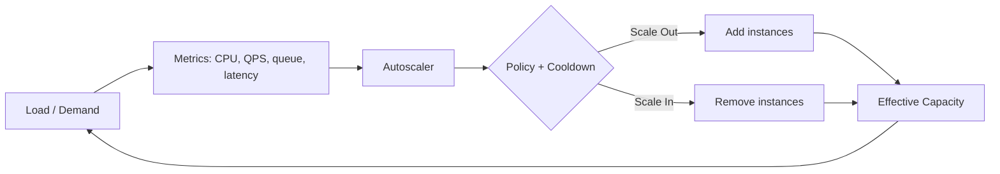

# Autoscaling for cost efficiency

> **Learning Path:** Reliability Engineering & Cost Fundamentals
> **Section:** 23.3.6 — Cloud cost / FinOps

**Autoscaling for cost efficiency**

### 1. The problem

In cloud you pay for capacity over time, not for work done. Demand is rarely flat. It spikes at 9am, drops at night, surges on a product launch, and flatlines on weekends.

If you provision for peak you buy idle capacity for ~80% of the time. If you provision for average you brown out at peak.

Static sizing forces a choice: waste money or violate SLOs. Autoscaling exists to avoid that choice by making capacity a function of demand.

### 2. Mental model

Think of a thermostat, not a bigger house.

You don’t build a house that can heat for 50°C summer and -20°C winter simultaneously. You install a thermostat that turns heating on and off to keep the room in a band.

Autoscaling keeps the system in a target operating band — latency, queue length, utilization — by adding or removing compute. The cost saving is the idle capacity you don’t pay for.

### 3. How it works

A control loop runs continuously:

Measure → Compare to target → Decide → Act → Wait for effect.

The essential knobs are:
* **Signal:** what you measure. CPU is cheap but laggy. Queue length and request rate are leading.
* **Target:** e.g., 60% CPU, p95 latency <200ms, queue <100.
* **Policy:** how aggressively to add/remove. Usually scale-up fast, scale-down slow.
* **Cooldown / stabilization:** prevent flapping. New instances need time to become ready and warm.

### 4. Architectural reasoning

Autoscaling helps when demand is variable and the cost of idle capacity exceeds the cost of scaling operations.

Choose it when:
* Workload is bursty or follows a predictable daily/weekly pattern.
* Cold start time is acceptable relative to SLOs, or you can keep a warm pool.
* The service is stateless or can shed/replace instances cheaply.

Avoid or limit it when:
* Cold start is > SLO budget, e.g., JVMs, large ML models. You need base capacity.
* Workload is essentially constant. Autoscaler adds complexity for no saving.
* Scale-up latency is unacceptable. You need provisioned headroom.

Alternatives: overprovisioning for guaranteed latency, scheduled scaling for known peaks, predictive scaling using historical patterns, and serverless which hides the loop entirely.

### 5. Trade-offs and failure modes

* **Cost vs latency.** Scale-up takes minutes. If you react to CPU you are already behind. Leading metrics like queue length or request rate reduce lag but are noisier.
* **Scale-up asymmetry.** Scale up is urgent, scale down is where money is saved. Scale down too aggressively and you evict in-flight work; too conservatively and you leak cost.
* **Flapping and thrashing.** Noisy metrics + short cooldown = instances added and removed repeatedly. That burns cost and hurts reliability.
* **Tactical scaling vs economic scaling.** HPA on CPU is simple. Cost-optimal scaling uses utilization, cost per request, and can prefer cheaper instance types or zones.
* **Cold start tax.** New instances aren’t instant. If you scale to zero you pay latency on the first request. For AI inference with 45s model load you cannot scale from zero on demand.

Common failures: scaling on average CPU hides hot nodes, scaling on request count without queue depth causes backlog, and scaling in during a rolling deploy causes capacity loss.

### 6. Example

SaaS API tier with diurnal traffic: 2k RPS overnight, 20k RPS 9-11am.

Static for peak = 20k RPS capacity 24/7.

With autoscaling:
* Base = 4 pods for night minimum.
* Scale out on queue length >50 and request rate >80% of current capacity.
* Scale in on queue <10 for 15 min.
* Cooldown 5 min up, 10 min down.

Result: capacity tracks demand within ~5-10 min. Idle spend drops ~60-70% vs static, while p95 latency stays under SLO. Cost is paid for the lag, not for the peak forever.

### 7. Reasoning challenge

You run an LLM inference API. P99 latency SLO is 200ms. Traffic is 100 RPS weekdays 9-17, 10 RPS otherwise, with 10x spikes during product demos. Cold start for a model instance is 45s. Instances cost $0.50/hr.

Do you autoscale to zero? What metric do you scale on, and what base capacity do you keep? What is the cost vs latency trade-off you accept?

### 8. Key takeaway

* Autoscaling is cost control through dynamic matching of capacity to demand, not just availability.
* Save money on scale-in, protect SLOs on scale-up. The two directions need different policies.
* The signal you choose determines how early you react; the cooldown determines how stable you stay.
* Cost-efficient autoscaling requires base capacity for cold-start latency and a leading metric, not just CPU.
