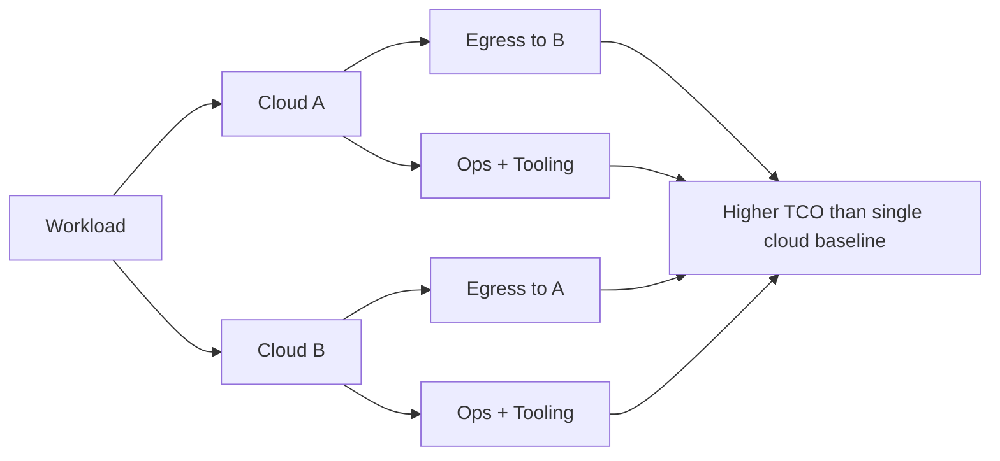

# Multi-cloud cost trade-offs

> **Learning Path:** Reliability Engineering & Cost Fundamentals
> **Section:** 23.3.7 — Cloud cost / FinOps

**Multi-cloud cost trade-offs**

### 1. The problem

Cloud costs scale with usage, but multi-cloud costs scale with *complexity*. The problem isn't just paying for compute, it's paying for moving data, duplicating teams, and losing economies of scale.

A single cloud gives you one pricing model, one control plane, one FinOps tool. Multi-cloud gives you workload portability and vendor leverage, but every cross-cloud boundary is a tax: egress fees, duplicated services, and operational overhead.

The question isn't "can we save money with multi-cloud?" It's "what are we buying with the extra cost, and is it worth it?"

### 2. Mental model

Think of multi-cloud as insurance, not discount.

Single cloud = lower marginal cost per unit, higher risk concentration.
Multi-cloud = higher baseline cost, lower risk concentration.

Cost doesn't just come from VMs and storage. It comes from:
* **Data movement:** Egress is the most visible tax. Cloud providers charge $0.01-$0.12/GB out, and almost nothing in.
* **Operational duplication:** Two IAM models, two monitoring stacks, two FinOps practices.
* **Fragmented purchasing power:** You lose volume discounts and reserved instance efficiency when spend is split.
* **Best-of-breed fragmentation:** You pay integration tax to make services talk.

### 3. How it works

Cost structure in multi-cloud is additive, not substitutive.

You pay for the workload twice in ops, and for every byte that crosses the perimeter. Internal replication for HA inside one region is cheap. Cross-cloud replication is expensive and slow.

FinOps in multi-cloud means normalizing costs to a common unit: cost per useful request, not $/vCPU per provider.

### 4. Architectural reasoning

Multi-cloud makes sense when the *constraint is not cost*.

Choose multi-cloud when:
* **Compliance/ data residency** forces workloads to stay in specific geographies/providers.
* **Availability** requires failure domains beyond one provider's control plane.
* **Negotiation leverage** matters at scale: splitting >$10M/year spend can change commercial terms.

Choose single cloud when:
* Cost efficiency and speed of delivery are primary constraints.
* Workloads are homogenous and data is mostly read-local.
* Team size is limited and FinOps maturity is low.

The architectural decision is: where do we draw the blast radius boundary? If you need it across clouds, accept the cost tax. If you don't, don't pay it.

### 5. Trade-offs and failure modes

**Egress vs. resilience.** Replicating state across clouds for active-active DR looks good on paper until you realize the replication traffic alone can be 15-30% of your bill. Most teams under-provision bandwidth and over-pay for it.

**Tooling duplication vs. best-of-breed.** Using CloudWatch *and* Cloud Monitoring *and* Datadog means three bills and three alerting models. The failure mode is alert fatigue and cost blind spots.

**Reserved capacity vs. flexibility.** Single-cloud commitments give 40-60% discounts. Splitting spend destroys commitment value. Teams often buy on-demand everywhere and pay the premium.

**Hidden cost of portability.** Abstraction layers like Kubernetes reduce lock-in, but you still pay the native service tax. Running managed services in two clouds rarely means identical services, so you end up maintaining two implementations.

### 6. Example

An AI inference service with spiky demand.

Single-cloud: Run on AWS Inferentia with Savings Plans, use S3 + CloudFront, one FinOps dashboard. Cost per 1k requests is predictable.

Multi-cloud: Run inference on GCP for EU traffic to meet data residency, AWS for US. Model weights must be synced cross-cloud on every update. Egress for 50GB model * 100 updates/month = 5TB/month egress = ~$400/mo just to move weights, plus duplicate CI/CD, monitoring, and two sets of autoscaling policies. You gain compliance and ~30% better spot pricing in EU, but baseline ops cost rises 2x.

The decision is valid only because residency is non-negotiable.

### 7. Reasoning challenge

You have a batch ETL pipeline that processes 20TB nightly, writes results to a data warehouse, and must survive a regional outage.

Option A: Run everything in one cloud with cross-region replication.
Option B: Run readers in Cloud A, writers in Cloud B, with cross-cloud replication for DR.

Which is cheaper, and what metric would you measure for 3 months to prove it?

### 8. Key takeaway

* Multi-cloud is a reliability/compliance premium, not a cost saving strategy by default.
* Egress and operational duplication are the two cost multipliers that kill multi-cloud economics.
* Normalize cost to business value per request, not provider list price.
* Use multi-cloud only where a non-cost constraint forces it; otherwise consolidate for FinOps leverage.

You should be able to reason: *Where does data cross a billable boundary, who operates it, and what discount are we giving up?*
