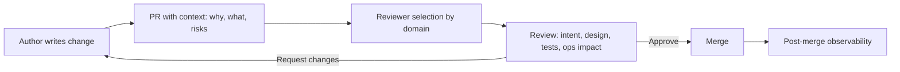

# Code review practices

> **Learning Path:** Technical Leadership & Delivery
> **Section:** 24.1.1 — Code & delivery practices

**Code review practices**

### 1. The problem

A single developer can write fast code. A team can’t scale that speed without paying for it later.

The problem is not syntax errors. It is:
* Knowledge silos: only the author understands why the code is the way it is
* Defects and architectural drift escaping to main
* Bus factor: critical paths understood by one person
* No forcing function for standards, security, and maintainability

Without a deliberate review step, quality becomes accidental and architectural intent decays with every PR.

### 2. Mental model

Code review is not bug hunting. It is a distributed quality gate and a knowledge transfer mechanism.

Think of it as a design review that happens continuously, at the smallest unit of change. The reviewer is not a gatekeeper, they are a second set of eyes with a different context: system-wide constraints, operational history, and future change cost.

The value is not catching typos. It is aligning the change with architecture, operability, and team standards before it becomes expensive.

### 3. How it works

The essential mechanism is small, contextual review with clear ownership.

Author provides context, not just diff. Reviewer validates:
* Does this solve the right problem?
* Does it fit the architecture and non-functional requirements?
* Are tests sufficient and meaningful?
* Can it be operated, observed, and changed safely?

Good reviews are asynchronous, time-boxed, and focused. The PR is small enough to understand in 15-30 minutes.

### 4. Architectural reasoning

Code review exists to shift left on quality and distribute system understanding.

When it helps:
* Teams > 1 person, especially with shared services
* Systems where failure cost is high: payments, data pipelines, AI model serving
* Microservices and platform code where cross-service contracts matter
* Onboarding new engineers fast

Alternatives:
* No review: fastest initially, catastrophic drift later
* Post-merge review / QA finds it: expensive, breaks trunk
* Automated checks only: catches style and obvious bugs, misses design intent

You choose review rigor based on blast radius, not team preference. Core platform changes get more reviewers and deeper scrutiny than a UI tweak.

In AI systems, the same principle applies to prompts, feature stores, and model configs. Review the data contract and evaluation, not just the Python.

### 5. Trade-offs and failure modes

* **Speed vs quality.** Reviews add latency. Mitigate with small PRs, clear templates, and reviewer rotation. Large PRs kill both speed and quality.
* **Review fatigue and rubber stamping.** Reviewers approve to unblock. Signals: <2 min review time, only nits. Fix with reviewer ownership and limits on concurrent PRs.
* **Bikeshedding.** Reviews devolve into style debates. Fix with automated linting/formatting and a written style guide. Reserve human time for architecture and risk.
* **False security.** Review does not replace tests, monitoring, or security scans. It complements them.
* **Knowledge bottleneck.** If only one person can review a service, you have a bus factor. Rotate reviewers and require author to be present in review.

### 6. Example

Enterprise payments platform, 12 engineers, 40 microservices.

Policy: PRs <400 lines, one reviewer from same service team + one from platform for changes touching auth, DB migrations, or deployment manifests.

Template requires: problem statement, alternatives considered, rollout plan, rollback plan, observability changes.

Result: architectural drift dropped because cross-team reviewer catches implicit coupling early. Mean time to recover improved because reviewers ask “how will we know this failed?” before merge.

AI-assisted review is used for boilerplate checks and suggesting tests, but human review owns design and risk decisions.

### 7. Reasoning challenge

You are architecting a new AI feature flag service used by 8 teams. Velocity is critical for the next quarter. Two options:

A. Require two human reviewers for every PR, average 4 hour wait.
B. Require one human reviewer + automated policy checks, with mandatory human review only for changes to rollout logic.

Which do you choose and what guardrails do you add to prevent the failure modes above?

### 8. Key takeaway

* Code review is architectural alignment, not syntax policing.
* Small PRs + right reviewer > many reviewers + large PRs.
* Review quality degrades with size, ambiguity, and reviewer overload.
* Automate style, enforce human review for design, risk, and operability.
