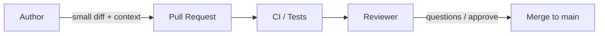

# Pull request etiquette

> **Learning Path:** Technical Leadership & Delivery
> **Section:** 24.1.2 — Code & delivery practices

**Pull request etiquette**

### The problem

Shared main branch is a single point of failure for a team. Without a gate, anyone can land breaking changes, merge conflicts pile up, and review becomes a rubber stamp.

The real constraint isn't Git, it's human bandwidth and risk. Reviewers are busy, context-switching is expensive, and a bad merge costs more than the time saved by shipping fast. Pull requests exist to make integration safe, reviewable, and teachable — not to create process for its own sake.

### Mental model

Think of a PR as a **proposal for a change to a shared system**, not a code dump.

The author is asking: *Will you trust this change enough to run it in production?*
The reviewer is asking: *Do I have enough context to say yes, safely?*

Etiquette is the protocol that makes that trust cheap to establish.

### How it works

A good PR minimizes the cognitive load to answer yes/no.

Essentials:
* **Small scope.** One logical change per PR. Reviewers can hold the whole diff in head.
* **Context first.** Why this change, what problem it solves, how to test it. Link ticket, design doc, or incident.
* **Self-contained.** Green CI, passing tests, no broken main. No "WIP, will fix later".
* **Clean history.** Rebase, squash, or merge commits as per team norm. No 30-step fixup noise.
* **Respect review time.** Don't @ everyone. Request specific reviewers. Respond promptly, batch feedback.

### Architectural reasoning

When does etiquette matter most?

* **Trunk-based development / high-velocity teams.** Main must stay releasable. PR size controls merge conflict surface area.
* **Distributed ownership.** PR description becomes the handoff doc between teams. Without it, knowledge silos form.
* **Safety-critical systems.** Review is the last human check before automation. Good etiquette makes that check effective.

Alternatives: long-lived feature branches, direct push. Both trade review quality for speed and create integration hell later. PR etiquette is the compromise that keeps delivery cadence without sacrificing safety.

### Trade-offs and failure modes

* **Small PRs vs batching.** Small PRs review faster and merge cleaner, but create overhead. The right size is what a reviewer can understand in 15-30 min.
* **Thorough review vs latency.** Over-reviewing blocks flow. Use checklists and automation for mechanical checks; save human attention for design and risk.
* **Author pushes back vs reviewer nits.** Etiquette means both sides act in good faith. Authors should not defend every line; reviewers should not bikeshed.

Failure modes architects see repeatedly:
* Giant PRs that sit for weeks, then get rubber-stamped.
* PRs with no context, forcing reviewers to reverse engineer intent.
* Drive-by approvals from unqualified reviewers to unblock.
* PRs used as design discussion, not implementation review.

These all increase defect rate and erode trust in the process.

### Example

Enterprise payments service, 12 engineers across 3 time zones.

Norm: PRs < 400 lines, must reference JIRA, CI green, one reviewer from owning team + one from platform for changes touching retries/DLQ.

A hotfix for a race condition arrives at 2am UTC. Author opens a 120-line PR with:
* Incident link and postmortem summary
* Repro test added, CI passes
* Diff shows only the lock acquisition change

Reviewer in EU wakes, understands problem in 5 minutes, approves. Merge window respected, no cross-team confusion. The PR itself becomes the audit trail.

If that same change arrived as a 2000-line branch with mixed refactors, review would be skipped or delayed, risking a production incident.

### Reasoning challenge

You have a critical bug fix that requires a 600-line change touching three services. Your team norm is PRs under 400 lines. CI is green. Do you split it into three PRs that depend on each other, or ship one larger PR with extra context?

Consider merge order, review latency, rollback safety, and reviewer load.

### Key takeaway

* A PR is a communication artifact first, a code artifact second.
* Make review cheap: small scope, clear why, green tests, minimal history.
* Etiquette protects main branch health, reviewer trust, and team velocity.
* Consistency beats perfection. Enforce norms with automation, not guilt.
