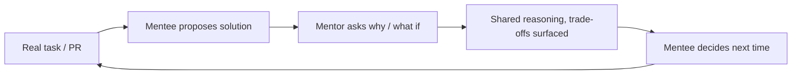

# Technical mentoring

> **Learning Path:** Technical Leadership & Delivery
> **Section:** 24.1.3 — Code & delivery practices

**Technical mentoring**

### 1. The problem

Code and delivery practices don't scale by adding more senior reviewers. The problem is *judgment distribution*.

A senior can review every PR, but velocity caps at their bandwidth. A junior can ship, but makes repeated local optimizations, misses failure modes, and creates architectural drift. Knowledge stays tribal.

Constraints you actually face: limited senior time, onboarding cost, bus factor, and the need for consistent delivery quality across teams. Training gives information. Mentoring is meant to transfer *reasoning*.

### 2. Mental model

Mentoring is not 1:1 teaching. It is a deliberate system for converting senior tacit knowledge into junior explicit judgment, faster than osmosis.

Think of it as a feedback loop for decision making, not code transfer.

The mentor's job is to make their internal checklist visible, then remove themselves.

### 3. How it works

Effective technical mentoring is anchored in real work, not abstract sessions.

* **Contextual prompts over answers.** Instead of "fix this", ask: what are you optimizing for? What fails first under load? What would you change if this had to run for 5 years?
* **Expose reasoning, not just results.** Walk through *why* a design was rejected, what constraints drove it, and what was sacrificed.
* **Bounded scope.** 30-60 min weekly, tied to one current problem. Long-term pairing on a feature > ad-hoc Q&A.
* **Make the invisible visible.** Share mental models: risk vs speed trade-offs, operability checklist, failure modes you check first.

It works when the mentee drives the question and the mentor drives the quality of the question.

### 4. Architectural reasoning

When to invest in mentoring vs other levers.

Mentoring helps when:
* You need to scale technical judgment, not just output. Code review catches bugs; mentoring prevents the class of bugs.
* Onboarding time is expensive and repeated. A mentee who learns *how you decide* reduces senior interruptions later.
* You are introducing new delivery practices — e.g., SRE principles, event-driven design, AI system guardrails — where local reasoning matters.

Alternatives: documentation, formal training, pair programming, guilds.

* Docs scale but go stale and don't teach judgment.
* Pairing is high bandwidth and synchronous.
* Guilds spread patterns but are slow for individual growth.

Decision: Use mentoring for high-leverage individuals and critical capability gaps, pair programming for immediate delivery safety, docs for stable patterns.

### 5. Trade-offs and failure modes

* **Time now vs capacity later.** Mentoring consumes senior cycles immediately for long-term throughput. If measured only on sprint velocity, it looks wasteful.
* **Dependency risk.** Mentoring can become a crutch. The failure mode is "shadowing" where the mentee waits for approval instead of building independent reasoning.
* **Inconsistent quality.** Mentoring is only as good as the mentor's ability to articulate *why*. Bad mentors give rules, not principles.
* **Context switching cost.** Unbounded mentoring destroys focus. Needs boundaries.

The architect's job is to design the mentoring system: clear goals, limited scope, and a graduation criteria.

### 6. Example

Platform team rolling out event-driven architecture with Kafka.

Instead of a workshop, a senior architect mentors two mid-level engineers owning the first two services.

Weekly 45 min: review their design proposal, force them to articulate producer-consumer decoupling, replay requirements, ordering guarantees, and failure modes.

Mentor surfaces the decision framework: *What problem does ordering solve for us? What do we lose with partitions? How do we replay safely?*

After 6 weeks the engineers lead design reviews for other teams. The senior's time drops from reviewing every PR to reviewing architectural assumptions only.

Mentoring scaled judgment, not just knowledge.

### 7. Reasoning challenge

You have one staff engineer and three new hires joining a payments service with strict SLOs and regulatory constraints.

Do you:
A) Have the staff engineer review all PRs,
B) Run formal training on SLOs and compliance, or
C) Mentor one hire as a delivery lead while the others pair on tasks?

What do you optimize for in the first 8 weeks, and what failure mode are you trying to avoid?

### 8. Key takeaway

* Mentoring scales judgment, not just output. Its purpose is to reduce future senior load.
* Anchor it in real decisions, not abstract topics. The loop is task → reasoning → reflection → independence.
* Bound it tightly. Time-box, make goals explicit, and define graduation.
* Measure by decreasing dependency, not hours spent. Fewer "what should I do?" questions is the signal.
