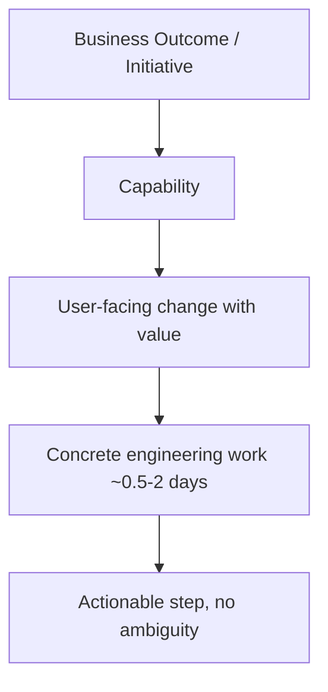

# Task breakdown & estimation

> **Learning Path:** Technical Leadership & Delivery
> **Section:** 24.1.4 — Code & delivery practices

### The problem

You need to commit to delivery dates for a complex system with incomplete information. Top-down estimates feel precise but are wrong. Bottom-up estimates are accurate but too slow to produce.

The problem isn't math. It's uncertainty hiding in large work items.

Large tasks hide dependencies, unknowns, and integration risk. You can't see what you don't break out, and you can't manage risk you can't see.

### Mental model

Estimation is not predicting the future. It's making uncertainty visible and communicable.

Think of work as fractal: an epic looks simple until you zoom in, then it reveals features, stories, tasks, and subtasks. The more you decompose, the more the unknowns surface.

Good breakdown = work items small enough to be understood, sized consistently, and independent enough to be parallelized.

### How it works

Decompose until you reach a stable unit of work.

A practical decomposition ladder:

Rules that make it work:
* **Definition of Ready:** An item is estimable when scope, dependencies, and acceptance criteria are clear enough to discuss.
* **Consistent granularity:** All teams use the same size band. Mixing 2-week epics with 2-hour tasks destroys planning.
* **Defer commitment:** Estimate the work you can see now, re-estimate as you learn.

Estimation methods are just communication tools:
* **T-shirt sizing** for early discovery, fast and coarse.
* **Three-point** `optimistic + 4*most likely + pessimistic / 6` to surface risk.
* **Reference class forecasting** to anchor on past similar work, not hope.

### Architectural reasoning

When it helps:
* Planning capacity across teams and quarters
* Prioritizing work under constraint
* Identifying integration and dependency hotspots before they block
* Communicating risk to stakeholders in business terms

Alternatives:
* **Top-down expert judgment** is fast but hides variance. Good for initial direction, bad for commitment.
* **Analogous estimation** from past projects is cheap and surprisingly accurate if the context matches.
* **No formal estimation** works only for very small, well-understood teams with high autonomy.

Choose breakdown depth based on decision horizon. Strategic roadmap needs features. Sprint planning needs tasks. Architecture decisions need enough detail to see coupling and data flow.

### Trade-offs and failure modes

* **Granularity vs overhead.** Smaller items reduce risk but increase planning cost. Aim for 1-2 day tasks; below that you’re micromanaging.
* **Accuracy vs speed.** Precise estimates take longer and feel better but don’t improve outcomes. Coarse, fast estimates let you iterate.
* **Commitment vs flexibility.** Fixed dates create pressure to under-estimate. Buffers and confidence levels communicate honesty.

Common failures:
* **Planning fallacy:** People estimate duration ignoring historical overruns.
* **Anchoring:** First number spoken becomes the target.
* **Integration debt:** Tasks are estimated in isolation, integration is a surprise.
* **Estimation theater:** Teams estimate to satisfy process, not to make decisions.

### Example

Enterprise AI retrieval system rollout.

Epic: Improve RAG answer quality.

Decompose:
* Feature: Add hybrid search with reranking
* Story: As analyst, I want relevant docs ranked by recency so answers reflect latest policy
* Tasks: 
  1. Prototype reranker on 10k query log – 1 day
  2. Evaluate recall@10 vs baseline – 0.5 day
  3. Add feature flag and rollout plan – 1 day
  4. Update evaluation harness for drift detection – 2 days

Three-point estimate for the feature: optimistic 6 days, most likely 10, pessimistic 20 → ~11 days. The team communicates 70% confidence to finish in 2 weeks with a risk note: reranker latency unknown.

The breakdown surfaces the real risk: evaluation harness, not the model.

### Reasoning challenge

You have 3 teams, 6 weeks, and 12 epics. Leadership wants a committed date for “AI Copilot GA”. 

Do you:
A. Estimate each epic top-down and sum them
B. Break down only the first 2 weeks of work to a task level, then use rolling wave planning
C. Assign story points to epics and convert to days using velocity

What do you need to know first, and what would you communicate back?

### Key takeaway

* Breakdown exposes uncertainty; estimation communicates it.
* Size work consistently and decompose to a unit you can actually finish in days.
* Use coarse estimates early, refine as you learn. Re-estimate is a feature, not failure.
* Communicate confidence and risks, not just dates.
