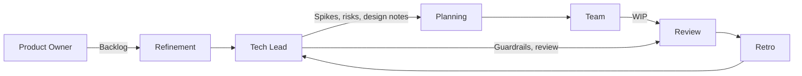

# Agile/sprint involvement at tech-lead level

> **Learning Path:** Technical Leadership & Delivery
> **Section:** 24.1.5 — Code & delivery practices

**Agile/sprint involvement at tech-lead level**

### 1. The problem

Agile delivers speed through small batches and decentralized decision making. At tech-lead level the problem is not speed, it is **coherence under pressure**.

Without technical oversight, sprint planning optimizes for story points, not architecture. Teams pick the easiest path per sprint, integration points drift, non-functional requirements are deferred, and technical debt compounds silently. Product gets velocity, engineering gets fragility.

The constraint is dual: the tech lead must protect long-term system properties — reliability, scalability, security, maintainability — while not becoming a bottleneck that kills flow.

### 2. Mental model

Think of the tech lead as a **circuit breaker and amplifier**, not a gatekeeper.

* Amplifier: makes good technical decisions visible and reusable across the team.
* Circuit breaker: stops work that would create irreversible coupling, data loss, or architectural drift early, when cost is low.

The team owns delivery; the tech lead owns the integrity of the delivery path.

### 3. How it works

Effective involvement is rhythmic, not continuous.

* **Backlog refinement:** translate product intent into technical scope. Identify hidden coupling, data model changes, cross-service impacts.
* **Sprint planning:** validate estimates with implementation risk, not just effort. Authorize technical spikes for unknowns > 20% risk.
* **In-sprint:** minimal interruption. Answer architecture questions, unblock integration, keep design decisions recorded.
* **Review / Definition of Done:** ensure changes meet non-functional bars and are observable.

### 4. Architectural reasoning

When it helps:
* Multiple teams touch shared components, services, or data.
* System has hard non-functional requirements: latency SLOs, data consistency, security boundaries.
* Domain complexity is high and mistakes are expensive to revert.

What it solves:
* Prevents local optimization that creates global fragility.
* Creates a consistent decision log so the team can move fast without re-debating.
* Distributes technical context, reducing bus factor.

Alternatives:
* Full decentralization: tech lead as advisor only. Works when teams are senior, system is modular, and coupling is low.
* Central architecture review board. Works for regulated systems, but adds latency.

Choose involvement depth based on coupling and risk, not team seniority alone.

### 5. Trade-offs and failure modes

* **Bottleneck vs drift.** Too much involvement = approval queue. Too little = silent architectural decay. The failure mode is often invisible until an incident.
* **Spike debt.** Tech leads authorize spikes but teams skip documenting outcomes. Spikes become sunk cost without reusable patterns.
* **Estimation theater.** Tech lead re-estimates stories, eroding team ownership. The team learns to defer thinking.
* **Review fatigue.** If all code must pass tech lead, review latency grows and quality drops.

The key control is *decision records*, not approvals. Record why a design was chosen, what was rejected, and under what conditions to revisit.

### 6. Example

Enterprise payments platform, 3 teams.

Product wants new refund flow in 2 sprints. Tech lead in refinement discovers refund requires new saga across payments, ledger, and notifications. Current ledger lacks idempotency keys.

Decision: approve 3-point spike to prototype idempotency, accept 1-week delay to sprint commitment. Record ADR: use outbox pattern for ledger events, reject synchronous RPC to notifications.

Result: sprint delivers refund behind feature flag with safe rollback. No production incident. Team reuses outbox pattern for next feature.

Without involvement, team would have built synchronous call, shipped faster, and created duplicate refunds under retry.

### 7. Reasoning challenge

You have two squads. Squad A owns API gateway, Squad B owns pricing service. Product wants a new discount API in one sprint.

Squad B estimates 5 points and plans to add the logic directly in the pricing service. Tech lead knows pricing service is already at 80% CPU and has no contract tests with gateway.

Do you block the story, ask for a spike, or let it proceed with a guardrail? What do you record?

### 8. Key takeaway

* Tech lead involvement is about preserving architectural properties under delivery pressure, not maximizing velocity this sprint.
* Intervene early in refinement and planning, stay light in execution, enforce quality at review.
* Make decisions explicit with ADRs and spikes; avoid tacit approvals that create bottlenecks.
* Trade-off is speed now vs cost later. Your job is to make that trade-off visible and intentional.
