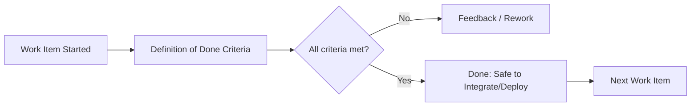

# Definition of done

> **Learning Path:** Technical Leadership & Delivery
> **Section:** 24.1.6 — Code & delivery practices

### The problem

Teams ship work that different people call “done” for different reasons. A developer marks a ticket complete when code is written. QA marks it complete when tests pass. Ops marks it complete when it can be deployed safely. Product marks it complete when the user value is measurable.

Without a shared definition, work leaks between handoffs, rework multiplies, and quality degrades quietly. In distributed systems the cost is higher: an incomplete service can pass unit tests but break contracts, violate SLOs, or introduce data corruption downstream.

The problem isn’t laziness. It’s ambiguity under constraints: parallel work, async teams, CI/CD pipelines, compliance and audit requirements, and the need to scale decision-making without constant managerial oversight.

### Mental model

Definition of Done is a team-level contract: an explicit, testable checklist that defines when a work item is truly complete and safe to integrate, deploy, and support.

It is not a quality aspiration. It is a gate.

Think of it as the acceptance criteria for the *process*, not just the feature. Definition of Ready tells you when you can start. Definition of Done tells you when you can stop.

### How it works

A DoD is a small, stable list owned by the team and visible to stakeholders. Good items are observable and verifiable, not intentions.

Typical elements:
* Code complete with peer review merged
* Automated tests pass with required coverage thresholds
* Static analysis, security scan, and linting pass
* Work item is documented and traceable
* Feature flags / config are ready for safe rollout
* Observability added: logs, metrics, traces, alerts
* Deployment verified in staging; rollback plan exists
* Acceptance criteria demonstrably met and signed off

For AI systems the DoD expands beyond code: data validation passed, model metrics meet target thresholds on hold-out set, lineage documented, bias/fairness checks run, monitoring and drift detection configured, and model card or risk assessment completed.

The DoD becomes executable. Items map to pipeline gates, automated checks, and manual approvals.

### Architectural reasoning

DoD solves coordination without central control. It lets teams work autonomously while preserving system integrity.

When it helps:
* Multiple teams contribute to the same service or platform. DoD encodes interface contracts and quality bars.
* You need safe continuous delivery. The DoD is the checklist your CI/CD enforces.
* Compliance or regulated domains require evidence of process. DoD creates an audit trail.
* AI/ML delivery where “working model” is insufficient. You need reproducible training, evaluation, and monitoring before promotion.

Alternatives: implicit tribal knowledge, manager sign-off per ticket, or “definition of done by the loudest voice.” Those scale poorly and fail under load.

Choose a DoD when the cost of a bad merge, incident, or silent quality regression exceeds the cost of enforcing the checklist.

### Trade-offs and failure modes

* **Rigidity vs speed.** Overly strict DoD slows flow. Overly loose DoD hides debt. The right level is the minimum set that prevents known failure modes.
* **Checklist theater.** Teams tick boxes without understanding. Mitigate by making criteria automated where possible and reviewing DoD quarterly.
* **Local vs global.** Team DoD may be necessary but not sufficient for system-level readiness. You often need a higher-level Definition of Done for release, covering integration tests, SLO validation, and security review.
* **Drift.** DoD rots if not maintained. New risks, new services, new compliance rules require updates. Treat DoD as living architecture.

Failure mode to watch: DoD defined only for code, not for operational readiness. A feature can be “done” but unobservable in production, making incidents inevitable.

### Example

Enterprise payments platform, two teams: API team and Ledger team.

The API team DoD includes: contract test against ledger schema passes, PACT contract published, OpenAPI updated, security scan clean, canary deploy succeeds with error rate <0.1% for 30 min.

The Ledger team DoD includes: idempotency verified, reconciliation job passes, data retention policy applied, audit log emitted.

A shared release DoD adds: end-to-end payment flow tested in pre-prod, rollback validated, runbook updated, on-call notified.

Without this, the API team would close tickets when code merged, and the ledger would receive breaking changes at 2am.

### Reasoning challenge

Your team is shipping an LLM-powered classifier for fraud detection. Velocity is dropping because the DoD requires manual bias review, full shadow mode evaluation for 2 weeks, and a security review for every model change. Product wants to cut shadow mode to 3 days.

What do you do? Which criteria are non-negotiable for safety and which can be relaxed with mitigations? How would you change the DoD rather than abandon it?

### Key takeaway

* DoD is a coordination contract that replaces ambiguity with verifiable completion.
* Make it observable and mostly automated; manual checks should be rare and high-value.
* Separate team DoD from system/release DoD; both are needed.
* Review DoD regularly against incidents and architectural changes. It encodes your quality bar.
