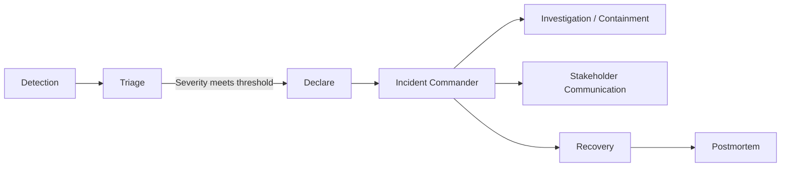

# Incident response leadership

> **Learning Path:** Technical Leadership & Delivery
> **Section:** 24.2.1 — Incident & operational leadership

**The problem**

A production incident is not a technical bug, it is a coordination failure under time pressure. You have incomplete data, noisy alerts, multiple teams touching the same system, business stakeholders demanding updates, and engineers under stress making decisions that are hard to reverse.

Without explicit leadership, teams duplicate work, chase the wrong hypothesis, hide bad news, and communicate inconsistently to customers. The fix is often found quickly, but the blast radius grows because no one is owning scope, prioritization, and communication.

**Mental model**

Incident response leadership is a temporary organization designed to make decisions with partial information.

Think of it as an Incident Commander pattern borrowed from emergency response. One person owns the outcome, not the technical fix. Their job is to reduce uncertainty, allocate attention, and protect the team from external pressure.

The commander creates a clear operating rhythm: what we know, what we don't know, what we're doing next, and when we'll update.

**How it works**

The leader does four things repeatedly:

* **Frame the problem.** Define the current hypothesis, impact scope, and success criteria. "We are investigating latency in payment API, impact is checkout failures in US-East, success is error rate <0.1%."
* **Constrain the search.** Assign parallel tracks with clear owners: investigation, mitigation, communication, customer impact. No one chases the same log.
* **Make explicit trade-offs.** With incomplete data you must choose: rollback now vs wait for root cause, degrade feature vs risk full outage, page more people vs preserve sleep. The leader documents the rationale.
* **Manage the outside.** One communication channel to business and customers, one internal channel for technical work. The leader absorbs pressure so engineers can think.

Decision quality comes from time-boxed checks: "We will test hypothesis A for 15 minutes, then decide to pivot."

**Architectural reasoning**

This helps when systems are distributed and ownership is split. It solves the problem of attention allocation under uncertainty, not the technical fault.

Choose explicit command when:
* Impact crosses team boundaries
* Business cost of delay > cost of coordination overhead
* Information is noisy and hypotheses are competing

Alternatives:
* Swarm: everyone joins one channel. Fast for small, well-known services with one team. Fails at scale with noise and duplication.
* Tech lead drives: works until stakeholder pressure and customer comms distract the fixer.

Leadership adds overhead. Use it when the cost of misalignment exceeds the cost of coordination.

**Trade-offs and failure modes**

* **Centralization vs speed.** A commander can become a bottleneck if they require approval for every action. Good leaders delegate tactical decisions and reserve veto for irreversible actions.
* **Transparency vs noise.** Full open comms builds trust but can flood engineers. Separate channels for signal vs noise.
* **Speed vs accuracy.** Early rollback is safe but may mask root cause. Leaders must decide which risk the business can tolerate now.
* **Blame vs learning.** If the commander punishes bad news, engineers hide symptoms. Psychological safety is an operational requirement.

Common failure: leader is the best debugger. They dive into logs and lose situational awareness. Command is not fixing, it is directing fixing.

**Example**

Payment service latency spikes to 2s p99. Alerts fire in API, DB, and message bus.

Commander declares SEV1, sets up two channels. Investigation track owns API and DB. Mitigation track prepares rollback of last deployment. Comm track owns customer update every 15 min.

First hypothesis: DB CPU. Investigation finds normal CPU but connection pool exhaustion. Mitigation tests rollback, predicts 10 min. Business asks for ETA. Commander responds: "We have a plausible hypothesis, we will validate in 10 min, rollback ready as fallback."

Rollback succeeds, error rate drops. Commander stops work: no further root cause during incident. Postmortem scheduled.

Without a commander, two senior engineers would debate DB vs API in main channel while customer success tweets incorrect status.

**Reasoning challenge**

You are on-call for an AI inference service. Latency spikes and cost metrics spike simultaneously. One engineer suspects model serving overload, another suspects a runaway prompt causing a feedback loop in your RAG pipeline. Business is asking if you should throttle all users.

What do you decide to prioritize first: isolate the hypothesis, communicate a mitigation plan to business, or page the ML platform team? What information do you need before you can decide?

**Key takeaway**

* Incidents are decision problems under uncertainty, not just technical problems.
* Leadership creates clarity: scope, hypothesis, owner, next check-in.
* Protect technical work from external pressure and protect the business from silent heroics.
* Document trade-offs explicitly; postmortems only work when decisions are visible.
