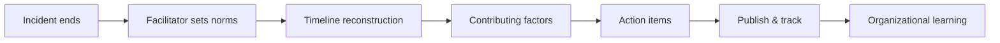

# Postmortem facilitation

> **Learning Path:** Technical Leadership & Delivery
> **Section:** 24.2.2 — Incident & operational leadership

### The problem

Incidents happen. The technical fix is usually the easy part. The hard part is what happens after: why the same class of failure recurs, why teams hide information, and why action items die.

Without structure, postmortems become either a blame session that drives information underground, or a ritual document no one reads. The cost is repeat incidents, slower recovery, and erosion of trust.

The constraint is human, not technical: people are stressed, time is limited, data is incomplete, and incentives point to defending rather than learning.

### Mental model

A postmortem is not a root cause report. It is a learning system.

Facilitation is the control plane for that system. It shapes what gets surfaced, how it is discussed, and what gets committed to.

Think of it as: **Collect → Make safe → Reconstruct → Learn → Commit**

The facilitator's job is to keep the conversation on the timeline of events and decisions, not on intentions or character.

### How it works

Good facilitation enforces a tight structure:

1. **Scope and set norms.** Timebox, define blameless ground rules, and make clear the output is fixes, not punishment.
2. **Reconstruct, don't theorize.** Build a timeline from first alert to resolution using logs, metrics, and chat. Stick to observable facts.
3. **Five whys with evidence.** Ask why the system allowed the failure, not why a person acted. Stop at system conditions.
4. **Separate causes from impacts.** Distinguish detection delay, blast radius, and recovery time.
5. **Generate corrective actions.** Each action is specific, owned, and tied to a failure mode. Classify as prevention, detection, mitigation, or response.
6. **Close the loop.** Publish summary, track actions, and review completion in a later retro.

### Architectural reasoning

When does facilitation matter most? In systems with high coupling, on-call rotation, and production ownership spread across teams. That's where handoffs create gaps in mental models.

Alternatives:
* **Blameful review.** Fast, satisfies immediate desire for accountability. Destroys psychological safety and hides near-misses.
* **No formal review.** Saves time short term. Incidents repeat with higher cost.
* **Automated RCA.** Good for data gathering, bad for human factors and cross-team coordination.

Choose structured facilitation when reliability is a business constraint and incidents cross team boundaries. It enables a learning architecture where incident data feeds back into design, monitoring, and runbooks.

### Trade-offs and failure modes

* **Speed vs depth.** A 24h postmortem captures freshness; a 5-day postmortem gets better analysis. Pick a fast, lightweight first pass and a deeper follow-up for severe incidents.
* **Comprehensiveness vs actionability.** Long lists feel thorough but fail. 3-5 high-leverage actions beat 20 low-impact ones.
* **Psychological safety vs accountability.** Safety without follow-through breeds complacency. Accountability without safety breeds concealment.

Failure modes to watch:
* **The facilitator is the on-call engineer.** They become defensive and data is filtered.
* **Timeline is skipped.** Jumping to solutions creates shallow causes.
* **Actions are vague.** "Improve monitoring" is not an action. "Add alert on queue depth > X with runbook link" is.
* **No review.** Actions rot. Learning does not compound.

### Example

Payments service outage, 18 minutes of failed checkouts.

Facilitator from platform team, not payments. Norms set: no names in findings, focus on system.

Timeline built from traces, PagerDuty, Slack. Key points: deploys to new region finished 12 min before incident, canary passed, but rollback config was stale. Alert on error rate fired but threshold was set too high due to previous tuning. On-call followed runbook, but runbook pointed to wrong dashboard.

Contributing factors: lack of automated rollback test, alert fatigue, runbook drift.

Actions:
* Prevention: add rollback smoke test to deploy pipeline, owner: release eng.
* Detection: lower error rate threshold and add SLO burn alert, owner: SRE.
* Mitigation: make region failover automatic for 5xx > 1%, owner: payments.
* Response: runbook audit + auto-link in alerts, owner: SRE.

Published within 48h, actions tracked in Jira, reviewed in next sprint demo.

### Reasoning challenge

You facilitate a postmortem where the on-call engineer is visibly defensive, a senior manager keeps asking "who approved this change?", and two teams are disputing which service caused the cascade. The timeline is 40% complete.

What do you do next to keep the session productive and blameless, without losing critical information?

### Key takeaway

* Postmortems exist to change the system, not to assign fault.
* Facilitation is a reliability control plane: it determines what gets learned and what gets repeated.
* Psychological safety is a prerequisite for accurate reconstruction.
* Good output is a small set of owned, testable corrective actions with a clear feedback loop.
