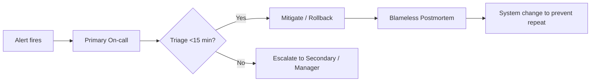

# On-call ownership

> **Learning Path:** Technical Leadership & Delivery
> **Section:** 24.2.3 — Incident & operational leadership

**On-call ownership**

### 1. The problem

Incidents don't happen to systems. They happen to people at 3am. In classic silos, developers build and hand off to operations. When something breaks, the ops team pages, the dev team wakes up, context is missing, and MTTR grows.

The constraint is 24/7 reliability with limited people. You need fast detection, fast triage, and someone with enough context to make safe changes under pressure. Handoffs create delay, blame, and learned helplessness.

### 2. Mental model

On-call ownership is **You Build It, You Run It**.

The team that owns the service owns its production behavior, including the incidents. Ownership is not heroics. It is a contract: design for operability, define SLOs, carry the pager, and learn from failures.

Think of it as a service boundary, not a job title. The service has a single accountable owner. The on-call rotation is just the operational expression of that ownership.

### 3. How it works

Ownership is encoded in structure, not good intentions.

* **Service-aligned rotation.** One team per service, primary and secondary on-call. No shared generic NOC.
* **SLOs and error budgets.** What is acceptable? When do you page? Ownership needs a decision threshold.
* **Runbooks + automation.** Common failure modes are codified: diagnose, mitigate, rollback. The on-call engineer should not be improvising.
* **Escalation policy.** Clear timeboxes: triage in 15 min, mitigation in 60 min, escalate if unknown.
* **Blameless postmortems.** Incident -> fix -> learn -> change system. The goal is to remove the toil that caused the page.

### 4. Architectural reasoning

When does service ownership help?

* Distributed systems with many interacting services. The only person who knows the failure modes is the team that wrote the code.
* Need for low MTTR. Context lives with the builders.
* You want incentives aligned. If developers feel pager pain, they design for observability, safe deploys, and graceful degradation.

Alternatives exist:

* **Centralized ops/NOC.** Specialists handle all incidents. Good for standardization and when you have very few services. Bad for context, slow MTTR, and creates a throw-over-the-wall culture.
* **Shared on-call.** Multiple teams rotate a platform. Works for truly shared infrastructure, but creates ambiguity about who fixes what.

Choose service ownership when service complexity and change velocity are high. Choose central ops when services are stable, homogeneous, and few.

### 5. Trade-offs and failure modes

* **Burnout vs accountability.** Ownership is good until the rotation is understaffed, alert noise is high, or the service is too large for one team. Mitigate with alert quality, rotation size, and on-call load caps.
* **Depth vs breadth.** Specialists are faster at platform issues. Service owners are faster at app issues. Hybrid models often keep platform SRE for shared foundations and service teams for their services.
* **Hero culture.** If the same person always fixes it, you have learned nothing. Postmortems must drive automation, not praise.
* **Escalation ambiguity.** Without clear SLOs and runbooks, on-call engineers escalate too late or too early.

### 6. Example

Payments service at a fintech. Team of 8 owns API, ledger, reconciliation, and fraud checks.

They define SLO: 99.95% availability, p95 latency <200ms. Error budget burn alerts page primary. Runbook exists for DB failover and payment provider degradation.

During an incident, provider latency spikes. Primary on-call confirms via dashboards, triggers circuit breaker, sheds non-critical traffic, and communicates in incident channel. Secondary is on standby. Postmortem leads to adding provider latency SLO and automated fallback.

The fix is owned by the same team that wrote the integration. No ticket handoff to a separate ops team.

### 7. Reasoning challenge

You have a monolith with 3 teams, each owning different features but sharing the same deploy and DB. Incidents page a central ops team who then contacts the relevant dev team. MTTR is 90 minutes average.

Do you move to service ownership now, or first split the monolith? What is the minimum you need before making on-call ownership work?

### 8. Key takeaway

* Ownership is a design decision, not a cultural slogan. It changes who gets paged, what gets built, and how failures are handled.
* On-call works when service boundaries are clear, alerts are actionable, and the team has authority to change the system.
* The real cost is not the pager. It is the toil and cognitive load. Reduce pages by improving systems, not by hiding them.
* Blameless postmortems close the loop: incident -> learning -> architectural change.
