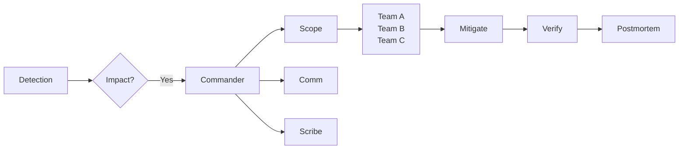

# Cross-team coordination

> **Learning Path:** Technical Leadership & Delivery
> **Section:** 24.2.4 — Incident & operational leadership

**Cross-team coordination**

### 1. The problem

An incident rarely stays inside one team. A latency spike in payments touches API gateway, auth, payments service, fraud detection, and data pipeline. Each team owns its service, its on-call, its dashboards, and its runbooks.

Under time pressure you get: partial information, conflicting hypotheses, duplicate work, and slow decisions because no one has full authority.

The problem is not technical. It is coordination cost across ownership boundaries when observability is incomplete and the clock is running.

### 2. Mental model

Think of incident response as a distributed system. Teams are nodes. Coordination is the protocol between them.

You need three things for the protocol to work:
* **A single source of truth** for state: what is impacted, what is tried, what is known.
* **Clear roles** so decision latency stays low.
* **Bounded interfaces** between teams: what each team can promise, how fast, and what signals they need.

Without those, you get broadcast noise and heroics instead of progress.

### 3. How it works

Effective coordination is minimal and explicit.

**Incident Commander** owns the timeline, not the fix. They triage, prioritize, and keep communication out-of-band from execution.

**Communications lead** owns external updates. **Scribe** owns the timeline of actions.

Teams work in parallel within their blast radius. They report status against a shared incident doc, not in chat threads.

Escalation is pre-defined: severity → on-call → manager → exec. No ad-hoc hunting for people.

### 4. Architectural reasoning

Why centralize command but decentralize execution?

Centralized command reduces decision thrashing. One person owns "what is the next hypothesis", everyone else owns "how do we test it fast in our domain".

Decentralized execution respects service ownership and avoids a single bottleneck for remediation.

This maps to architecture: you want loose coupling between teams the same way you want loose coupling between services. Define contracts: SLOs, dependencies, runbooks, and an interface for incident handoff.

Alternatives:
* **Full distributed ownership** - fast for small teams, fails at scale with coordination gaps.
* **War room with everyone** - high context, high interruption cost, tends to create bystanders.
* **Commander model** - balances speed and clarity, assumes trust and training.

Choose commander model when incident scope spans >2 teams, impact is customer-facing, or MTTR is a business risk.

### 5. Trade-offs and failure modes

* **Centralization vs autonomy.** Too much control slows teams. Too little creates conflicting mitigations. The trade-off is decision speed vs local knowledge.
* **Communication overhead.** The incident channel must be signal, not noise. Over-communication causes fatigue; under-communication causes duplicate work.
* **Tool fragmentation.** If teams use different dashboards, alerting, and chat tools, the shared source of truth breaks. You need a common incident record, even if investigations stay in native tools.

Failure modes to watch:
* Diffusion of responsibility: "I thought team X was handling it."
* Premature mitigation: rolling back without confirming root cause, causing more damage.
* Post-incident blame: erodes reporting and slows future coordination.

### 6. Example

Payment failures spike at 14:03 UTC. Error rate 12%, p95 latency 4s.

Commander declares SEV2, opens incident doc. Scribe logs timeline. Comm posts status page draft.

Team API gateway finds 5xx from auth. Team auth finds DB replica lag. Team payments confirms retries are amplifying load.

Commander decides: stop retry storm first, then investigate replica. Payments disables retries. Error rate drops to 2% in 8 minutes. Auth team fails over replica. Verification and postmortem follow.

No single team could have fixed it. Coordination enabled parallel, non-conflicting actions with a shared timeline.

### 7. Reasoning challenge

You have a multi-region outage affecting search and recommendations. Two teams: Search owns query path, Recommendations owns ranking. Both show degraded latency. On-call engineers are debating whether the root cause is shared infra or a bad deploy.

Do you pull in both teams into one video call, or appoint an incident commander and keep teams working asynchronously with a shared doc? What information do you need first to decide?

### 8. Key takeaway

* Incidents are cross-team coordination problems first, technical problems second.
* One commander for decisions, many owners for execution.
* Shared state and clear interfaces beat perfect tools.
* Design coordination like you design systems: minimize coupling, define contracts, and plan for failure modes.
