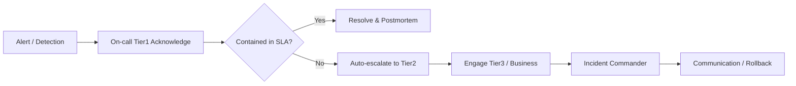

# Escalation management

> **Learning Path:** Technical Leadership & Delivery
> **Section:** 24.2.5 — Incident & operational leadership

**Escalation management is not about sending more alerts. It's about deciding who gets to make the next decision, and when.**

### The problem

An incident starts with a signal, not a person. CPU spikes, latency breaches SLO, a model starts drifting, a payment queue stalls. The first responder has limited context, limited authority, and limited time.

Without a clear path, you get two failure modes: the incident sits with the wrong person too long, or it bounces around until someone with authority finally gets involved. Both increase MTTR and erode trust.

Constraints create the need:
* **Time pressure.** Impact grows non-linearly with delay.
* **Attention is scarce.** On-call engineers cannot be woken for every anomaly.
* **Authority mismatch.** L1 can restart a service; only L3 can approve a rollback or customer communication.
* **Fatigue.** Repeated false escalations train people to ignore alerts.

### Mental model

Think of escalation as a circuit breaker for human attention.

Normal operation → triage → contained by first responder → resolved.
If not contained within a time/condition window → transfer decision rights up the chain.

Escalation is not promotion, it's a transfer of *decision scope*.

### How it works

An effective policy encodes three things:

1. **Triggers.** Objective, not subjective. Time-based: no owner acknowledged in 5 min. Signal-based: severity S1, error budget burn > 5% in 1 min, customer impact > X. Business-based: revenue-impacting, regulatory, exec request.

2. **Tiers and roles.** Not just people, decision rights.
* Tier 1: Detection, triage, initial mitigation.
* Tier 2: Domain expertise, can change config/deploy.
* Tier 3: Architecture/engineering leadership, can make costly trade-offs, approve incidents to be escalated externally.

3. **Channels and cadence.** Page vs Slack vs phone. Who gets notified, how, and when to stop.

Automation handles the mechanical part: timers, paging, runbook links. Humans handle the judgment part.

### Architectural reasoning

When it helps:
* Systems with clear blast radius and SLOs.
* Teams with separate on-call and leadership.
* AI systems where degradation is gradual, not binary, and needs human judgment to decide "retrain vs rollback vs throttle".

Alternatives:
* **Ad-hoc escalation.** Fast initially, fails at scale and under stress. No auditability.
* **Flat paging.** Everyone gets everything. Fast but creates alert fatigue and diffusion of responsibility.
* **Fully automated remediation.** Great for known failures, dangerous for novel ones.

Choose tiered escalation when you need predictable MTTR and clear ownership, and you can afford the overhead of defining triggers.

### Trade-offs and failure modes

* **Speed vs noise.** Tight windows escalate fast but cause false positives. Loose windows protect sleep but increase customer impact.
* **Clarity vs flexibility.** Strict policy is auditable but can be wrong for edge cases. Loosely defined policy invites hesitation.
* **Automation vs judgment.** Auto-escalate is reliable until it pages the wrong person for a flapping alert. Human-in-the-loop adds latency.

Common failures:
* **Escalation lag.** Timer is too long or acknowledgement is silent. Incident sits.
* **Escalation ping-pong.** Unclear ownership leads to multiple people rejecting.
* **Over-escalation.** Leaders get woken for L1 issues. They start ignoring.
* **Under-escalation.** Business impact is hidden because the on-call team doesn't have customer context.

### Example

E-commerce checkout latency SLO is 500ms p95. Anomaly detection fires.

Tier1 on-call acknowledges in 3 min, sees 2x latency on payment service, restarts pod per runbook. No improvement in 7 min.

Policy triggers auto-escalation to Tier2 payment SME, who confirms downstream fraud API degradation. Tier2 can throttle non-critical checks. No improvement in 10 min.

Auto-escalation to Incident Commander + Product Lead. Decision: enable cached fraud score and notify customers of slight risk increase. Business impact contained, postmortem scheduled.

Without timers and role boundaries, the restart would have been retried indefinitely.

### Reasoning challenge

Your AI inference service shows 3% accuracy drop over 2 hours, no errors, latency normal. On-call is Tier1 ML Ops. No customer complaints yet. Escalate now, or wait for explicit error budget burn?

What trigger would you define, and who should own the decision to rollback the model?

### Key takeaway

* Escalation is about transferring decision rights under time pressure, not just notifying people.
* Design triggers around impact and containment time, not severity labels.
* Make the policy explicit, automated where possible, and audited in postmortems.
* Optimize for the few critical decisions: who can act, when, and how fast.

You should leave understanding when to escalate automatically, when to require human confirmation, and how escalation policy shapes MTTR, burnout, and organizational trust.
