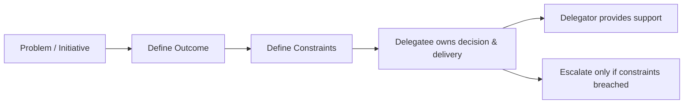

# Delegation

> **Learning Path:** Technical Leadership & Delivery
> **Section:** 24.3.2 — People & process

**Delegation**

### 1. The problem

A senior engineer / architect becomes the bottleneck. Every design review, every incident, every cross-team decision routes through you. The system grows, the team grows, and your calendar becomes the constraint on delivery.

The problem isn't workload. It's coupling. If decision rights and ownership are centralized, throughput is capped by one person, context is lost on handoffs, and the team never builds judgment.

### 2. Mental model

Delegation is not task assignment. It is the transfer of ownership with decision rights.

Analogy: You are not the foreman handing out nails. You are the architect defining the load-bearing requirements, then letting the structural team choose the beam. You retain accountability for the building, they own the choice of beam.

Good delegation = Outcome + Constraints + Decision Rights + Support. Bad delegation = Task + Hope.

### 3. How it works

The mechanism is a contract, not a command.

1. **Define outcome, not method.** "Reduce p95 latency to <200ms for checkout" not "Add Redis cache here".
2. **Define constraints.** Non-negotiables: security, SLOs, cost cap, data privacy, API compatibility. These are your guardrails.
3. **Give decision rights.** The delegatee chooses the approach, trade-offs, and implementation.
4. **Provide support, not approval.** Coaching, access to context, unblocking. Review only at constraint boundaries.
5. **Escalate on breach, not on discomfort.** If a constraint is hit, pull back in. Otherwise stay out.

### 4. Architectural reasoning

When it helps:
* **Scaling delivery.** You cannot be the critical path for every service.
* **Building system judgment.** Teams learn to reason under constraints, which is how architecture scales.
* **Resilience.** If you are on vacation, incidents still get resolved.
* **Parallel work.** Multiple domains can move without serializing through you.

What it solves: bottleneck, single point of failure, slow decision making, learned helplessness.

Alternatives:
* **Micromanagement:** Fast short term, kills autonomy and throughput.
* **Abdication:** No constraints, leads to rework and architectural drift.
* **Committee:** Safe, slow, diffuses ownership.

Choose delegation when the cost of a wrong decision is recoverable and the cost of delay is high. Retain control when the blast radius is irreversible.

### 5. Trade-offs and failure modes

Trade-offs an architect must remember:
* **Speed vs Consistency.** Delegation speeds delivery but risks local optima. Constraints keep the system coherent.
* **Learning vs Risk.** First time is slower, but compounds. You pay tuition for future autonomy.
* **Visibility vs Overhead.** Less direct control means you need better signals, not more meetings.

Failure modes:
* **Abdication:** Outcome and constraints undefined. Delegatee guesses, you get surprise.
* **False delegation:** Task handed over but every decision still requires your sign-off. Creates waiting.
* **No support:** Decision rights given without context, access, or coaching. Sets people up to fail.
* **Constraint drift:** Guardrails are vague. "Be careful with security" is not a constraint.

### 6. Example

Enterprise payment platform migration to event-driven architecture.

You define: Outcome = zero-downtime migration of payment capture. Constraints = no loss of payments, p99 latency <300ms, PCI scope unchanged, rollback <5 min. Decision rights = platform team owns choice of event bus, schema, and rollout plan.

You do not pick Kafka vs EventBridge, or decide on exactly-once semantics. You provide the reliability model, the failure scenarios to test, and a review at the migration runbook.

Result: team designs a dual-write + shadow validation approach you hadn't considered, learns to reason about event ordering, and owns the incident response.

### 7. Reasoning challenge

Your team must build an AI retrieval pipeline with RAG. You have 3 weeks, a junior engineer, and a production LLM API cost cap.

Do you:
a) Design the whole pipeline yourself and hand off implementation?
b) Delegate the full design with only "it must work and stay under $500/mo" ?
c) Define outcome and constraints, then let the engineer pick retrieval strategy and evaluation method with you as coach?

What do you delegate, what do you keep, and what is the minimal constraint set you need to define?

### 8. Key takeaway

* Delegation is transfer of ownership with decision rights, not task dumping.
* Define outcome + hard constraints, then get out of the way.
* Retain accountability, give autonomy within guardrails.
* Measure delegation health by escalation rate and decision quality, not by how many tasks you offload.
