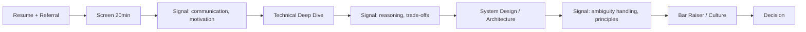

# Technical hiring & interviewing

> **Learning Path:** Technical Leadership & Delivery
> **Section:** 24.3.3 — People & process

**Technical hiring & interviewing**

### 1. The problem

You are scaling an engineering org. A bad hire costs 1.5-2x annual salary in ramp + replacement, and a great hire compounds team velocity for years. You have ~60-90 minutes per candidate to predict 2-3 years of performance on systems you will design together.

The problem is not finding someone who can solve LeetCode. It is predicting: will this person make good architectural trade-offs under ambiguity, communicate with stakeholders, and raise the bar of the team?

Constraints: limited signal, high cost of errors, need speed at scale, and legal/ethical requirement for fairness. You cannot A/B test a hire.

### 2. Mental model

Hiring is a prediction system with noisy signals.

You are building a classifier: `Candidate -> Future Performance`. Each interview stage is a feature extractor with cost, noise, and bias.

Good hiring architecture maximizes predictive signal per unit of candidate and interviewer time, while minimizing false positives and false negatives.

Think: signal quality > interview quantity.

### 3. How it works

A minimal signal pipeline:

Each stage filters and adds signal:
* **Screen:** Fit, motivation, basic bar. Low cost, high throughput.
* **Technical deep dive:** Past work, not algorithms. "Walk me through a system you designed. What would you change now?" Tests reasoning, not recall.
* **System design/architecture interview:** The core for Solution Architects. Given constraints, produce a coherent design, justify trade-offs, and iterate on critique.
* **Bar raiser:** Consistency check and team fit. Reduces individual interviewer bias.

### 4. Architectural reasoning

When it helps and what to optimize for.

**For AI Solution Architect roles**, the predictive signal you need is:
* Ability to reason from problem -> constraints -> options -> trade-off
* Comfort with ambiguity and incomplete requirements
* Communication with product, security, and infra stakeholders
* Experience operating systems at scale, not just building demos

Therefore, prioritize:
* **Past system ownership over whiteboard puzzles.** Ask for real trade-offs made: cost vs latency, consistency vs availability, build vs buy.
* **Live architecture discussion over take-homes.** Take-homes produce polished artifacts but high candidate cost and low signal on collaboration. A 60-min guided design reveals thinking in real time.
* **Standardized rubric over gut feel.** Score on dimensions: problem framing, decomposition, trade-off articulation, communication, and follow-through. This reduces variance across interviewers.

Alternatives:
* Coding screens filter for ICs; less predictive for architect level.
* Extensive take-home projects increase signal but kill candidate experience and introduce bias against candidates with caregiving constraints.
* Unstructured chats feel friendly but produce low inter-rater reliability.

Choose the format that matches the job's critical success factors, not the format that is easiest to run.

### 5. Trade-offs and failure modes

* **Speed vs accuracy.** More stages reduce false positives but increase time-to-offer and candidate drop-off. Architect roles justify 4-5 stages; junior roles do not.
* **Standardization vs depth.** Rubrics improve fairness and calibration, but over-scripting kills ability to probe edge cases. Keep rubric tight, prompts open.
* **False negative cost is high.** Top architects are rare. Over-indexing on culture fit or polished presentation rejects non-traditional but high-impact candidates.
* **Bias amplification.** Resume screening and referral-heavy pipelines replicate existing demographics. Mitigate with blind resume review, structured interviews, and diverse panels.
* **Signal decay.** Interview performance correlates weakly with on-the-job performance if the interview does not mirror real work. A candidate who can recite CAP theorem is not the same as one who can decide when eventual consistency is acceptable for a payments system.

Common failure modes: optimizing for "cleverness" instead of judgment; no calibration between interviewers; hiring manager veto without documented rationale.

### 6. Example

Hiring a Senior AI Solution Architect for enterprise RAG platform.

Screen: 20 min, focus on motivation and prior customer-facing architecture.

Technical deep dive: Candidate describes migrating a retrieval system from single vector DB to hybrid. Interviewer probes: Why hybrid? What metrics changed? What failed in production? What would you do differently with today's constraints?

System design: "Design an evaluation pipeline for RAG agents across 3 regions with data residency. Latency SLO 800ms p95, cost cap $X/month." Candidate must frame requirements, propose data flow, discuss consistency, observability, and cost controls. Interviewer challenges assumptions.

Bar raiser checks calibration on trade-offs and communication clarity.

Decision is based on rubric scores, not "I liked them."

### 7. Reasoning challenge

You have 30 open architect roles, 500 applicants/week, and 3 senior interviewers.

Option A: 2-stage process - 30 min screen + 60 min system design, high throughput.
Option B: 4-stage process with take-home design doc, slower throughput, higher signal.

What do you choose, and what guardrails do you put in place to avoid the main failure mode of your choice?

### 8. Key takeaway

* Hiring is prediction under uncertainty. Design the interview as a signal pipeline, not a quiz.
* Optimize for job-relevant signals: trade-off reasoning, ambiguity handling, and communication.
* Standardize scoring, calibrate interviewers, and audit for bias.
* Every stage must earn its cost in predictive value and candidate experience.
