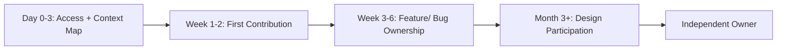

# Onboarding new engineers

> **Learning Path:** Technical Leadership & Delivery
> **Section:** 24.3.4 — People & process

**Onboarding new engineers**

### 1. The problem

A new engineer is not unproductive because they lack skill. They are unproductive because they lack *context*: how decisions were made, where the bodies are buried, which Slack threads matter, who owns what.

Without a system, context transfer relies on ad-hoc conversations with senior engineers. That creates three constraints:
* Senior time is expensive and fragmented. Every interruption is context-switch cost for them.
* Knowledge is tacit and uneven. The new hire gets the version the last person told them.
* Ramp-up is non-linear. Early weeks feel slow, then productivity collapses when they finally touch a critical path without understanding failure modes.

Onboarding is not orientation. It is controlled knowledge transfer under time and attention constraints.

### 2. Mental model

Think of onboarding as a product with a user: the new engineer. The product goal is time-to-first-meaningful-contribution and time-to-independent-ownership.

The core mechanism is *scaffolded exposure*: give just enough structure to reduce search cost, then progressively remove scaffolding as mental models form.

An analogy: you don't learn a city by getting a full map and a history book. You learn by walking a few key routes, then being dropped in with a transit card.

### 3. How it works

Effective onboarding is designed, not documented.

A minimal architecture:
* **Access and safety net first.** Accounts, repos, local dev, runbooks for common failures. First day should be blocked by zero toil.
* **Context map, not encyclopedia.** A 1-page system map: domains, critical services, data flows, deployment, on-call. Who to ask for what. This is the mental model scaffold.
* **Guided first contribution.** A scoped, well-bounded task with clear acceptance criteria and a reviewer who knows the history. Success here builds confidence and validates tooling.
* **Progressive ownership.** 30-60-90 plan that moves from read-only → fix → change → design. Each phase has explicit learning goals and a human checkpoint.

The process is delivered via a mix of self-serve artifacts and high-signal human interaction. Self-serve for stable facts, human for judgment.

### 4. Architectural reasoning

When does structured onboarding help? When team throughput depends on distributed ownership and knowledge is not easily codified.

Alternatives:
* *Sink or swim*: cheap to set up, expensive in senior time and attrition. Works only for tiny teams with stable codebases.
* *Pure documentation*: scales read cost, fails on tacit knowledge and stale docs. Docs rot faster than code.
* *Buddy only*: high quality but non-repeatable and couples ramp-up to one person's availability.

You choose designed onboarding when the cost of a bad ramp exceeds the cost of designing the ramp. That is true in any system with production risk, regulatory constraints, or >3 interacting services.

The decision is architectural because onboarding shapes coupling. Poor onboarding creates knowledge silos and hero dependencies. Good onboarding increases bus factor and reduces mean time to recovery.

### 5. Trade-offs and failure modes

* **Speed vs depth.** Pushing for a first PR in 48h feels good but creates shallow understanding. Optimal is fast enough to build momentum, slow enough to build mental models.
* **Standardization vs customization.** A template ramp plan is reusable; per-person customization is higher yield. The trade-off is maintainer cost. Most teams need a template with optional tracks per domain.
* **Self-serve vs human time.** Over-invest in docs and you get outdated artifacts. Over-invest in 1:1s and you burn seniors. Balance by making docs the first pass, humans the second pass.

Common failure modes:
* Documentation without curation. New hires spend hours reading old RFCs.
* No feedback loop. No one reviews whether the onboarding actually works.
* Access friction. If local dev takes 3 days to set up, the rest of the plan fails.

### 6. Example

A payments team with 12 services, Kafka event bus, and PCI scope. New engineer joins.

Day 1: automated provisioning script gives access, local dev container runs, context map shows 3 domains: Ingest, Authorization, Settlement. On-call runbook linked.

Week 1: first contribution is a logging observability ticket in a low-risk service, with a reviewer who explains why certain events are not logged for compliance.

Week 4: owns a bug in the retry path, guided by a checklist of failure modes: idempotency, poison pill, DLQ.

Month 3: participates in a design review for a new idempotency key schema. They now know where the bodies are buried.

Ramp time to independent ownership drops from ~6 months to ~10 weeks, and senior interruptions are batched.

### 7. Reasoning challenge

You have two new hires starting next week. One senior engineer can spare 4 hours/week for onboarding. You can invest 2 days now to build a self-serve context map and a first-contribution template.

Do you split senior time evenly, or concentrate it on one hire for first 2 weeks and let the other rely on self-serve? What signals would change your decision?

### 8. Key takeaway

* Onboarding is a socio-technical system for transferring tacit context under attention constraints.
* Design for scaffolded exposure: context map → guided contribution → progressive ownership.
* Self-serve artifacts reduce senior load; human checkpoints transfer judgment.
* Measure time-to-first-meaningful-contribution and time-to-independent-ownership, not days-to-completed-docs.
* The goal is not faster ramp-up, it is lower risk ownership.
