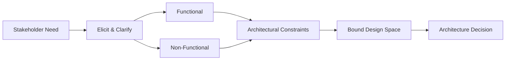

# Requirements gathering

> **Learning Path:** Non-AI System Design Practice
> **Section:** 25.1.1 — System design practice

**Requirements gathering**

### 1. The problem

A system built from a feature list will fail. It will be fast in the wrong place, scale in the wrong dimension, or be rebuilt six months later.

The problem isn't missing features. It's missing *constraints*. Without constraints the design space is infinite, so engineers optimize for what they can imagine, not what the business actually needs.

Requirements gathering exists to turn vague intent into architectural constraints that bound the solution.

### 2. Mental model

Think of requirements as constraints, not a wishlist.

Functional requirements define *what* must happen: "Process a payment". Non-functional requirements define *how well* it must happen: latency < 200ms p95, 10k TPS peak, 99.95% availability, data residency in EU.

Constraints are the real design drivers. They decide whether you need a monolith or microservices, synchronous or async, SQL or object store, single region or multi-region.

### 3. How it works

Effective gathering is iterative clarification, not a one-time document.

* Elicit from multiple roles: product defines value, ops defines reliability, security defines compliance, finance defines cost.
* Translate to verifiable constraints. "Fast" becomes "p95 < 200ms". "Scalable" becomes "10k to 100k users in 12 months".
* Prioritize constraints. Not all are equal. Availability can trump latency for a bank transfer; latency can trump cost for a trading UI.
* Close ambiguity early. If you cannot measure it, you cannot architect for it.

The output is a small set of hard constraints and assumptions, not a 40-page spec.

### 4. Architectural reasoning

Good requirements enable decisions instead of deferring them.

When it helps:
* High uncertainty: new domain, new team, new tech. You need constraints to pick a viable shape.
* Costly changes later: data model, network topology, and compliance are expensive to change post-launch.
* Multi-team systems: shared expectations prevent integration failures.

Alternatives to poor gathering:
* Build-first: prototype fast, then retrofit constraints. Works for exploratory MVPs, expensive for core systems.
* Assumption-driven: engineer assumes the constraints. Leads to over-engineering or under-engineering.

Choose gathering depth proportional to reversibility. Schema design and data residency are irreversible. UI copy is reversible.

### 5. Trade-offs and failure modes

* Time now vs rework later. Gathering feels slow. Rebuilding is slower.
* Precision vs speed. Over-specifying kills agility. Under-specifying kills architecture.
* Gold plating: gathering every possible future need produces an over-constrained system.
* Moving target: stakeholders change priorities mid-gathering. Mitigate by validating constraints with a lightweight prototype or spike.
* Missing non-functionals: the classic failure. Functionality ships, then latency, cost, or security forces a rewrite.

The most dangerous failure mode is *silent* requirements: a constraint that no one states, but everyone expects, like auditability.

### 6. Example

E-commerce checkout.

Stakeholder says: "Make checkout faster".

Bad requirements: "Faster checkout".

Good constraints:
* Functional: support guest checkout, Apple Pay, 3DS.
* Non-functional: p95 < 800ms end-to-end, 5k TPS peak Black Friday, 99.9% availability, PCI DSS scope minimized, EU card data never leaves EU.

These constraints immediately shape architecture: synchronous payment call is too slow → async pre-authorization with callback. Global scale needed → regional checkout services. PCI scope → tokenization service isolated. Cost constraint → cache product prices, not hit DB per request.

Without the constraints you would build a single service and discover the problems in production.

### 7. Reasoning challenge

You are designing a real-time fraud scoring service. Product says "scores must be accurate". Security says "must be explainable". Ops says "latency budget is 50ms p99". Finance says "cost must stay under $0.001 per request".

What questions do you ask first, and which constraint do you treat as non-negotiable? What architectural options does that eliminate?

### 8. Key takeaway

* Requirements are constraints that bound the design space. Gather constraints, not features.
* Non-functional requirements drive architecture more than functional ones.
* Make constraints measurable and prioritize them. One hard constraint can eliminate 80% of options.
* Gather enough to decide irreversibles. You can refine the rest later.
