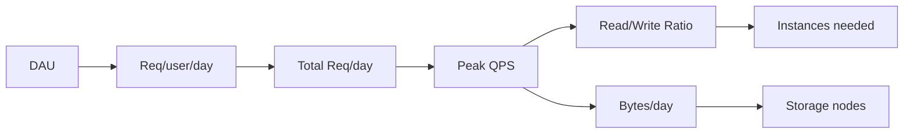

# Capacity estimation

> **Learning Path:** Non-AI System Design Practice
> **Section:** 25.1.2 — System design practice

### The problem

You are building a system and you have no idea how many machines to buy. Too few and latency spikes, errors rise, and the service collapses at peak. Too many and you burn budget and increase operational complexity.

Capacity estimation is not about precise sizing. It is about making architectural decisions early with enough confidence to avoid expensive rework. It answers: how many requests per second will we handle, how much data will we store, and what resources does that imply?

### Mental model

Capacity estimation is back-of-the-envelope math to turn business assumptions into resource requirements.

Think in a funnel:

Users -> Requests -> Data

DAU * requests per user per day = total requests per day. Convert to QPS with peak factor. Then apply read/write ratio, payload size, and retention to get compute and storage.

The goal is order-of-magnitude correctness, not exact numbers.

### How it works

The essential mechanism is a few simple calculations with explicit assumptions.

1. **Traffic**
   * DAU / MAU -> concurrent users
   * Requests per user per day -> total requests per day
   * Peak factor 2-3x average -> QPS peak

2. **Data**
   * Writes per second = QPS * write ratio
   * Average object size -> bytes per day
   * Retention period -> total storage

3. **Resources**
   * QPS per instance from benchmarks -> instances needed
   * Storage per instance -> shards / nodes needed
   * Network ingress/egress from object sizes

Write assumptions down. If DAU is wrong, everything scales linearly.

Example flow:

### Architectural reasoning

Capacity numbers drive design choices.

* **QPS too high for one DB?** -> read replicas, caching, sharding.
* **Write volume too high?** -> async write path, batching, queue.
* **Storage growing fast?** -> tiered storage, compression, TTL/eviction.
* **Peak >> average?** -> autoscaling, over-provisioning headroom, or shedding load.

Without estimation you pick architecture by habit. With it you pick architecture by constraint.

When it helps most:
* Early design reviews to test feasibility
* Cost modeling before launch
* Identifying hotspots before they become outages
* Sizing sharding keys and partition counts

### Trade-offs and failure modes

* **Overestimation -> cost waste.** Headroom is good, gold-plating is not. A common failure is sizing for 5-year growth on day one.
* **Underestimation -> cascading failure.** No headroom for traffic spikes, GC pauses, or node loss.
* **Static assumptions.** Real traffic is bursty and skewed. Use peak factor and measure actual QPS/read-write ratio.
* **Ignoring tail latency.** Average QPS hides P99. A service can be "enough" on average and fail on spikes.
* **Storage vs compute coupling.** Growing data increases read latency and backup time even if QPS is stable.

Good practice: estimate, then add 20-50% headroom for operational overhead and failures, and re-estimate quarterly.

### Example

URL shortener for 100M MAU.

Assumptions: 10% DAU = 10M daily active. 5 requests/user/day = 50M req/day. Peak 3x average.
Average QPS = 50M / 86400 ≈ 579. Peak QPS ≈ 1,737.

Read/write 90/10. Writes ≈ 174/s peak. Each record 100 bytes.
Storage per day ≈ 50M * 100B * 10% writes? Actually all records stored once. ~5 GB/day. 1 year retention ≈ 1.8 TB.

One API instance handles ~5k QPS. So 1 instance covers peak with headroom. DB writes 174/s is fine for one node, but for HA and growth, 3-node cluster with sharding is reasonable.

If you estimated 10M QPS instead of 1.7k, you'd over-provision by 5,000x.

### Reasoning challenge

You are designing a photo sharing feed. 50M DAU, each user views 200 photos/day, uploads 0.5 photos/day. Average photo 2 MB after compression. Peak factor 2.5x.

What is peak QPS? What is daily storage growth? Would you put the feed behind a cache? How many DB shards would you start with if each shard handles 10k writes/s?

Do not compute exact answer now. Identify which assumptions change the outcome most and what architectural decision they force.

### Key takeaway

* Capacity estimation is reasoning, not precision. Order of magnitude is enough to pick architecture.
* Start with business assumptions: DAU, requests/user, read/write ratio, object size, retention.
* Convert to QPS and storage, then derive instances, shards, and cache needs.
* Use headroom for peaks and failures, but avoid sizing for fantasy growth.
* Re-estimate as real metrics arrive; capacity plans rot fast.
