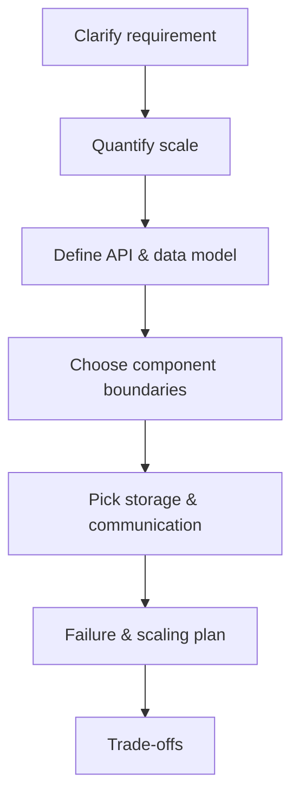

# High-level design

> **Learning Path:** Non-AI System Design Practice
> **Section:** 25.1.3 — System design practice

**High-level design is not drawing boxes. It is making explicit trade-offs under constraints, fast.**

### 1. The problem

You are given a vague requirement: "build X". You have 45 minutes and no spec. You must produce a coherent architecture that is plausible, scalable, and defensible.

The problem isn't missing features. It's ambiguity. You need to turn an ill-defined need into concrete boundaries: scale, latency, consistency, cost, team size, and time to ship.

Without a process, you jump to technology. With a process, you derive the technology.

### 2. Mental model

High-level design = **Constraints first, then shape.**

Think of it as a funnel:
Requirements → Scale → Data model → Component boundaries → Failure modes → Cost

You are not designing the system. You are designing the set of decisions that make the system possible.

### 3. How it works

A repeatable practice:

1. **Clarify.** Functional vs non-functional. Must-haves vs nice-to-haves. Ask: who writes, who reads, how often, how fresh.
2. **Quantify.** QPS, peak, data size, read/write ratio, latency SLO. Order of magnitude is enough.
3. **API first.** Define the interface before implementation. It forces you to decide what the system actually promises.
4. **Data model.** Where does state live? What is the access pattern? This drives 80% of the design.
5. **Components.** Split by responsibility, not by tech. e.g., ingress, routing, processing, storage, observability.
6. **Failure.** What breaks first? Hot keys, write amplification, cold start, network partition.
7. **Trade-offs.** Write them down explicitly.

### 4. Architectural reasoning

High-level design helps when you need to reason before building.

It solves:
* **Ambiguity → Clarity.** Forcing numbers exposes unrealistic assumptions early.
* **Coupling → Boundaries.** Deciding what is synchronous vs async, what is strongly consistent vs eventually consistent.
* **Risk → Options.** You can compare alternatives with the same constraints.

Alternatives you might skip:
* **Jump to tech.** Leads to over-engineering.
* **Deep dive too early.** Premature optimization on storage engine before QPS is known.
* **Design by analogy.** "We used Kafka last time" without checking if fan-out and replay are actually required.

Choose high-level design when the cost of being wrong is high: distributed state, multi-tenant, or long-lived services.

### 5. Trade-offs and failure modes

Architects remember few things:

* **Consistency vs Availability.** You cannot have both under partition. Pick per operation.
* **Latency vs Throughput.** Caching and batching help throughput, hurt freshness.
* **Strong coupling vs Operational complexity.** Microservices scale teams, increase failure surface and latency.
* **Write amplification.** Logging every event is cheap until you replay it 10 times.

Common failure modes in practice:
* No backpressure. Producers outrun consumers.
* Single writer bottleneck. Hot partition kills throughput.
* Missing observability. You can't debug what you can't see.
* Over-normalized data. Great for OLTP, terrible for reads.

### 6. Example

Design a rate limiter for a public API, 10k RPS peak, per user per minute quota.

Constraints: low latency <10ms, tolerate bursts, multi-region.

Reasoning:
* API: `allow(user_id, key)` -> bool.
* Scale: 10k RPS ~ 600k/min. In-memory per node works, but need distribution.
* Data model: key = `user_id:window`. Value = count + expiry. Access is point read/write.
* Decision: local in-memory cache + Redis with sliding window, fallback to local token bucket if Redis fails.
* Failure: Redis outage -> degrade to local allowance, accept over-limit risk. Hot users -> shard by user hash.

This is high-level. No code. Just boundaries, storage choice, and degradation plan.

### 7. Reasoning challenge

You need to build a real-time leaderboard for a game with 1M DAU, scores update constantly, top 100 must be fresh within 1s, full ranking can be stale.

Would you store scores in one sorted set, or maintain per-player writes and recompute top 100 periodically? What breaks at 10x scale?

### 8. Key takeaway

* Start with numbers. Scale and SLOs drive design, not taste.
* Define API and data access patterns before components.
* Make trade-offs explicit: consistency, latency, cost, operability.
* Design for failure and for growth. The first version is a sketch, not final.

You should finish able to take a vague prompt and produce a defensible set of choices, with why each choice was made and what it costs.
